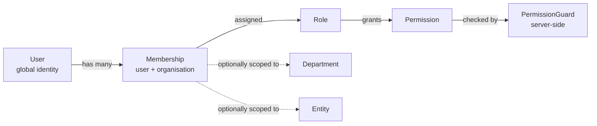

# 03 — User Roles and Permissions

**Status:** Baseline v1.0 — 2026-08-29
**Authority:** This document is the _specification_. The runtime authority is the seeded
`permissions` / `role_permissions` tables and the server-side guard. The frontend uses
permissions only to decide what to render — never to decide what is allowed.

---

## 1. Model

Financy uses **role-based access control with scope qualifiers**.

Three ideas, kept strictly separate:

| Concept        | Meaning                                                              | Example                       |
| -------------- | -------------------------------------------------------------------- | ----------------------------- |
| **Identity**   | Who you are, globally. One `User` row per human.                     | `aisha@acme.com`              |
| **Membership** | Your relationship to one organisation. A user may belong to several. | Aisha @ Acme, role `EMPLOYEE` |
| **Permission** | A single verb-on-noun capability.                                    | `transaction:review`          |

**A user has no permissions. A membership does.** Every authorisation decision therefore begins
by resolving the membership from the session — which is also what makes tenant isolation
structural rather than incidental.

### 1.1 Permission naming

`<resource>:<action>` — lowercase, colon-separated, stable forever.

Actions: `read` · `read_all` · `create` · `update` · `delete` · `approve` · `review` ·
`export` · `manage`.

- `read` — records you own or that are within your scope.
- `read_all` — every record in the organisation. This is the **tenant-wide** escalation and is
  granted sparingly.
- `manage` — full configuration control over a resource, including its settings.

### 1.2 Scope qualifiers

Beyond the permission itself, three scope levels narrow _which rows_ a permission applies to:

| Scope          | Rows visible                                                     | Typical roles                     |
| -------------- | ---------------------------------------------------------------- | --------------------------------- |
| `SELF`         | Only records where the member is the owner/requester/cardholder  | Employee                          |
| `DEPARTMENT`   | Records belonging to the member's department and its descendants | Manager                           |
| `ENTITY`       | Records belonging to assigned legal entities                     | Entity-scoped Finance             |
| `ORGANISATION` | All records in the organisation                                  | Finance Admin, Org Admin, Auditor |

Scope is stored on the membership and applied by the repository layer as a mandatory `WHERE`
clause. It is never optional and never client-supplied.

---

## 2. The five roles

### 2.1 Organisation Admin (`ORG_ADMIN`)

The system owner. Configures the organisation and controls access.

**Responsibilities:** organisation profile, entities, departments, users, roles, integrations,
security settings.

**Deliberate limitation:** an Org Admin can _configure_ spend policy but is **not** automatically
an approver of spend and cannot mark a reimbursement paid. Configuration authority and
transaction authority are separated so that no single role can both write the rule and execute
the payment. Both capabilities can be held by one person only by explicitly granting them both
roles' permissions — and that grant is itself audited.

**Cannot:** delete audit events (nobody can); remove their own last-admin status; approve their
own spend requests.

### 2.2 Finance Admin (`FINANCE_ADMIN`)

The daily operator. Owns the financial record.

**Responsibilities:** review and code transactions, manage budgets, process reimbursements,
manage vendors and bills, run reports and exports, manage accounting mappings, act as the
finance approver in policy chains.

**Cannot:** change roles or permissions (that is Org Admin); approve their own spend requests;
edit posted financial values (only issue adjustments).

### 2.3 Manager / Approver (`MANAGER`)

Departmental budget holder.

**Responsibilities:** approve or reject spend within their department scope, view department
spend and budget, request spend for the team.

**Cannot:** see other departments' data; change policy; review or code transactions for
accounting; approve their own requests.

### 2.4 Employee (`EMPLOYEE`)

Anyone who spends.

**Responsibilities:** submit spend requests, use assigned cards, upload receipts, submit expenses
and reimbursement claims, view their own records.

**Cannot:** see anyone else's spend; approve anything; see budgets except a read-only view of a
budget their request is charged against.

### 2.5 Auditor (`AUDITOR`)

Read-everything, change-nothing.

**Responsibilities:** review the complete financial and audit record; export for audit.

**Cannot:** create, update, delete, or approve **anything**. This is enforced structurally: the
role holds no permission whose action is a mutation, and a defence-in-depth guard rejects any
non-`GET` request from a membership whose role is `AUDITOR`, independent of the permission check.

---

## 3. Authoritative permission matrix

Legend: **✔** granted · **○** granted, scope-limited (see column note) · **✖** denied

### 3.1 Organisation and access

| Permission               | ORG_ADMIN | FINANCE_ADMIN | MANAGER | EMPLOYEE | AUDITOR |
| ------------------------ | :-------: | :-----------: | :-----: | :------: | :-----: |
| `organization:read`      |     ✔     |       ✔       |    ✔    |    ✔     |    ✔    |
| `organization:update`    |     ✔     |       ✖       |    ✖    |    ✖     |    ✖    |
| `entity:read`            |     ✔     |       ✔       |    ✔    |    ✔     |    ✔    |
| `entity:manage`          |     ✔     |       ✖       |    ✖    |    ✖     |    ✖    |
| `department:read`        |     ✔     |       ✔       |    ✔    |    ✔     |    ✔    |
| `department:manage`      |     ✔     |       ✖       |    ✖    |    ✖     |    ✖    |
| `user:read`              |     ✔     |       ✔       | ○ dept  |    ✖     |    ✔    |
| `user:invite`            |     ✔     |       ✖       |    ✖    |    ✖     |    ✖    |
| `user:update`            |     ✔     |       ✖       |    ✖    |    ✖     |    ✖    |
| `user:deactivate`        |     ✔     |       ✖       |    ✖    |    ✖     |    ✖    |
| `membership:manage_role` |     ✔     |       ✖       |    ✖    |    ✖     |    ✖    |
| `session:revoke_any`     |     ✔     |       ✖       |    ✖    |    ✖     |    ✖    |
| `security_event:read`    |     ✔     |       ✖       |    ✖    |    ✖     |    ✔    |

### 3.2 Policy and approvals

| Permission          | ORG_ADMIN | FINANCE_ADMIN |   MANAGER   |    EMPLOYEE    | AUDITOR |
| ------------------- | :-------: | :-----------: | :---------: | :------------: | :-----: |
| `policy:read`       |     ✔     |       ✔       |      ✔      |       ✔        |    ✔    |
| `policy:manage`     |     ✔     |       ✔       |      ✖      |       ✖        |    ✖    |
| `approval:read`     |     ✔     |       ✔       | ○ own queue | ○ own requests |    ✔    |
| `approval:act`      |     ✖     |       ✔       |   ○ dept    |       ✖        |    ✖    |
| `approval:delegate` |     ✔     |       ✔       |      ✔      |       ✖        |    ✖    |
| `approval:override` |     ✖     |       ✔       |      ✖      |       ✖        |    ✖    |

> `approval:override` lets Finance force a decision on a stalled chain. It always writes an audit
> event of type `approval.overridden` carrying a mandatory reason. Org Admin does **not** hold it,
> per the separation in §2.1.

### 3.3 Spend, cards, transactions

| Permission               |  ORG_ADMIN  | FINANCE_ADMIN |   MANAGER   |  EMPLOYEE   | AUDITOR |
| ------------------------ | :---------: | :-----------: | :---------: | :---------: | :-----: |
| `spend_request:create`   |      ✔      |       ✔       |      ✔      |      ✔      |    ✖    |
| `spend_request:read`     |      ✔      |       ✔       |   ○ dept    |   ○ self    |    ✔    |
| `spend_request:read_all` |      ✔      |       ✔       |      ✖      |      ✖      |    ✔    |
| `spend_request:update`   | ○ own draft |  ○ own draft  | ○ own draft | ○ own draft |    ✖    |
| `spend_request:cancel`   |    ○ own    |       ✔       |   ○ dept    |   ○ self    |    ✖    |
| `card:read`              |      ✔      |       ✔       |   ○ dept    |   ○ self    |    ✔    |
| `card:read_all`          |      ✔      |       ✔       |      ✖      |      ✖      |    ✔    |
| `card:create`            |      ✔      |       ✔       |      ✖      |      ✖      |    ✖    |
| `card:update_limit`      |      ✖      |       ✔       |      ✖      |      ✖      |    ✖    |
| `card:lock`              |      ✔      |       ✔       |   ○ dept    |   ○ self    |    ✖    |
| `card:terminate`         |      ✔      |       ✔       |      ✖      |      ✖      |    ✖    |
| `transaction:read`       |      ✔      |       ✔       |   ○ dept    |   ○ self    |    ✔    |
| `transaction:read_all`   |      ✔      |       ✔       |      ✖      |      ✖      |    ✔    |
| `transaction:categorize` |      ✖      |       ✔       |   ○ dept    |   ○ self    |    ✖    |
| `transaction:review`     |      ✖      |       ✔       |      ✖      |      ✖      |    ✖    |
| `transaction:import`     |      ✔      |       ✔       |      ✖      |      ✖      |    ✖    |

### 3.4 Expenses, receipts, reimbursements

| Permission                | ORG_ADMIN | FINANCE_ADMIN | MANAGER |     EMPLOYEE      | AUDITOR |
| ------------------------- | :-------: | :-----------: | :-----: | :---------------: | :-----: |
| `expense:create`          |     ✔     |       ✔       |    ✔    |         ✔         |    ✖    |
| `expense:read`            |     ✔     |       ✔       | ○ dept  |      ○ self       |    ✔    |
| `expense:approve`         |     ✖     |       ✔       | ○ dept  |         ✖         |    ✖    |
| `receipt:upload`          |     ✔     |       ✔       |    ✔    |         ✔         |    ✖    |
| `receipt:read`            |     ✔     |       ✔       | ○ dept  |      ○ self       |    ✔    |
| `receipt:read_all`        |     ✔     |       ✔       |    ✖    |         ✖         |    ✔    |
| `receipt:delete`          |     ✖     |       ✔       |    ✖    | ○ own, unattached |    ✖    |
| `reimbursement:create`    |     ✔     |       ✔       |    ✔    |         ✔         |    ✖    |
| `reimbursement:read`      |     ✔     |       ✔       | ○ dept  |      ○ self       |    ✔    |
| `reimbursement:approve`   |     ✖     |       ✔       | ○ dept  |         ✖         |    ✖    |
| `reimbursement:mark_paid` |     ✖     |       ✔       |    ✖    |         ✖         |    ✖    |

### 3.5 Budgets, reports, accounting

| Permission               | ORG_ADMIN | FINANCE_ADMIN | MANAGER | EMPLOYEE | AUDITOR |
| ------------------------ | :-------: | :-----------: | :-----: | :------: | :-----: |
| `budget:read`            |     ✔     |       ✔       | ○ dept  |    ✖     |    ✔    |
| `budget:manage`          |     ✖     |       ✔       |    ✖    |    ✖     |    ✖    |
| `report:read`            |     ✔     |       ✔       | ○ dept  |    ✖     |    ✔    |
| `report:export`          |     ✔     |       ✔       | ○ dept  |    ✖     |    ✔    |
| `accounting_code:manage` |     ✖     |       ✔       |    ✖    |    ✖     |    ✖    |
| `accounting:export`      |     ✖     |       ✔       |    ✖    |    ✖     |    ✖    |

### 3.6 Vendors, bills, procurement (Phase 5)

| Permission               | ORG_ADMIN | FINANCE_ADMIN | MANAGER | EMPLOYEE | AUDITOR |
| ------------------------ | :-------: | :-----------: | :-----: | :------: | :-----: |
| `vendor:read`            |     ✔     |       ✔       |    ✔    |    ✔     |    ✔    |
| `vendor:manage`          |     ✔     |       ✔       |    ✖    |    ✖     |    ✖    |
| `bill:read`              |     ✔     |       ✔       | ○ dept  |    ✖     |    ✔    |
| `bill:create`            |     ✔     |       ✔       |    ✖    |    ✖     |    ✖    |
| `bill:approve`           |     ✖     |       ✔       | ○ dept  |    ✖     |    ✖    |
| `bill:mark_paid`         |     ✖     |       ✔       |    ✖    |    ✖     |    ✖    |
| `purchase_order:create`  |     ✔     |       ✔       |    ✔    |    ✔     |    ✖    |
| `purchase_order:read`    |     ✔     |       ✔       | ○ dept  |  ○ self  |    ✔    |
| `purchase_order:approve` |     ✖     |       ✔       | ○ dept  |    ✖     |    ✖    |

### 3.7 Audit and integrations

| Permission              | ORG_ADMIN | FINANCE_ADMIN | MANAGER | EMPLOYEE | AUDITOR |
| ----------------------- | :-------: | :-----------: | :-----: | :------: | :-----: |
| `audit_event:read`      |     ✔     |       ✔       |    ✖    |    ✖     |    ✔    |
| `audit_event:export`    |     ✔     |       ✖       |    ✖    |    ✖     |    ✔    |
| `integration:read`      |     ✔     |       ✔       |    ✖    |    ✖     |    ✔    |
| `integration:manage`    |     ✔     |       ✖       |    ✖    |    ✖     |    ✖    |
| `notification:read_own` |     ✔     |       ✔       |    ✔    |    ✔     |    ✔    |

> **No role holds `audit_event:create`, `audit_event:update`, or `audit_event:delete`.** Those
> permissions do not exist. Audit events are written only by the application's audit service, on
> a path with no API surface.

---

## 4. Invariants (enforced by code and by test)

These are the rules that must never be violable. Each maps to a security test in
`16-TESTING-STRATEGY.md`.

| ID     | Invariant                                                                                                                                                                                           |
| ------ | --------------------------------------------------------------------------------------------------------------------------------------------------------------------------------------------------- |
| INV-01 | Every request is scoped to exactly one organisation, resolved from the session's membership. A client-supplied `organizationId` is ignored, and if present and mismatched, the request is rejected. |
| INV-02 | A user cannot approve their own spend request, expense, reimbursement, bill, or purchase order — at any step, under any policy, including as a delegate.                                            |
| INV-03 | A user cannot grant themselves a permission they do not hold, nor elevate their own role.                                                                                                           |
| INV-04 | The last remaining `ORG_ADMIN` membership in an organisation cannot be demoted, deactivated, or deleted.                                                                                            |
| INV-05 | `AUDITOR` memberships are rejected on all non-`GET` requests, independent of permissions.                                                                                                           |
| INV-06 | Audit events are append-only. No code path issues `UPDATE` or `DELETE` against `audit_events`; the database role holds only `INSERT` and `SELECT` on that table.                                    |
| INV-07 | Scope-limited permissions are applied as a mandatory `WHERE` clause in the repository, not as a post-fetch filter.                                                                                  |
| INV-08 | Any change to a role, permission, or membership writes a `security_event` in addition to an audit event.                                                                                            |
| INV-09 | Permission checks occur on the server for every endpoint, including those a frontend would not normally call.                                                                                       |
| INV-10 | A deactivated membership's sessions are revoked immediately, and its pending approval steps are reassigned or escalated.                                                                            |

---

## 5. Delegation

An approver may delegate their approval authority for a bounded period (holiday, leave).

- Delegation is `from_membership` → `to_membership`, with `starts_at`, `ends_at`, optional scope.
- The delegate acts **as themselves**, recorded as `acted_by = delegate`,
  `acted_on_behalf_of = delegator`. The audit trail never loses the real actor.
- INV-02 applies to both parties: a delegate cannot approve their _own_ request even when the
  delegator could have.
- Delegation cannot chain. A delegate cannot re-delegate.
- Creating, using, and expiring a delegation are all audited.

---

## 6. Custom roles (Phase 6)

The schema supports custom roles from day one (`roles` is a table, not an enum, with an
`is_system` flag). The five system roles are seeded and immutable. Custom role creation is
deliberately deferred to Phase 6 so that the permission catalogue stabilises first — but no
schema migration is needed to enable it.

Guardrails when it ships: a custom role may not include a permission the granting admin does not
hold; it may not be granted `audit_event` mutation permissions (which do not exist); and INV-04
still applies to the system `ORG_ADMIN` role.

---

## 7. Frontend usage

The session response includes the resolved permission set and scope. The frontend uses it to:

- hide navigation items the user cannot use;
- disable and explain actions rather than failing silently;
- render an explicit **permission-denied state** for directly-navigated routes.

This is a **usability affordance only**. Every corresponding server endpoint enforces the same
rule independently, and the API test suite verifies each endpoint's denial path without involving
the frontend at all.
