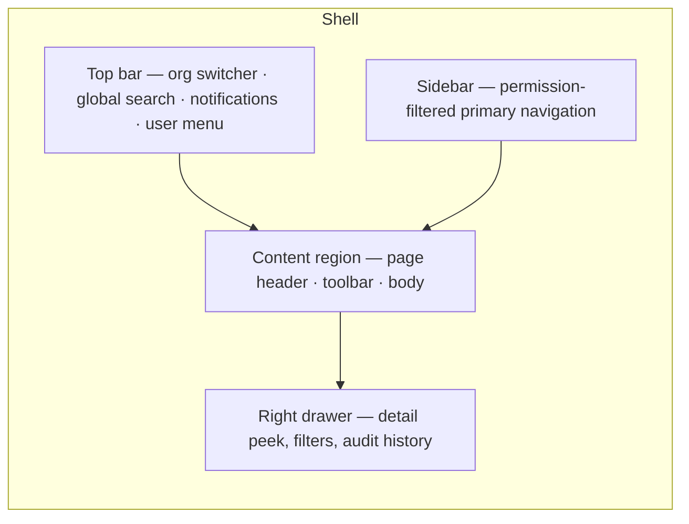

# 04 — Information Architecture

**Status:** Baseline v1.0 — 2026-08-29
**Governs:** `apps/web/src/app` route structure and `packages/ui` component contracts.

---

## 1. Application shell



**Layout rules**

- Sidebar is fixed at `240px`, collapsible to `64px` (icon-only), state persisted per user.
- Content region is fluid with a `1600px` maximum, `24px` gutters.
- The right drawer overlays at `≤1280px` and docks at `>1280px`. It is used for record detail
  peek, advanced filters, and audit history — never for primary creation flows, which use a full
  page or a modal.
- Breakpoints: `sm 640` · `md 768` · `lg 1024` · `xl 1280` · `2xl 1536`.
  This is a **desktop-first productivity tool**; below `lg`, tables degrade to stacked record
  cards rather than horizontally scrolling.

---

## 2. Primary navigation

Navigation is rendered from a single declarative manifest, filtered by the session's permission
set. An item the user cannot use is not shown; a route they navigate to directly renders the
permission-denied state (§4.9) rather than a 404 — hiding the existence of a feature is a
usability choice, not a security control.

| Order | Label | Route | Icon intent | Required permission | Phase |
|---|---|---|---|---|---|
| 1 | Overview | `/overview` | dashboard | *(any membership)* | 4 |
| 2 | Spend | `/spend` | send-money | `spend_request:read` | 2 |
| 3 | Cards | `/cards` | card | `card:read` | 2 |
| 4 | Transactions | `/transactions` | list | `transaction:read` | 2 |
| 5 | Expenses | `/expenses` | receipt | `expense:read` | 3 |
| 6 | Budgets | `/budgets` | gauge | `budget:read` | 4 |
| 7 | Bills | `/bills` | invoice | `bill:read` | 5 |
| 8 | Procurement | `/procurement` | cart | `purchase_order:read` | 5 |
| 9 | Vendors | `/vendors` | building | `vendor:read` | 5 |
| 10 | Reports | `/reports` | chart | `report:read` | 4 |
| 11 | Accounting | `/accounting` | ledger | `accounting_code:manage` | 6 |
| 12 | People | `/people` | users | `user:read` | 1 |
| 13 | Policies | `/policies` | shield | `policy:read` | 2 |
| 14 | Settings | `/settings` | cog | `organization:read` | 1 |
| 15 | Audit Log | `/audit` | history | `audit_event:read` | 1 |

**Grouping in the sidebar**

```text
  Overview
  ── SPEND ──────────
  Spend · Cards · Transactions · Expenses
  ── PLAN ───────────
  Budgets · Reports
  ── PAYABLES ───────
  Bills · Procurement · Vendors
  ── ADMIN ──────────
  Accounting · People · Policies · Settings · Audit Log
```

Group headers are hidden when every item in the group is filtered out.

---

## 3. Route map

```text
/(auth)
  /login                        credentials, MFA challenge
  /login/mfa                    step-up / second factor
  /register                     first-org creation
  /invite/[token]               accept invitation
  /forgot-password  /reset-password/[token]

/(app)
  /overview
  /spend                        list
  /spend/new                    create (multi-step)
  /spend/[id]                   detail + approval timeline
  /spend/approvals              my approval queue
  /cards                        list
  /cards/[id]                   detail + transactions + limit history
  /transactions                 list
  /transactions/[id]            detail + receipt + coding + audit
  /transactions/review          finance review queue
  /transactions/import          CSV import wizard
  /expenses                     list (tabs: mine · to approve · all)
  /expenses/new  /expenses/[id]
  /expenses/reimbursements      reimbursement batches
  /budgets  /budgets/new  /budgets/[id]
  /bills  /bills/new  /bills/[id]
  /procurement/requests  /procurement/orders  /procurement/orders/[id]
  /vendors  /vendors/[id]
  /reports  /reports/[reportKey]
  /accounting/codes  /accounting/mappings  /accounting/exports
  /people  /people/[membershipId]  /people/invite
  /policies  /policies/new  /policies/[id]  /policies/[id]/simulate
  /settings/organization  /settings/entities  /settings/departments
  /settings/categories    /settings/approvals  /settings/security
  /settings/integrations  /settings/notifications
  /audit                        filterable audit event stream
  /audit/[id]                   single event detail
```

Route groups map to layouts: `(auth)` is a centred single-column layout with no shell; `(app)`
carries the full shell and requires an authenticated session with an active membership.

---

## 4. The module surface contract

Rather than restating seventeen bullet points for fifteen modules, this section defines the
**mandatory surface every module implements**. Module-specific detail follows in §5. A module
that omits any of these is not complete (`19-DEFINITION-OF-DONE.md`).

### 4.1 List page

Composed of: page header (title, record count, primary action) → toolbar (search, filters,
saved views, bulk actions, export) → data table → pagination footer.

- **Table:** sticky header, sticky first column on narrow viewports, zebra-free with `1px`
  hairline separators, right-aligned numerics with tabular figures, 40px row height (32px in
  compact mode, a per-user preference).
- **Row click** opens the detail page. **Cmd/Ctrl-click** opens the drawer peek.
- Selection column appears only when the user holds at least one bulk-capable permission.

### 4.2 Detail page

Composed of: breadcrumb → record header (identifier, status badge, primary amount, actions) →
tabbed body → related records rail.

Standard tabs, in this order, omitting those that do not apply:
`Details` · `Approvals` · `Receipts / Documents` · `Accounting` · `Related` · `History`.

`History` renders the audit timeline for that record and is present on **every** detail page.

### 4.3 Create flow

- Simple records (vendor, category, department): modal with a single form.
- Complex records (spend request, budget, policy, bill, PO): a full page with a stepper, an
  explicit draft that is saved server-side, and a review step before submission.
- **Policy preview:** creation flows for spend requests, expenses, bills, and POs call the policy
  engine in *dry-run* mode as the user types, showing the anticipated verdict and approval chain
  before submission. The dry-run result is advisory; the authoritative evaluation happens on
  submit.

### 4.4 Edit flow

- Only fields that are legally mutable in the record's current state are editable; everything
  else renders read-only with a tooltip naming the reason.
- **Posted financial values are never editable.** The action offered instead is *Create
  adjustment*.
- Every successful edit produces an audit event with a field-level before/after diff.

### 4.5 Approval flow

A single shared component used by spend requests, expenses, reimbursements, bills, and purchase
orders — because they share one engine.

Shows: the requester and their department; the amount and currency; the purpose/memo; the policy
verdict with the specific rules that fired; the resolved approval chain with each step's state;
budget impact (remaining before and after); attached evidence; and the requester's recent
history. Actions: **Approve** · **Reject** (reason required) · **Return for changes** (comment
required) · **Delegate**.

### 4.6 Empty state

Three distinct kinds, never conflated:

| Kind | Trigger | Content |
|---|---|---|
| **First-run** | No records exist at all | Explanation of the module's purpose + primary CTA + link to docs |
| **Filtered-empty** | Records exist, filters exclude all | "No results for these filters" + *Clear filters* |
| **Scope-empty** | Records exist but none in the user's scope | "Nothing assigned to you" — no CTA implying broken access |

### 4.7 Loading state

Skeletons that match the final layout's geometry, never spinners for page loads. Table skeletons
render the correct column count and row height. Optimistic updates are used only for reversible,
non-financial actions (marking a notification read); **never** for approvals, payments, or state
transitions.

### 4.8 Error state

| Kind | Presentation |
|---|---|
| Field validation | Inline, below the field, with the server's message |
| Form-level | Banner at the top of the form, listing each failed field as an anchor link |
| Page load failure | Full-region error panel with the error code, a correlation ID, and *Retry* |
| Background failure | Toast, non-blocking, with *Retry* where the action is idempotent |
| Conflict (409) | Explicit "this record changed since you loaded it" panel with *Reload* |

Every error surface displays the machine-readable `code` and the request `correlationId` from
`10-API-SPECIFICATION.md`, so a user can quote it in a support request.

### 4.9 Permission state

A dedicated component — not a redirect and not a 404. It states which permission is required and
who to ask, and offers navigation back. Rendered when the API returns `403 FORBIDDEN` or when the
route's required permission is absent from the session.

### 4.10 Search, filter, sort, paginate

- **Search:** debounced 300ms, server-side, module-specific fields (documented per module in §5),
  reflected in the URL as `?q=`.
- **Filters:** a shared filter model. Every filter is a URL query parameter, so any filtered view
  is shareable and bookmarkable. Active filters render as removable chips above the table.
- **Sort:** server-side, single-column, click-to-cycle asc → desc → default; URL parameter
  `?sort=field:dir`.
- **Pagination:** cursor-based for large or realtime-ish sets (transactions, audit events),
  offset-based for small bounded sets (departments, entities). Default page size 50; options 25,
  50, 100, 200.

### 4.11 Bulk actions

Appear in a floating action bar once rows are selected, showing the selection count and the
aggregate amount where meaningful. Every bulk action shows a confirmation dialog naming the exact
count, runs server-side in a single transaction where semantics allow, returns a per-row result,
and reports partial failures explicitly. Bulk actions are permission-checked per row, not once
for the batch.

### 4.12 Export

Exports honour the *currently applied filters* and the user's scope. Every export is
permission-checked (`report:export` or module-specific), audit-logged with its parameters and row
count, rate-limited, and generated server-side. Exports over 5,000 rows are queued and delivered
via a signed, expiring download link rather than a synchronous response.

### 4.13 Audit history and related records

Every detail page carries a `History` tab reading `audit_events` for that record, and a `Related`
rail showing typed links to connected records — the spend request behind a transaction, the
receipt attached to it, the budget it consumed, the approval instance that authorised it.

---

## 5. Module specifics

Only what differs from §4 is listed.

### 5.1 Overview — `/overview`
KPI row (total spend MTD, pending approvals, uncategorised transactions, budget utilisation,
outstanding reimbursements) → spend trend chart → budget-vs-actual bars → "needs your attention"
queues → recent activity. Every value comes from a backend aggregate endpoint; **no client-side
computation of any figure**. Role-aware: an Employee sees their own spend and requests; a Manager
sees their department; Finance sees the organisation.

### 5.2 Spend — `/spend`
Columns: Reference · Requester · Department · Category · Amount · Requested for · Policy verdict ·
Approval state · Age.
Search: reference, requester name, memo, vendor.
Filters: status, policy verdict, department, entity, category, amount range, date range,
requester, approver, "awaiting my approval".
Bulk: approve, reject, remind approver.
Detail tabs: Details · Approvals · Documents · Related · History.

### 5.3 Cards — `/cards`
Columns: Name · Type (physical/virtual/mock) · Holder · Limit · Used · Available · Status ·
Expires. Availability rendered as an inline meter.
Actions: issue (mock provider), lock, unlock, terminate, change limit (Finance only).
**Never displays a PAN or CVV** — only the provider's last-four and a masked display token.
Detail: transactions on the card, limit change history, the governing policy, provider reference.

### 5.4 Transactions — `/transactions`
The densest table in the product. Columns: Date · Merchant · Amount · Card/Method · Person ·
Department · Category · Receipt · Policy · Review · Accounting.
Four status columns are deliberate — each is an independent axis of completeness and each is
filterable.
Sub-views: `All` · `Needs receipt` · `Needs review` · `Exceptions` · `Uncategorised`.
Bulk: categorise, request receipt, mark reviewed, export.
`/transactions/review` is a dedicated keyboard-driven queue: `J`/`K` to move, `C` to categorise,
`R` to mark reviewed, `E` to flag exception.

### 5.5 Expenses & Reimbursements — `/expenses`
Tabs: `Mine` · `To approve` · `All` (permission-gated) · `Reimbursements`.
Creation is receipt-first: upload, then confirm the parsed or entered fields.
Reimbursement batches group approved expenses per person per period, with a single payable total,
and enforce the duplicate-prevention rule at the database level.

### 5.6 Budgets — `/budgets`
Columns: Name · Scope (dept/entity/project/category) · Period · Allocated · Committed · Actual ·
Remaining · Utilisation.
Utilisation is a meter with semantic thresholds (`<75%` normal, `75–90%` caution, `90–100%` warn,
`>100%` over).
Detail: the period breakdown, the contributing transactions and commitments, alert configuration,
and overspend behaviour.

### 5.7 Bills / AP — `/bills`
Columns: Vendor · Bill number · Issue date · Due date · Amount · Approval · Payment · Accounting.
Ageing buckets (current, 1–30, 31–60, 61–90, 90+) as a summary strip.
Detail: line items with per-line coding, the vendor, the linked PO, documents, approvals.

### 5.8 Procurement — `/procurement`
Two lists: purchase requests and purchase orders. PO detail shows lines, received quantities, and
matched bills — the three-way match view.

### 5.9 Vendors — `/vendors`
Columns: Name · Category · Status · Spend YTD · Open bills · Last transaction.
Detail: profile, contacts, redacted payment details, bills, POs, transactions, spend trend.
Duplicate detection on create, by normalised name and tax identifier.

### 5.10 Reports — `/reports`
A gallery of report cards → a report page with the shared filter bar, a visualisation, a data
table, and export. Reports are defined by a server-side registry keyed by `reportKey`; adding a
report does not require a new route.

### 5.11 Accounting — `/accounting`
Three sub-pages: `Codes` (chart of accounts, cost centres, tax codes), `Mappings` (rules from
category/department/entity/vendor to GL account and dimensions, with a test harness), `Exports`
(history, status, re-download, and the unexported-items queue).

### 5.12 People — `/people`
Columns: Name · Email · Role · Department · Manager · Status · Last active.
Detail: profile, role and scope, manager chain, cards, spend, approval delegations, sessions with
individual revoke, and security events.
Invite flow: email, role, department, entity scope, manager — with a preview of the resulting
permissions before sending.

### 5.13 Policies — `/policies`
Columns: Name · Applies to · Priority · Rules · Status · Last modified.
The policy editor is a rule builder: condition groups (all/any) over typed fields, producing
typed outcomes. It is not a free-text expression box.
`/policies/[id]/simulate` runs the policy against historical transactions or a hypothetical
request and shows exactly which rules fire and what chain results. This is the single most
important trust-building screen in the product.

### 5.14 Settings — `/settings/*`
Organisation profile · Entities · Departments · Categories · Approval defaults · Security
(session policy, MFA requirement, IP allowlist) · Integrations · Notification preferences.
Every settings mutation is audited and shows its blast radius before confirmation.

### 5.15 Audit Log — `/audit`
Reverse-chronological, cursor-paginated stream. Columns: Timestamp · Actor · Action · Resource ·
Summary.
Filters: date range, actor, action type, resource type, resource ID, IP address.
Detail shows the full before/after payload, request correlation ID, IP, and user agent.
**Read-only by construction** — the UI offers no mutation affordance because the API exposes none.

---

## 6. Global surfaces

| Surface | Trigger | Behaviour |
|---|---|---|
| Command palette | `Cmd/Ctrl-K` | Navigate, search across modules, run permitted actions |
| Global search | Top bar | Cross-module server-side search, grouped results, scope-respecting |
| Notification centre | Bell icon | Unread count, grouped by type, deep links, mark-read |
| Org switcher | Top bar | Only for users with multiple memberships; switching resets all scoped state |
| Keyboard shortcuts | `?` | Overlay listing shortcuts for the current context |

---

## 7. Accessibility requirements

Non-negotiable, verified in CI with `axe` and by keyboard-only manual passes.

- WCAG 2.1 AA: contrast ≥ 4.5:1 for text, ≥ 3:1 for UI boundaries and graphical objects.
- Full keyboard operability, including the data table (arrow navigation, `Space` to select,
  `Enter` to open) and every menu, dialog, and drawer.
- Visible focus indicators everywhere; focus trapped in modals and restored on close.
- Semantic HTML first; ARIA only where semantics are insufficient.
- Status is never conveyed by colour alone — every badge carries a text label.
- `aria-live` announcements for async results, toasts, and validation summaries.
- Respects `prefers-reduced-motion`.
- All form controls have programmatically associated labels and error messages.
