# 05 — User Flows

**Status:** Baseline v1.0 — 2026-08-29
**Companion:** `docs/diagrams/` holds standalone `.mmd` sources for the reusable diagrams.

Every flow below is a specification, not an illustration. Each terminal state, error branch, and
audit event named here must exist in the implementation.

---

## 0. The first vertical slice (the MVP proving flow)

This is the flow that defines "the product works". It is implemented across Phases 1–4 and is
exercised end to end by `tests/e2e/vertical-slice.spec.ts`.

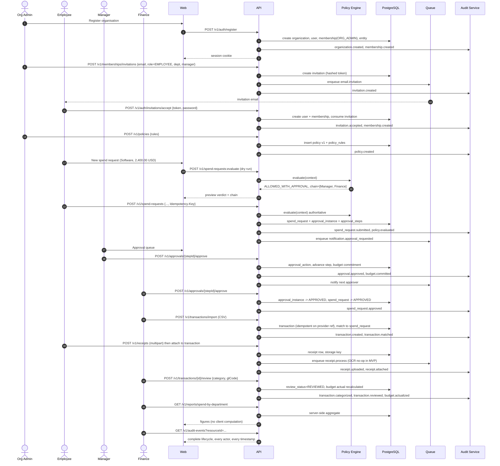
```mermaid
sequenceDiagram
  autonumber
  actor Daniel as Org Admin
  actor Aisha as Employee
  actor Marcus as Manager
  actor Priya as Finance
  participant Web
  participant API
  participant Policy as Policy Engine
  participant DB as PostgreSQL
  participant Q as Queue
  participant Audit as Audit Service

  Daniel->>Web: Register organisation
  Web->>API: POST /v1/auth/register
  API->>DB: create organization, user, membership(ORG_ADMIN), entity
  API->>Audit: organization.created, membership.created
  API-->>Web: session cookie

  Daniel->>API: POST /v1/memberships/invitations {email, role=EMPLOYEE, dept, manager}
  API->>DB: create invitation (hashed token)
  API->>Q: enqueue email.invitation
  API->>Audit: invitation.created
  Q-->>Aisha: invitation email

  Aisha->>API: POST /v1/auth/invitations/accept {token, password}
  API->>DB: create user + membership, consume invitation
  API->>Audit: invitation.accepted, membership.created

  Daniel->>API: POST /v1/policies {rules}
  API->>DB: insert policy v1 + policy_rules
  API->>Audit: policy.created

  Aisha->>Web: New spend request (Software, 2,400.00 USD)
  Web->>API: POST /v1/spend-requests:evaluate (dry run)
  API->>Policy: evaluate(context)
  Policy-->>API: ALLOWED_WITH_APPROVAL, chain=[Manager, Finance]
  API-->>Web: preview verdict + chain
  Aisha->>API: POST /v1/spend-requests {..., Idempotency-Key}
  API->>Policy: evaluate(context) authoritative
  API->>DB: spend_request + approval_instance + approval_steps
  API->>Audit: spend_request.submitted, policy.evaluated
  API->>Q: enqueue notification.approval_requested

  Marcus->>Web: Approval queue
  Marcus->>API: POST /v1/approvals/{stepId}/approve
  API->>DB: approval_action, advance step, budget commitment
  API->>Audit: approval.approved, budget.committed
  API->>Q: notify next approver
  Priya->>API: POST /v1/approvals/{stepId}/approve
  API->>DB: approval_instance -> APPROVED, spend_request -> APPROVED
  API->>Audit: spend_request.approved

  Priya->>API: POST /v1/transactions/import (CSV)
  API->>DB: transaction (idempotent on provider ref), match to spend_request
  API->>Audit: transaction.created, transaction.matched

  Aisha->>API: POST /v1/receipts (multipart) then attach to transaction
  API->>DB: receipt row, storage key
  API->>Q: enqueue receipt.process (OCR no-op in MVP)
  API->>Audit: receipt.uploaded, receipt.attached

  Priya->>API: POST /v1/transactions/{id}/review {category, glCode}
  API->>DB: review_status=REVIEWED, budget actual recalculated
  API->>Audit: transaction.categorized, transaction.reviewed, budget.actualized

  Priya->>API: GET /v1/reports/spend-by-department
  API->>DB: server-side aggregate
  API-->>Web: figures (no client computation)
  Priya->>API: GET /v1/audit-events?resourceId=...
  API-->>Web: complete lifecycle, every actor, every timestamp
```

**Assertions the e2e test makes at the end**

1. `spend_requests.status = 'APPROVED'` and it references the approval instance.
2. `transactions` row exists, is linked to the spend request, and has `receipt_status = 'ATTACHED'`.
3. The budget shows the amount as `actual`, no longer as `committed`, and `remaining` is correct.
4. The department report total includes exactly this transaction's amount, once.
5. `audit_events` contains at least fifteen events for this lifecycle, every one with a non-null
   `actor_membership_id` (or an explicit `SYSTEM` actor), in chronological order.
6. A user from a second organisation receives `404` — not `403` — for every ID in this flow.

---

## A. Organisation onboarding

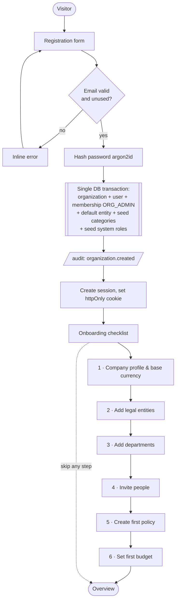
```mermaid
flowchart TD
  S([Visitor]) --> R[Registration form]
  R --> V{Email valid<br/>and unused?}
  V -- no --> RE[Inline error] --> R
  V -- yes --> CH[Hash password argon2id]
  CH --> TX[["Single DB transaction:<br/>organization + user + membership ORG_ADMIN<br/>+ default entity + seed categories<br/>+ seed system roles"]]
  TX --> AU[/audit: organization.created/]
  AU --> SES[Create session, set httpOnly cookie]
  SES --> W[Onboarding checklist]
  W --> W1[1 · Company profile & base currency]
  W1 --> W2[2 · Add legal entities]
  W2 --> W3[3 · Add departments]
  W3 --> W4[4 · Invite people]
  W4 --> W5[5 · Create first policy]
  W5 --> W6[6 · Set first budget]
  W6 --> D([Overview])
  W -.skip any step.-> D
```

The checklist is resumable and its completion state is stored on the organisation, so an admin who
leaves at step 3 returns to step 3.

---

## B. Employee invitation

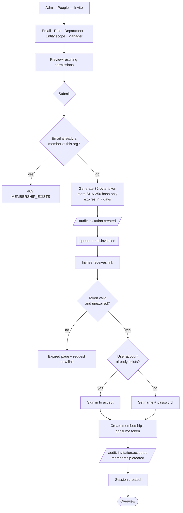
```mermaid
flowchart TD
  A[Admin: People → Invite] --> F[Email · Role · Department · Entity scope · Manager]
  F --> PV[Preview resulting permissions]
  PV --> SUB{Submit}
  SUB --> CHK{Email already a<br/>member of this org?}
  CHK -- yes --> ERR[409 MEMBERSHIP_EXISTS]
  CHK -- no --> TOK[Generate 32-byte token<br/>store SHA-256 hash only<br/>expires in 7 days]
  TOK --> AUD[/audit: invitation.created/]
  AUD --> Q[[queue: email.invitation]]
  Q --> MAIL[Invitee receives link]
  MAIL --> OPEN{Token valid<br/>and unexpired?}
  OPEN -- no --> EXP[Expired page + request new link]
  OPEN -- yes --> EX{User account<br/>already exists?}
  EX -- yes --> LOGIN[Sign in to accept] --> ACC
  EX -- no --> SET[Set name + password] --> ACC
  ACC[Create membership · consume token] --> AUD2[/audit: invitation.accepted<br/>membership.created/]
  AUD2 --> SES[Session created] --> OV([Overview])
```

Invitations are single-use, hash-stored, expiring, and revocable. Revocation is audited.

---

## C. Login and session lifecycle

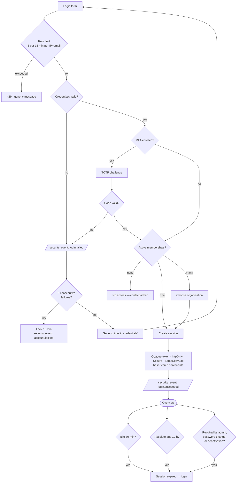
```mermaid
flowchart TD
  L[Login form] --> RL{Rate limit<br/>5 per 15 min per IP+email}
  RL -- exceeded --> R429[429 · generic message]
  RL -- ok --> VER{Credentials valid?}
  VER -- no --> SE[/security_event: login.failed/] --> LOCK{5 consecutive<br/>failures?}
  LOCK -- yes --> LK[Lock 15 min<br/>security_event: account.locked]
  LOCK -- no --> GEN[Generic 'invalid credentials'] --> L
  VER -- yes --> MFA{MFA enrolled?}
  MFA -- yes --> CH[TOTP challenge] --> MV{Code valid?}
  MV -- no --> SE
  MV -- yes --> MEM
  MFA -- no --> MEM{Active memberships?}
  MEM -- none --> NM[No access — contact admin]
  MEM -- one --> S[Create session]
  MEM -- many --> PICK[Choose organisation] --> S
  S --> COOK[Opaque token · httpOnly · Secure · SameSite=Lax<br/>hash stored server-side]
  COOK --> SE2[/security_event: login.succeeded/]
  SE2 --> OV([Overview])

  OV --> IDLE{Idle 30 min?}
  IDLE -- yes --> EXP[Session expired → login]
  OV --> ABS{Absolute age 12 h?}
  ABS -- yes --> EXP
  OV --> REV{Revoked by admin,<br/>password change,<br/>or deactivation?}
  REV -- yes --> EXP
```

Sessions are opaque and server-side precisely so that revocation is immediate and total — see
ADR-0005.

---

## D. Spend request

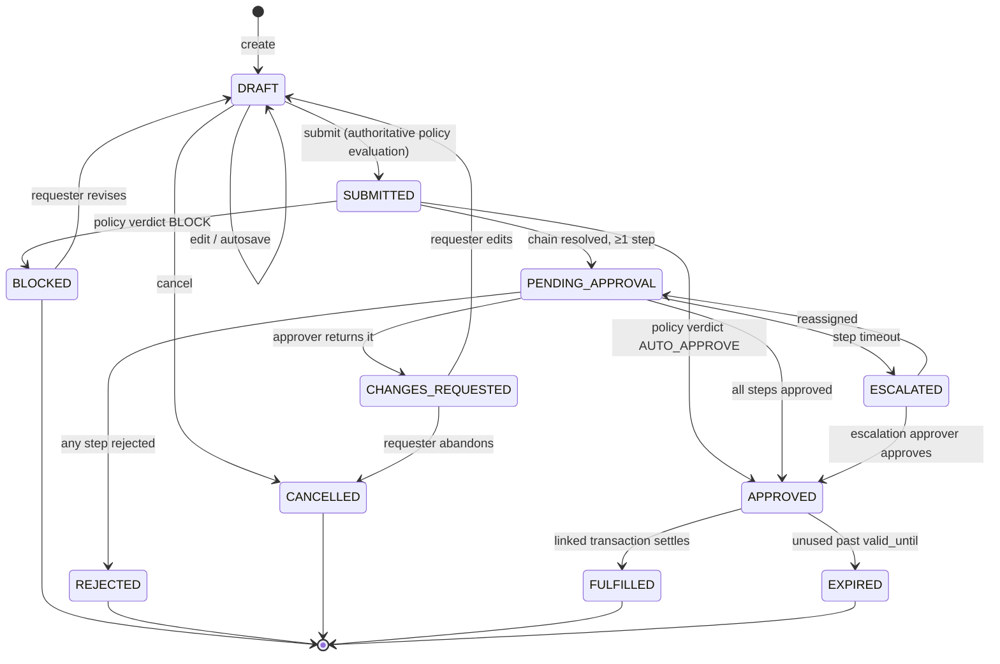
```mermaid
stateDiagram-v2
  [*] --> DRAFT: create
  DRAFT --> DRAFT: edit / autosave
  DRAFT --> SUBMITTED: submit (authoritative policy evaluation)
  DRAFT --> CANCELLED: cancel
  SUBMITTED --> PENDING_APPROVAL: chain resolved, ≥1 step
  SUBMITTED --> APPROVED: policy verdict AUTO_APPROVE
  SUBMITTED --> BLOCKED: policy verdict BLOCK
  PENDING_APPROVAL --> APPROVED: all steps approved
  PENDING_APPROVAL --> REJECTED: any step rejected
  PENDING_APPROVAL --> CHANGES_REQUESTED: approver returns it
  PENDING_APPROVAL --> ESCALATED: step timeout
  ESCALATED --> PENDING_APPROVAL: reassigned
  ESCALATED --> APPROVED: escalation approver approves
  CHANGES_REQUESTED --> DRAFT: requester edits
  CHANGES_REQUESTED --> CANCELLED: requester abandons
  APPROVED --> FULFILLED: linked transaction settles
  APPROVED --> EXPIRED: unused past valid_until
  BLOCKED --> DRAFT: requester revises
  BLOCKED --> [*]
  REJECTED --> [*]
  CANCELLED --> [*]
  FULFILLED --> [*]
  EXPIRED --> [*]
```

`BLOCKED` is distinct from `REJECTED`: blocked is the _policy_ refusing, rejected is a _human_
refusing. The distinction matters for reporting on policy effectiveness.

---

## E. Approval

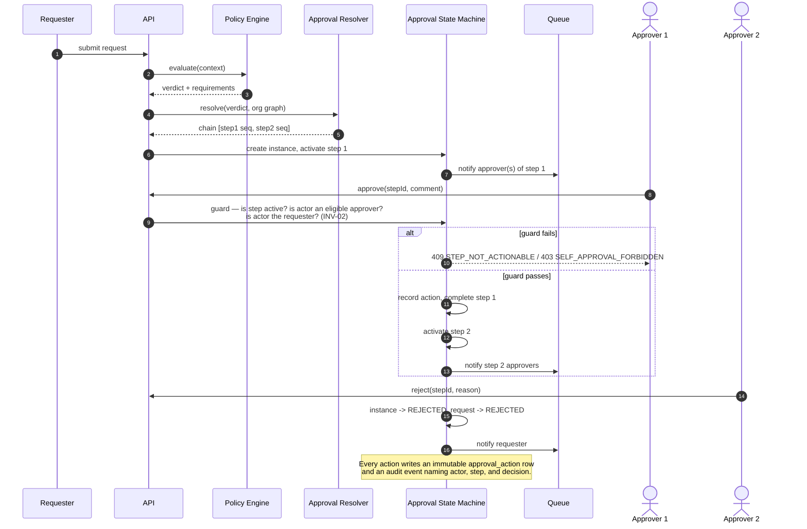
```mermaid
sequenceDiagram
  autonumber
  participant R as Requester
  participant API
  participant PE as Policy Engine
  participant AR as Approval Resolver
  participant SM as Approval State Machine
  participant Q as Queue
  actor A1 as Approver 1
  actor A2 as Approver 2

  R->>API: submit request
  API->>PE: evaluate(context)
  PE-->>API: verdict + requirements
  API->>AR: resolve(verdict, org graph)
  AR-->>API: chain [step1 seq, step2 seq]
  API->>SM: create instance, activate step 1
  SM->>Q: notify approver(s) of step 1

  A1->>API: approve(stepId, comment)
  API->>SM: guard — is step active? is actor an eligible approver?<br/>is actor the requester? (INV-02)
  alt guard fails
    SM-->>A1: 409 STEP_NOT_ACTIONABLE / 403 SELF_APPROVAL_FORBIDDEN
  else guard passes
    SM->>SM: record action, complete step 1
    SM->>SM: activate step 2
    SM->>Q: notify step 2 approvers
  end

  A2->>API: reject(stepId, reason)
  SM->>SM: instance -> REJECTED, request -> REJECTED
  SM->>Q: notify requester
  Note over SM: Every action writes an immutable approval_action row<br/>and an audit event naming actor, step, and decision.
```

**Step types**

| Type           | Completion rule                                             |
| -------------- | ----------------------------------------------------------- |
| `SEQUENTIAL`   | Steps activate in order; each must complete before the next |
| `PARALLEL_ALL` | All approvers in the step must approve                      |
| `PARALLEL_ANY` | Any one approver completes the step                         |
| `QUORUM(n)`    | `n` of the eligible approvers must approve                  |

A rejection at any step terminates the whole instance immediately.

---

## F. Policy evaluation

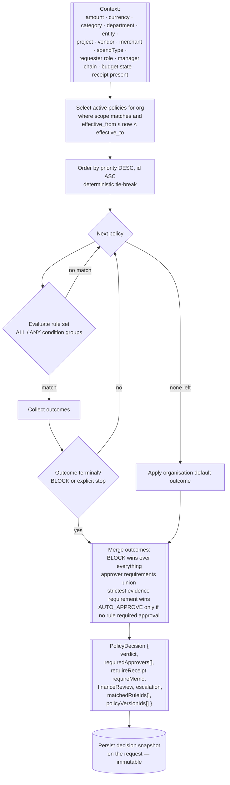
```mermaid
flowchart TD
  IN[["Context:<br/>amount · currency · category · department · entity ·<br/>project · vendor · merchant · spendType ·<br/>requester role · manager chain · budget state · receipt present"]]
  IN --> SEL[Select active policies for org<br/>where scope matches and<br/>effective_from ≤ now < effective_to]
  SEL --> ORD[Order by priority DESC, id ASC<br/>deterministic tie-break]
  ORD --> LOOP{Next policy}
  LOOP -- none left --> DEF[Apply organisation default outcome]
  LOOP --> RULES{Evaluate rule set<br/>ALL / ANY condition groups}
  RULES -- no match --> LOOP
  RULES -- match --> OUT[Collect outcomes]
  OUT --> TERM{Outcome terminal?<br/>BLOCK or explicit stop}
  TERM -- yes --> MERGE
  TERM -- no --> LOOP
  DEF --> MERGE[["Merge outcomes:<br/>BLOCK wins over everything<br/>approver requirements union<br/>strictest evidence requirement wins<br/>AUTO_APPROVE only if no rule required approval"]]
  MERGE --> RES[["PolicyDecision {<br/> verdict, requiredApprovers[],<br/> requireReceipt, requireMemo,<br/> financeReview, escalation,<br/> matchedRuleIds[], policyVersionIds[] }"]]
  RES --> PERSIST[(Persist decision snapshot<br/>on the request — immutable)]
```

The evaluation is **pure**: same context plus same policy versions always yields the same
decision. The decision, the matched rule IDs, and the policy _versions_ used are snapshotted onto
the request so that a later policy edit never changes the history of a past approval.

---

## G. Card lifecycle

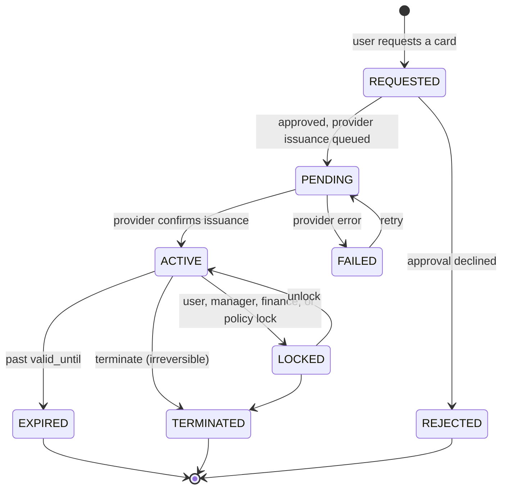
```mermaid
stateDiagram-v2
  [*] --> REQUESTED: user requests a card
  REQUESTED --> PENDING: approved, provider issuance queued
  REQUESTED --> REJECTED: approval declined
  PENDING --> ACTIVE: provider confirms issuance
  PENDING --> FAILED: provider error
  FAILED --> PENDING: retry
  ACTIVE --> LOCKED: user, manager, finance, or policy lock
  LOCKED --> ACTIVE: unlock
  ACTIVE --> EXPIRED: past valid_until
  ACTIVE --> TERMINATED: terminate (irreversible)
  LOCKED --> TERMINATED
  EXPIRED --> [*]
  TERMINATED --> [*]
  REJECTED --> [*]
```

Rules: a terminated card can never be reactivated; a locked card declines authorisations but
retains its history; limit changes create a `spend_limit` history row rather than mutating in
place; the application stores only the provider reference and last-four — never a PAN or CVV.

---

## H. Transaction lifecycle

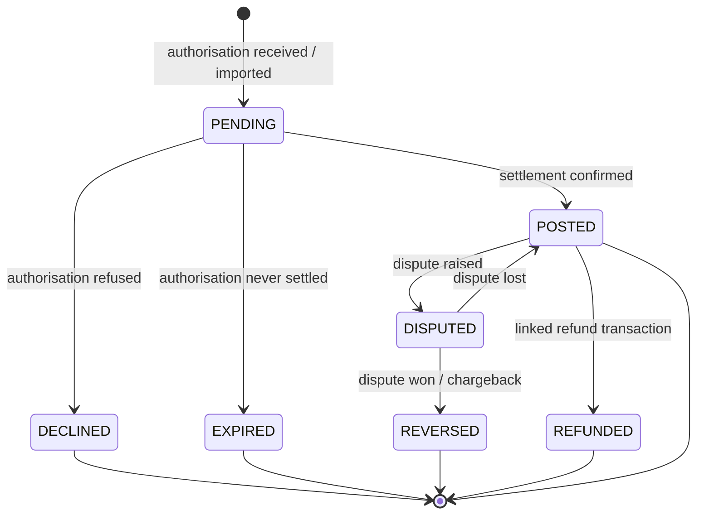
```mermaid
stateDiagram-v2
  [*] --> PENDING: authorisation received / imported
  PENDING --> POSTED: settlement confirmed
  PENDING --> DECLINED: authorisation refused
  PENDING --> EXPIRED: authorisation never settled
  POSTED --> DISPUTED: dispute raised
  DISPUTED --> POSTED: dispute lost
  DISPUTED --> REVERSED: dispute won / chargeback
  POSTED --> REFUNDED: linked refund transaction
  DECLINED --> [*]
  EXPIRED --> [*]
  REVERSED --> [*]
  REFUNDED --> [*]
  POSTED --> [*]
```

Three **independent** completeness axes track alongside the financial state and are never
conflated with it:

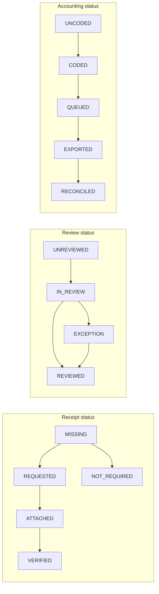
```mermaid
flowchart LR
  subgraph "Receipt status"
    r1[MISSING] --> r2[REQUESTED] --> r3[ATTACHED] --> r4[VERIFIED]
    r1 --> r5[NOT_REQUIRED]
  end
  subgraph "Review status"
    v1[UNREVIEWED] --> v2[IN_REVIEW] --> v3[REVIEWED]
    v2 --> v4[EXCEPTION] --> v3
  end
  subgraph "Accounting status"
    a1[UNCODED] --> a2[CODED] --> a3[QUEUED] --> a4[EXPORTED] --> a5[RECONCILED]
  end
```

**Duplicate prevention:** every inbound transaction carries `(provider, provider_transaction_id)`
under a unique constraint. A replayed webhook or a re-uploaded CSV is a no-op that returns the
existing record and logs `transaction.duplicate_ignored`.

---

## I. Receipt upload

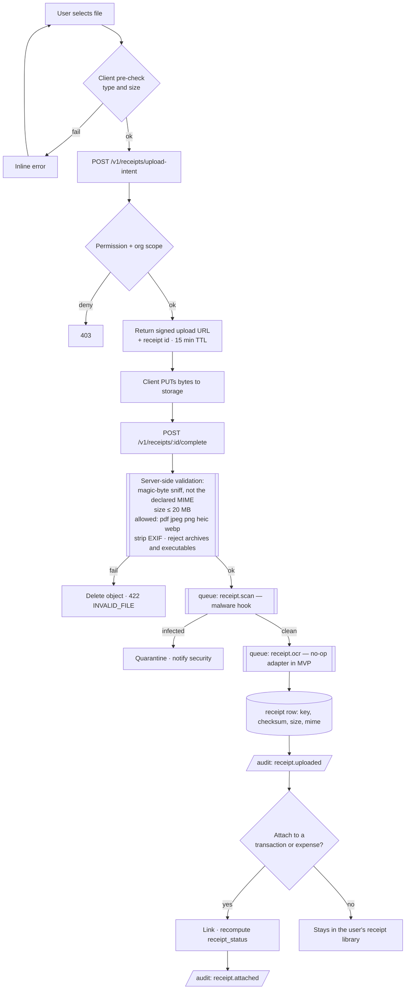
```mermaid
flowchart TD
  U[User selects file] --> CV{Client pre-check<br/>type and size}
  CV -- fail --> CE[Inline error] --> U
  CV -- ok --> INIT[POST /v1/receipts/upload-intent]
  INIT --> AUTH{Permission + org scope}
  AUTH -- deny --> D403[403]
  AUTH -- ok --> URL[Return signed upload URL<br/>+ receipt id · 15 min TTL]
  URL --> PUT[Client PUTs bytes to storage]
  PUT --> FIN[POST /v1/receipts/:id/complete]
  FIN --> SV[["Server-side validation:<br/>magic-byte sniff, not the declared MIME<br/>size ≤ 20 MB<br/>allowed: pdf jpeg png heic webp<br/>strip EXIF · reject archives and executables"]]
  SV -- fail --> DEL[Delete object · 422 INVALID_FILE]
  SV -- ok --> SCAN[[queue: receipt.scan — malware hook]]
  SCAN -- infected --> QUAR[Quarantine · notify security]
  SCAN -- clean --> OCRQ[[queue: receipt.ocr — no-op adapter in MVP]]
  OCRQ --> STORE[(receipt row: key, checksum, size, mime)]
  STORE --> AUD[/audit: receipt.uploaded/]
  AUD --> ATT{Attach to a<br/>transaction or expense?}
  ATT -- yes --> LINK[Link · recompute receipt_status]
  LINK --> AUD2[/audit: receipt.attached/]
  ATT -- no --> LIB[Stays in the user's receipt library]
```

Objects are **never public**. Every read is a fresh signed URL with a short TTL, issued only
after a permission and tenant-scope check on the owning record.

---

## J. Expense submission

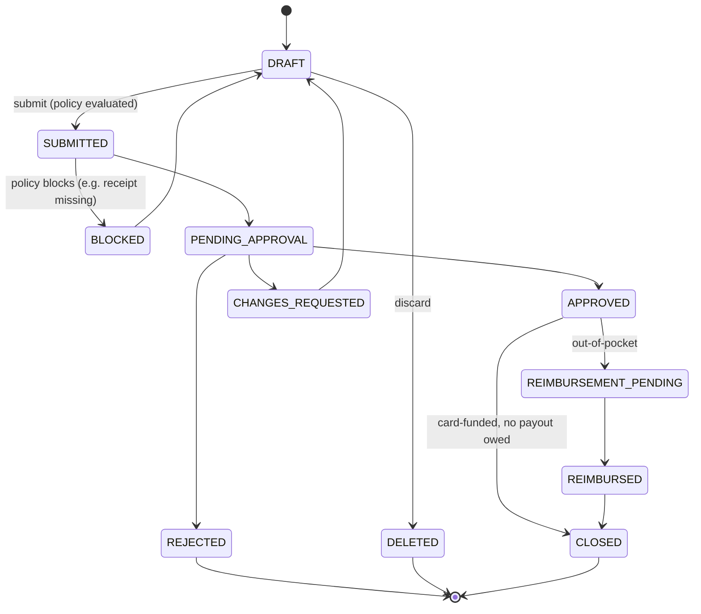
```mermaid
stateDiagram-v2
  [*] --> DRAFT
  DRAFT --> SUBMITTED: submit (policy evaluated)
  DRAFT --> DELETED: discard
  SUBMITTED --> BLOCKED: policy blocks (e.g. receipt missing)
  BLOCKED --> DRAFT
  SUBMITTED --> PENDING_APPROVAL
  PENDING_APPROVAL --> APPROVED
  PENDING_APPROVAL --> REJECTED
  PENDING_APPROVAL --> CHANGES_REQUESTED
  CHANGES_REQUESTED --> DRAFT
  APPROVED --> REIMBURSEMENT_PENDING: out-of-pocket
  APPROVED --> CLOSED: card-funded, no payout owed
  REIMBURSEMENT_PENDING --> REIMBURSED
  REIMBURSED --> CLOSED
  REJECTED --> [*]
  DELETED --> [*]
  CLOSED --> [*]
```

---

## K. Reimbursement

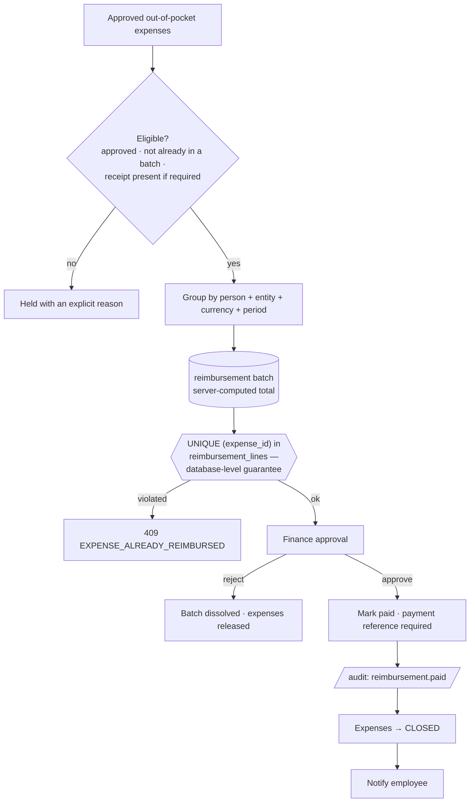
```mermaid
flowchart TD
  AP[Approved out-of-pocket expenses] --> ELG{Eligible?<br/>approved · not already in a batch ·<br/>receipt present if required}
  ELG -- no --> HOLD[Held with an explicit reason]
  ELG -- yes --> GRP[Group by person + entity + currency + period]
  GRP --> BATCH[(reimbursement batch<br/>server-computed total)]
  BATCH --> DUP{{"UNIQUE (expense_id) in<br/>reimbursement_lines —<br/>database-level guarantee"}}
  DUP -- violated --> ERR[409 EXPENSE_ALREADY_REIMBURSED]
  DUP -- ok --> APR[Finance approval]
  APR -- reject --> BACK[Batch dissolved · expenses released]
  APR -- approve --> PAY[Mark paid · payment reference required]
  PAY --> AUD[/audit: reimbursement.paid/]
  AUD --> CLOSE[Expenses → CLOSED]
  CLOSE --> NOTE[Notify employee]
```

The duplicate guarantee is a **unique index**, not application logic. Application logic returns a
friendly error; the database is what makes it impossible.

---

## L. Budget tracking

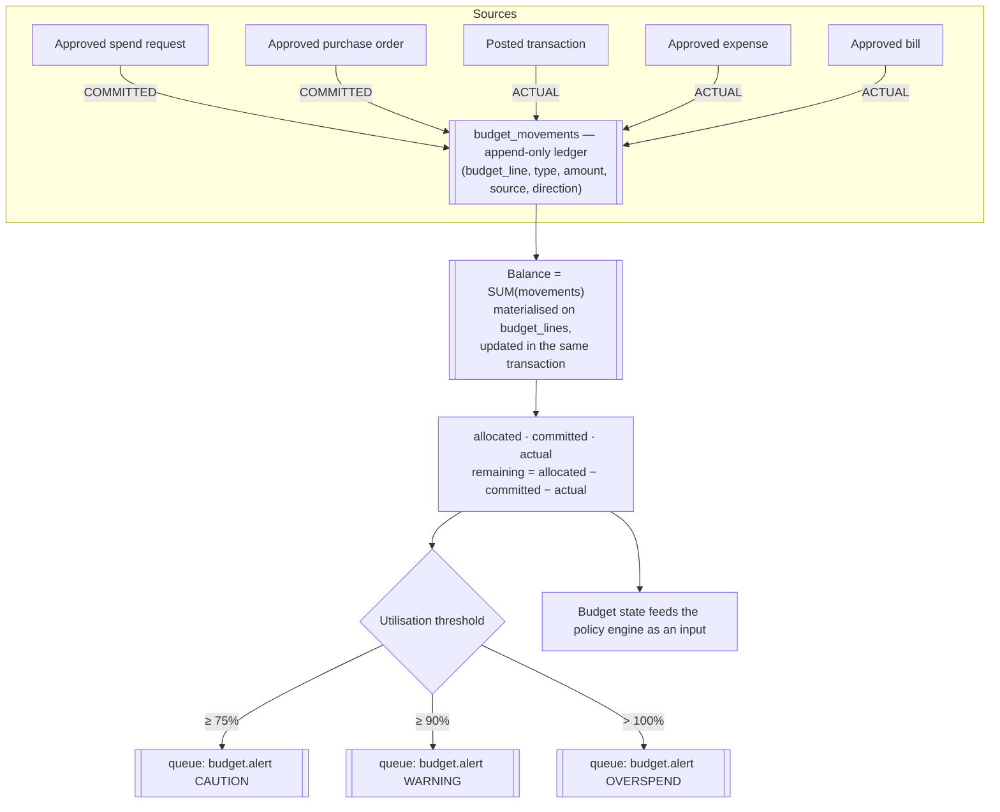
```mermaid
flowchart TD
  subgraph Sources
    C1[Approved spend request] -->|COMMITTED| L
    C2[Approved purchase order] -->|COMMITTED| L
    A1[Posted transaction] -->|ACTUAL| L
    A2[Approved expense] -->|ACTUAL| L
    A3[Approved bill] -->|ACTUAL| L
  end
  L[["budget_movements — append-only ledger<br/>(budget_line, type, amount, source, direction)"]]
  L --> AGG[["Balance = SUM(movements)<br/>materialised on budget_lines,<br/>updated in the same transaction"]]
  AGG --> CALC[allocated · committed · actual<br/>remaining = allocated − committed − actual]
  CALC --> THR{Utilisation threshold}
  THR -->|≥ 75%| N1[[queue: budget.alert CAUTION]]
  THR -->|≥ 90%| N2[[queue: budget.alert WARNING]]
  THR -->|> 100%| N3[[queue: budget.alert OVERSPEND]]
  CALC --> POL[Budget state feeds the policy engine as an input]
```

**Concurrency.** Two approvals hitting the same budget line simultaneously must not both see the
same "remaining". The budget line row is locked with `SELECT ... FOR UPDATE` inside the same
transaction that writes the movement and the approval action. Balances are never recomputed
optimistically from a stale read. Overspend behaviour is configured per budget: `WARN` (allow,
alert), `REQUIRE_APPROVAL` (inject a finance approval step), or `BLOCK` (policy verdict `BLOCK`).

**Commitment release.** A commitment converts to an actual when the linked transaction posts, and
is released when the request is cancelled, expires, or its transaction is reversed. Both are
movements; nothing is ever deleted.

---

## M. Bill / AP lifecycle

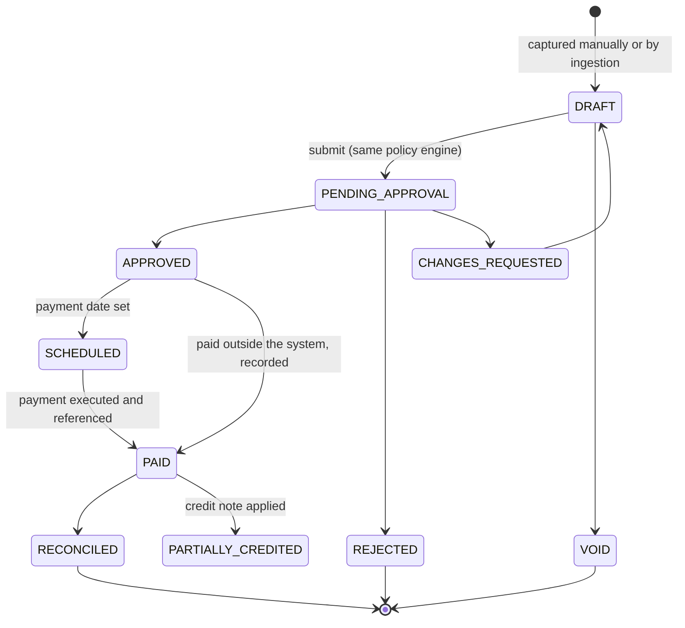
```mermaid
stateDiagram-v2
  [*] --> DRAFT: captured manually or by ingestion
  DRAFT --> PENDING_APPROVAL: submit (same policy engine)
  DRAFT --> VOID
  PENDING_APPROVAL --> APPROVED
  PENDING_APPROVAL --> REJECTED
  PENDING_APPROVAL --> CHANGES_REQUESTED
  CHANGES_REQUESTED --> DRAFT
  APPROVED --> SCHEDULED: payment date set
  SCHEDULED --> PAID: payment executed and referenced
  APPROVED --> PAID: paid outside the system, recorded
  PAID --> RECONCILED
  PAID --> PARTIALLY_CREDITED: credit note applied
  REJECTED --> [*]
  VOID --> [*]
  RECONCILED --> [*]
```

A `PAID` bill's amount is immutable. Corrections are credit notes — new linked records.

---

## N. Procurement lifecycle

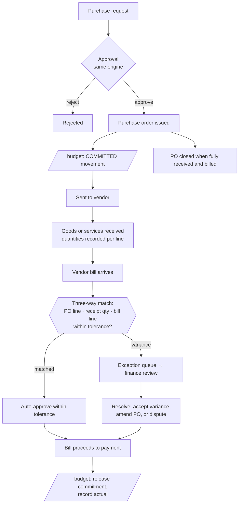
```mermaid
flowchart TD
  PR[Purchase request] --> PA{Approval<br/>same engine}
  PA -- reject --> PX[Rejected]
  PA -- approve --> PO[Purchase order issued]
  PO --> COM[/budget: COMMITTED movement/]
  COM --> SENT[Sent to vendor]
  SENT --> REC[Goods or services received<br/>quantities recorded per line]
  REC --> BILL[Vendor bill arrives]
  BILL --> M3{{Three-way match:<br/>PO line · receipt qty · bill line<br/>within tolerance?}}
  M3 -- matched --> APPR[Auto-approve within tolerance] --> PAY[Bill proceeds to payment]
  M3 -- variance --> EXC[Exception queue → finance review]
  EXC --> RES[Resolve: accept variance,<br/>amend PO, or dispute]
  RES --> PAY
  PAY --> REL[/budget: release commitment,<br/>record actual/]
  PO --> CLOSE[PO closed when fully received and billed]
```

---

## O. Vendor lifecycle

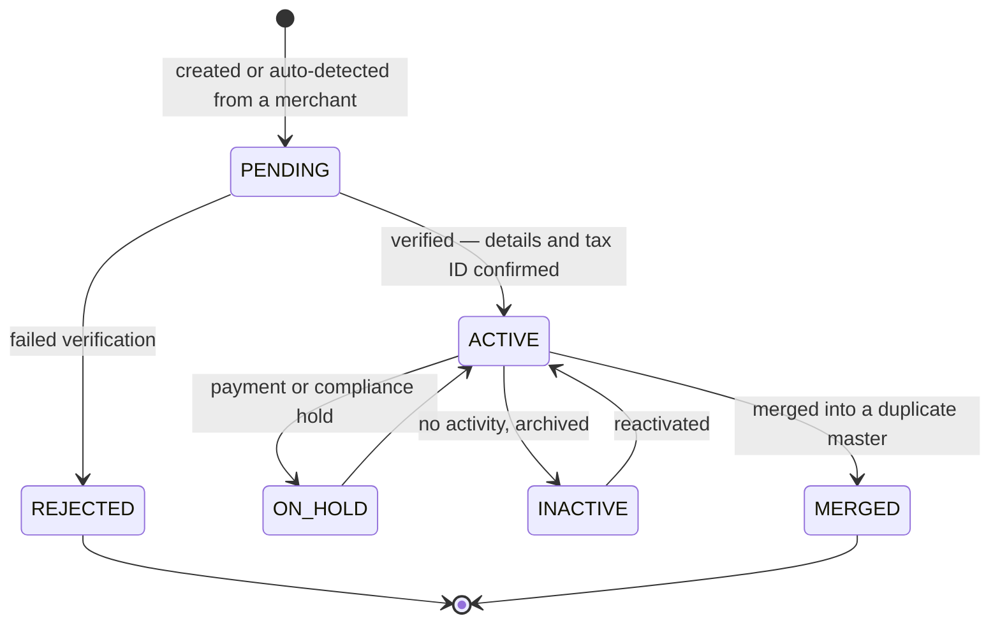
```mermaid
stateDiagram-v2
  [*] --> PENDING: created or auto-detected from a merchant
  PENDING --> ACTIVE: verified — details and tax ID confirmed
  PENDING --> REJECTED: failed verification
  ACTIVE --> ON_HOLD: payment or compliance hold
  ON_HOLD --> ACTIVE
  ACTIVE --> INACTIVE: no activity, archived
  INACTIVE --> ACTIVE: reactivated
  ACTIVE --> MERGED: merged into a duplicate master
  REJECTED --> [*]
  MERGED --> [*]
```

Duplicate detection on create compares normalised name and tax identifier. Merging is
non-destructive: the merged record is retained with a `merged_into_id` pointer so historical
references never break.

---

## P. Accounting export

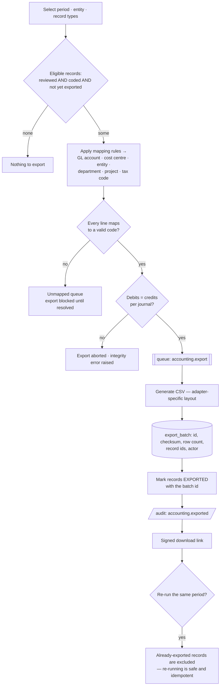
```mermaid
flowchart TD
  SEL[Select period · entity · record types] --> ELG{Eligible records:<br/>reviewed AND coded AND not yet exported}
  ELG -- none --> EMPTY[Nothing to export]
  ELG -- some --> MAP[Apply mapping rules →<br/>GL account · cost centre · entity ·<br/>department · project · tax code]
  MAP --> VAL{Every line maps<br/>to a valid code?}
  VAL -- no --> UNM[Unmapped queue<br/>export blocked until resolved]
  VAL -- yes --> BAL{Debits = credits<br/>per journal?}
  BAL -- no --> ERR[Export aborted · integrity error raised]
  BAL -- yes --> GEN[[queue: accounting.export]]
  GEN --> FILE[Generate CSV — adapter-specific layout]
  FILE --> BATCH[(export_batch: id, checksum, row count,<br/>record ids, actor)]
  BATCH --> MARK[Mark records EXPORTED<br/>with the batch id]
  MARK --> AUD[/audit: accounting.exported/]
  AUD --> DL[Signed download link]
  DL --> RE{Re-run the same period?}
  RE -- yes --> IDEM[Already-exported records are excluded<br/>— re-running is safe and idempotent]
```

An exported record cannot be edited. If it is wrong, an adjustment record is created and appears
in the next export.

---

## Q. Audit lifecycle

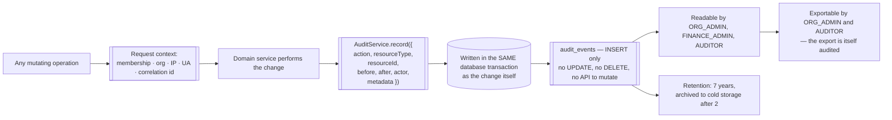
```mermaid
flowchart LR
  ACT[Any mutating operation] --> CTX[[Request context:<br/>membership · org · IP · UA · correlation id]]
  CTX --> SVC[Domain service performs the change]
  SVC --> EV[["AuditService.record({<br/> action, resourceType, resourceId,<br/> before, after, actor, metadata })"]]
  EV --> SAME[(Written in the SAME database transaction<br/>as the change itself)]
  SAME --> IMM[[audit_events — INSERT only<br/>no UPDATE, no DELETE, no API to mutate]]
  IMM --> RD[Readable by ORG_ADMIN, FINANCE_ADMIN, AUDITOR]
  RD --> EXP[Exportable by ORG_ADMIN and AUDITOR<br/>— the export is itself audited]
  IMM --> RET[Retention: 7 years,<br/>archived to cold storage after 2]
```

Writing the audit event inside the same transaction as the change is the point: either both
happen or neither does. An audit log that can silently miss events is worse than none, because it
is trusted.

---

## Cross-cutting: error and recovery behaviour

Every flow above inherits these branches without restating them.

| Condition                                    | Response                                                                                   |
| -------------------------------------------- | ------------------------------------------------------------------------------------------ |
| Session missing or expired                   | `401 UNAUTHENTICATED` → login, preserving the return URL                                   |
| Permission absent                            | `403 FORBIDDEN` → permission state (§4.9 of `04`)                                          |
| Resource in another organisation             | `404 NOT_FOUND` — **never `403`**, which would confirm existence                           |
| Optimistic concurrency conflict              | `409 CONFLICT` with the current version → reload prompt                                    |
| Invalid state transition                     | `409 INVALID_STATE_TRANSITION` naming current and attempted states                         |
| Validation failure                           | `422 VALIDATION_FAILED` with a field-keyed error map                                       |
| Duplicate idempotency key, same payload      | The original response is replayed                                                          |
| Duplicate idempotency key, different payload | `409 IDEMPOTENCY_KEY_REUSED`                                                               |
| Rate limit exceeded                          | `429` with `Retry-After`                                                                   |
| Upstream provider failure                    | `502 PROVIDER_ERROR`, job retried with exponential backoff, dead-lettered after 5 attempts |
