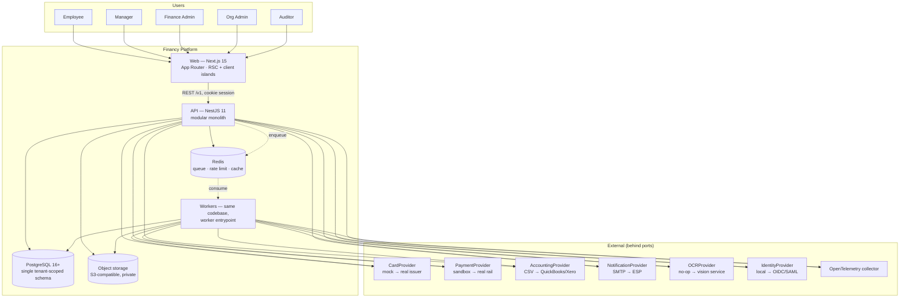
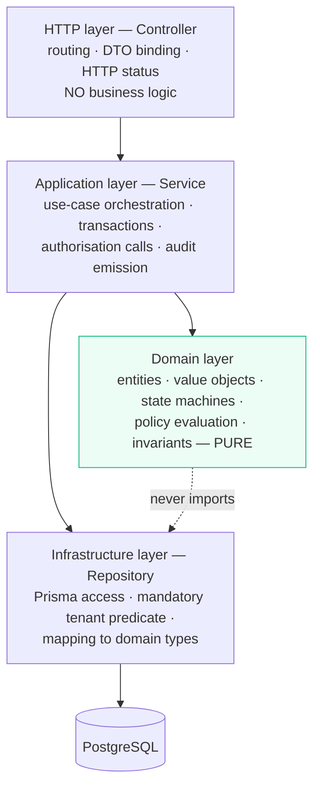
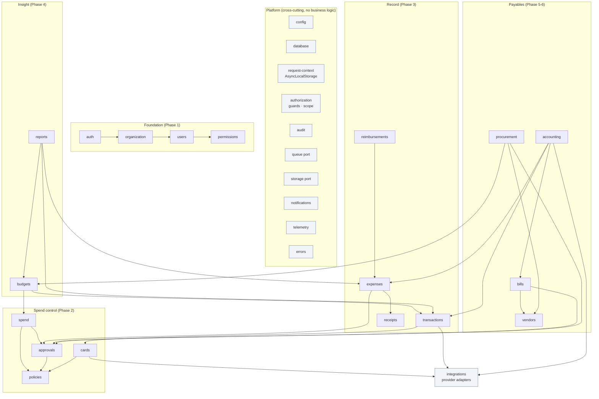
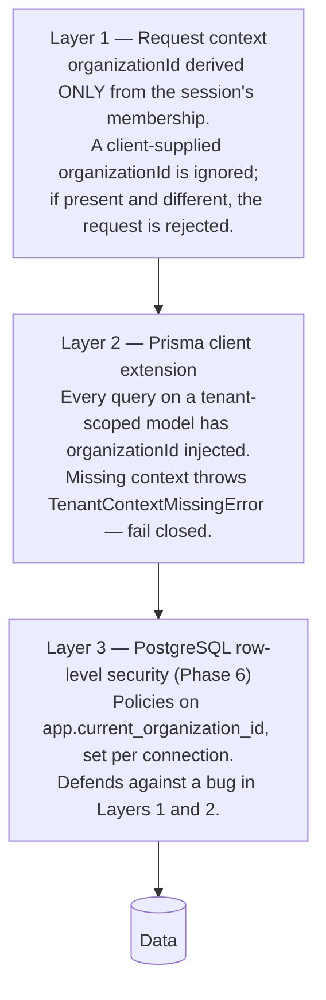
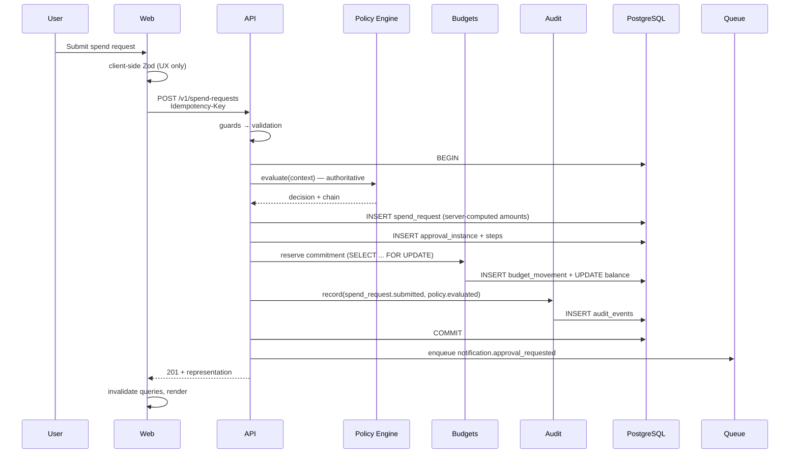
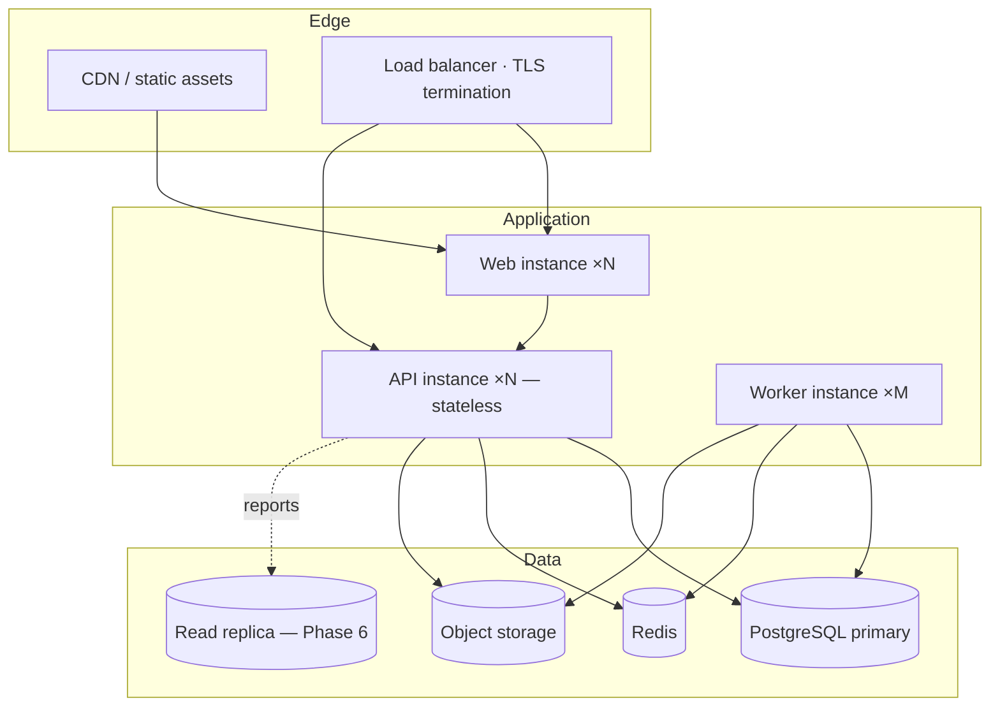

# 08 — Architecture

**Status:** Baseline v1.0 — 2026-08-29
**Decisions recorded in:** `20-DECISIONS.md`

---

## 1. Architectural stance

Financy is a **modular monolith**: one deployable unit, internally partitioned into domain
modules with enforced boundaries, sharing one database and one transaction scope.

This is a deliberate choice, not a stepping stone taken by default.

**Why not microservices**

- The hardest guarantees in this product — _the budget movement, the approval action, and the
  audit event all commit or none do_ — are trivial in one database transaction and require
  sagas, compensating actions, and eventual-consistency reasoning across services. For a finance
  system, that is a large correctness risk bought for no benefit at this scale.
- The domain boundaries are not yet proven. Splitting on guesses produces distributed coupling,
  which is strictly worse than local coupling.
- One team, no independent scaling pressure, no independent release pressure.

**How we keep the option open.** Module boundaries are enforced mechanically (§4.3), each module
owns its tables, cross-module reads go through a module's public interface rather than its
tables, and all external systems sit behind ports. If a module ever needs to leave, it leaves at
a seam that already exists.

---

## 2. System context



---

## 3. Technology decisions

| Layer       | Choice                                                        | Rationale                                                                                                                                                                                                                                                                                                    |
| ----------- | ------------------------------------------------------------- | ------------------------------------------------------------------------------------------------------------------------------------------------------------------------------------------------------------------------------------------------------------------------------------------------------------ |
| Monorepo    | **pnpm workspaces + Turborepo**                               | pnpm 11 already present; strict `node_modules` prevents phantom dependencies — which is exactly how module boundaries get quietly violated. Turbo gives caching and a task graph.                                                                                                                            |
| Backend     | **NestJS 11**                                                 | The brief prefers it absent a prior decision. Its module system, DI, guards, interceptors, and pipes map directly onto the cross-cutting concerns this product cannot omit: authorisation, tenant scoping, audit, validation. Those become framework-level guarantees rather than per-controller discipline. |
| API style   | **REST, `/v1`**                                               | Stable, cacheable, trivially testable, and well understood by the integrators this product will meet. GraphQL is reconsidered only if client query shapes become genuinely dynamic.                                                                                                                          |
| ORM         | **Prisma 6**                                                  | See ADR-0003 and §3.1.                                                                                                                                                                                                                                                                                       |
| Frontend    | **Next.js 15 App Router + React 19**                          | Server Components keep the initial payload small for data-dense pages; route-level layouts match the shell; Server Actions are _not_ used for financial mutations — those go through the versioned REST API so there is exactly one authorisation path.                                                      |
| Client data | **TanStack Query**                                            | Caching, invalidation, and request de-duplication for a table-heavy application.                                                                                                                                                                                                                             |
| Forms       | **react-hook-form + Zod**                                     | The same Zod schema validates on both sides, from `packages/contracts`.                                                                                                                                                                                                                                      |
| Styling     | **Tailwind CSS v4 + CSS variables**                           | Token-driven theming; utility classes keep the design system honest.                                                                                                                                                                                                                                         |
| Primitives  | **Radix UI**                                                  | Accessible, unstyled behaviour for menus, dialogs, and popovers. Accessibility is a requirement (NFR-UX-001); hand-rolling it is a false economy.                                                                                                                                                            |
| Money       | **decimal.js in a `Money` value object**                      | NFR-FIN-001..005.                                                                                                                                                                                                                                                                                            |
| Queue       | **BullMQ behind `QueuePort`**                                 | ADR-0006 — inline adapter locally, BullMQ in staging and production.                                                                                                                                                                                                                                         |
| Validation  | **Zod**                                                       | One schema, server-authoritative, client-inferred.                                                                                                                                                                                                                                                           |
| Auth        | **First-party sessions + `IdentityProvider` port**            | ADR-0005.                                                                                                                                                                                                                                                                                                    |
| Testing     | **Vitest · Supertest · Testcontainers/local PG · Playwright** | §7 of `16-TESTING-STRATEGY.md`.                                                                                                                                                                                                                                                                              |
| Logging     | **Pino**                                                      | Structured JSON, low overhead, redaction built in.                                                                                                                                                                                                                                                           |
| Tracing     | **OpenTelemetry SDK**                                         | Vendor-neutral by requirement.                                                                                                                                                                                                                                                                               |

### 3.1 Prisma over Drizzle — the reasoning

Both are credible. The deciding factors, weighted for a financial system:

| Criterion                 | Prisma                                                                                                                           | Drizzle                                                        | Weight                                                                              |
| ------------------------- | -------------------------------------------------------------------------------------------------------------------------------- | -------------------------------------------------------------- | ----------------------------------------------------------------------------------- |
| Migration tooling         | `migrate dev` / `deploy` / `diff` / `resolve`; shadow-database drift detection                                                   | Improving, but less mature drift and rollback story            | **Decisive** — every schema change must be a reviewed, ordered, reversible artefact |
| Decimal handling          | `Decimal` (decimal.js) end to end for `NUMERIC`                                                                                  | Returns `string`; safe but requires manual wrapping everywhere | High                                                                                |
| Global tenant enforcement | **Client extensions** can inject `organizationId` into every query on tenant-scoped models and throw when the context is missing | Would require discipline at each call site                     | **Decisive** — makes INV-01 structural                                              |
| Raw SQL when needed       | `$queryRaw` with tagged-template parameterisation                                                                                | Native, excellent                                              | Medium                                                                              |
| Type inference            | Generated, exact                                                                                                                 | Inferred from schema, excellent                                | Medium                                                                              |
| Bundle/runtime weight     | Heavier (engine)                                                                                                                 | Lighter                                                        | Low — this is a server                                                              |

**Decision: Prisma.** The two decisive criteria are migration rigour and the ability to make
tenant scoping a property of the data-access layer rather than a habit. Where Prisma's query
planner is insufficient — the reporting aggregates — we drop to `$queryRaw` with explicit,
reviewed SQL, which is the right tool for those queries anyway.

---

## 4. Backend architecture

### 4.1 Layering inside a module



Rules, enforced by lint and review:

- **Controllers** are thin. They bind a validated DTO, call one application service method, and
  map the result to an HTTP response. A controller containing an `if` about business meaning is
  a defect.
- **Application services** own the use case and the transaction boundary. They are where "load,
  authorise, mutate, audit, commit" lives.
- **Domain** is pure TypeScript with no framework and no I/O — which is why the policy engine,
  the state machines, and `Money` are exhaustively unit-testable without a database.
- **Repositories** are the only code that touches Prisma, and they always apply the tenant
  predicate.

### 4.2 Module map



**The critical structural fact in this diagram:** `spend`, `expenses`, `bills`, and `procurement`
all depend on `approvals` and `policies`. There is exactly one policy engine and exactly one
approval state machine in the system. Phase 5 adds _inputs_ to them, never a second
implementation. An architecture test asserts this by checking that no module outside
`modules/policies` exports a function whose name matches `/evaluat(e|ion)/i` over a spend context.

### 4.3 Boundary enforcement

Discipline that is not mechanised is not discipline. Enforced in CI:

| Rule                                                                  | Mechanism                                     |
| --------------------------------------------------------------------- | --------------------------------------------- |
| No deep imports across modules — only `modules/<x>/index.ts`          | `eslint-plugin-boundaries`                    |
| Domain layer imports no infrastructure                                | `eslint-plugin-boundaries`                    |
| `PrismaClient` imported only in `packages/db` and `platform/database` | `no-restricted-imports`                       |
| BullMQ imported only in the queue adapter                             | `no-restricted-imports`                       |
| No money arithmetic in `frontend`                                     | Custom lint rule over `Decimal`/`Money` usage |
| Every controller route has a permission decorator                     | Custom test enumerating the Nest route table  |
| No `UPDATE`/`DELETE` against `audit_events`                           | Grant assertion + source scan                 |

### 4.4 Request pipeline

```mermaid
sequenceDiagram
  participant C as Client
  participant MW as Middleware
  participant G as Guards
  participant I as Interceptors
  participant P as Pipes
  participant CT as Controller
  participant S as Service
  participant R as Repository
  participant DB as PostgreSQL

  C->>MW: HTTP request
  MW->>MW: correlation id · security headers · body limit
  MW->>MW: rate limit (Redis or in-memory)
  MW->>G:
  G->>G: 1 AuthGuard — resolve session, load membership
  G->>G: 2 TenantGuard — bind organizationId to AsyncLocalStorage;<br/>reject any mismatched client-supplied org id
  G->>G: 3 PermissionGuard — required permission present?
  G->>G: 4 ScopeGuard — attach scope predicate to context
  G->>G: 5 StepUpGuard — high-risk action needs recent re-auth?
  G->>I:
  I->>I: IdempotencyInterceptor — replay or reserve the key
  I->>P:
  P->>P: ZodValidationPipe — parse from packages/contracts
  P->>CT: typed, validated DTO
  CT->>S: use case call
  S->>DB: BEGIN
  S->>R: read with mandatory tenant predicate
  S->>S: domain logic — invariants, state machine
  S->>R: write
  S->>R: write audit event (same transaction)
  S->>DB: COMMIT
  S-->>CT: result
  CT-->>I:
  I->>I: serialise · store idempotent response · emit metrics
  I-->>C: response + correlation id
```

Note the ordering: **tenant binding happens before permission checking**, and permission checking
happens before validation. A caller is never told whether a resource exists in another
organisation, because the query that would reveal it cannot be constructed.

### 4.5 Tenant isolation — three independent layers



Three layers because one is a single point of failure and two share the application as a common
mode. Layer 3 is the only one that still holds if the application is wrong.

**Cross-tenant reads return `404`, never `403`** — a `403` confirms the record exists.

---

## 5. Frontend architecture

```text
frontend/src/
├── app/
│   ├── (auth)/…                    centred layout, no shell
│   └── (app)/
│       ├── layout.tsx              shell: sidebar, top bar, providers
│       └── <module>/…              page.tsx · loading.tsx · error.tsx
├── features/<module>/
│   ├── api/                        typed hooks over packages/contracts
│   ├── components/                 domain-specific composition
│   └── schemas/                    form schemas derived from contracts
├── components/                     app-level shared (shell, nav, states)
├── lib/                            api client, session, formatters, permissions
└── styles/
```

**Rules**

1. **Server Components by default.** `'use client'` only where interactivity requires it —
   tables with selection, forms, drawers.
2. **No money arithmetic in the browser.** Totals, balances, and utilisation all arrive computed.
   A lint rule enforces it. The browser formats; it does not calculate.
3. **Permissions drive rendering only.** Every guarded action's server endpoint enforces the same
   rule independently.
4. **One API client** with typed methods generated from `packages/contracts`; no ad-hoc `fetch`.
5. **URL is the state container** for filters, sort, and pagination, so every view is shareable.
6. **Four states per screen**, always: loading skeleton, empty (three kinds), error, permission
   denied.

**Data fetching split:** the initial page render fetches server-side (RSC) with the session
cookie forwarded; subsequent interactions use TanStack Query from the client against the same
`/v1` endpoints. There is one API and one authorisation path regardless of who calls it.

---

## 6. Shared packages

| Package              | Contents                                                                                                                                                                           | Depends on |
| -------------------- | ---------------------------------------------------------------------------------------------------------------------------------------------------------------------------------- | ---------- |
| `@financy/core`      | `Money`, `Currency`, `Result`, domain error taxonomy, ID types, state-machine helper, date/period utilities. **Zero I/O, zero framework.**                                         | nothing    |
| `@financy/contracts` | Zod schemas and inferred types for every request, response, and shared enum; error codes; pagination envelopes.                                                                    | `core`     |
| `@financy/db`        | Prisma schema, migrations, generated client, seed scripts, tenant client extension.                                                                                                | `core`     |
| `@financy/ui`        | Design-system primitives and finance components (`DataTable`, `Money`, `StatusBadge`, `ApprovalTimeline`, `AuditTimeline`, `FilterBar`, `KpiCard`, empty/error/permission states). | `core`     |
| `@financy/config`    | `tsconfig` bases, ESLint flat config with boundary rules, Tailwind preset, Vitest base.                                                                                            | nothing    |

`@financy/contracts` is the joint that keeps the two applications honest: the server validates
with the schema, the client infers types from the same schema, and a contract change that breaks
either side fails the build.

---

## 7. Data flow — a mutation end to end



**The point of this diagram:** the policy decision, the request, the approval chain, the budget
movement, and the audit events are one atomic unit. The notification is deliberately _outside_
the transaction — it is not allowed to fail the financial write, and it is idempotent so a retry
is safe.

---

## 8. Error architecture

A single taxonomy, defined once in `@financy/core` and surfaced identically everywhere.

```typescript
abstract class AppError extends Error {
  abstract readonly code: string; // stable, machine-readable
  abstract readonly httpStatus: number;
  readonly details?: Record<string, unknown>;
  readonly correlationId: string;
}
```

| Family                | HTTP | Examples                                                                                      |
| --------------------- | ---- | --------------------------------------------------------------------------------------------- |
| `AuthenticationError` | 401  | `UNAUTHENTICATED`, `SESSION_EXPIRED`, `MFA_REQUIRED`                                          |
| `AuthorizationError`  | 403  | `FORBIDDEN`, `SELF_APPROVAL_FORBIDDEN`, `STEP_UP_REQUIRED`                                    |
| `NotFoundError`       | 404  | `RESOURCE_NOT_FOUND` (also returned for cross-tenant access)                                  |
| `ConflictError`       | 409  | `INVALID_STATE_TRANSITION`, `POSTED_RECORD_IMMUTABLE`, `LAST_ADMIN`, `IDEMPOTENCY_KEY_REUSED` |
| `ValidationError`     | 422  | `VALIDATION_FAILED` with a field-keyed map                                                    |
| `RateLimitError`      | 429  | `RATE_LIMITED` with `Retry-After`                                                             |
| `ProviderError`       | 502  | `PROVIDER_ERROR`, `PROVIDER_TIMEOUT`                                                          |
| `InternalError`       | 500  | `INTERNAL_ERROR` — never leaks internals to the client                                        |

A global exception filter maps these to the envelope in `10-API-SPECIFICATION.md §6`, logs with
the correlation ID, and reports unexpected errors to error tracking. Codes are part of the public
contract and are treated as such.

---

## 9. Configuration

Configuration is validated **at startup** by a Zod schema. A missing or malformed variable
crashes the process immediately — a service that starts with a broken configuration and fails
later, under load, in production, is worse than one that refuses to start.

Groups: `NODE_ENV` / `APP_ENV`, ports and URLs, `DATABASE_URL` and pool size, session and cookie
settings, Redis URL (optional; absence selects the inline queue adapter), storage driver and
credentials, provider selection per port, SMTP, telemetry, and feature flags.

Documented in `.env.example`. No secret is ever committed.

---

## 10. Deployment topology



The API and the workers are **the same build artefact** with different entrypoints
(`main.ts` / `worker.ts`). This guarantees that a job and a request see identical domain code —
there is no way for the worker's copy of a business rule to drift from the API's.

---

## 11. Deferred, with the trigger that would revisit it

| Deferred                       | Revisit when                                                                                                                |
| ------------------------------ | --------------------------------------------------------------------------------------------------------------------------- |
| Microservices                  | A module needs independent scaling or an independent release cadence, _and_ its boundary has proven stable for two quarters |
| Event sourcing                 | Audit requirements exceed what the append-only audit log provides                                                           |
| CQRS with separate read models | Reporting queries degrade past NFR-PERF-004 on a read replica                                                               |
| GraphQL                        | Client query shapes become genuinely dynamic                                                                                |
| Multi-region                   | A customer contract requires data residency in a second region                                                              |
| Table partitioning             | `transactions` or `audit_events` exceeds 50 million rows                                                                    |
