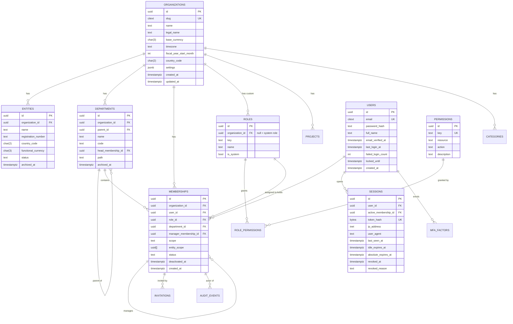
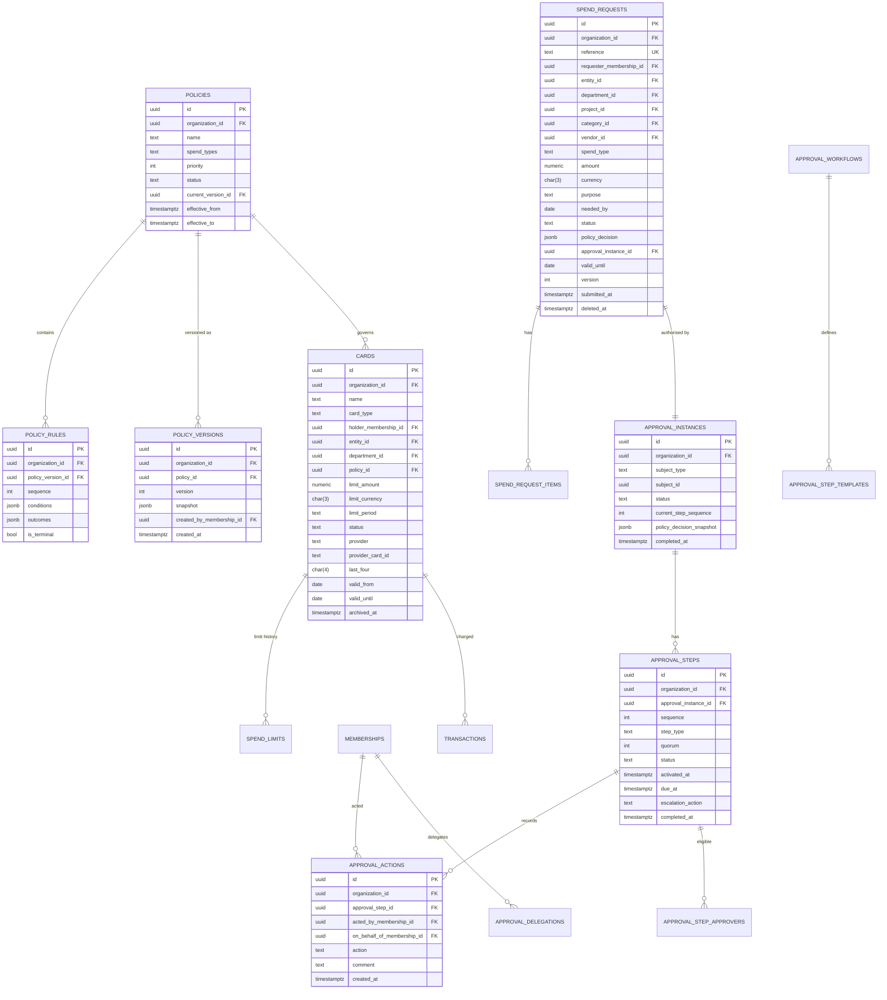
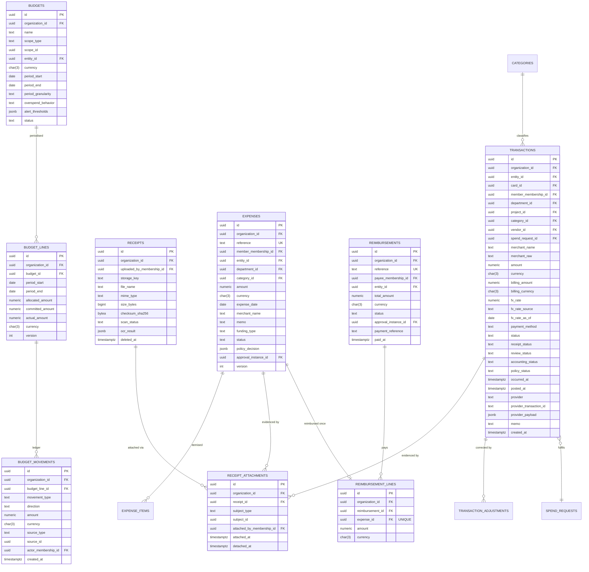
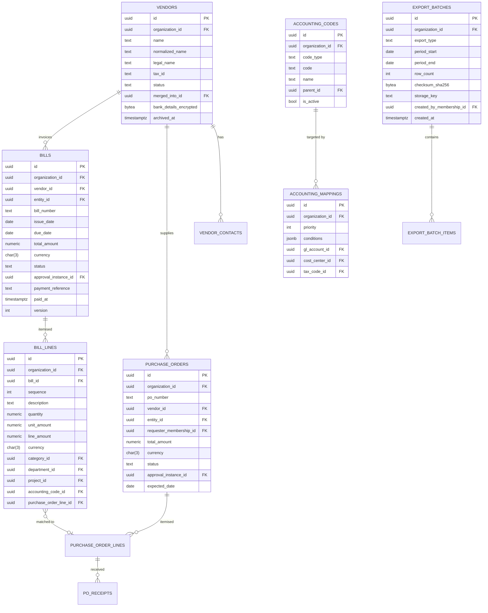
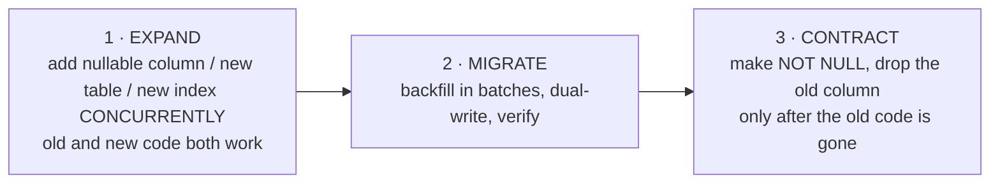

# 09 — Database Design

**Status:** Baseline v1.0 — 2026-08-29
**Engine:** PostgreSQL 16+ (development host runs 18.1)
**ORM:** Prisma 6 — `packages/db/prisma/schema.prisma` is the executable form of this document.

---

## 1. Design rules

These apply to every table without exception. They are what separates this schema from a generic
CRUD schema.

### 1.1 Identity and keys
- Primary keys are **UUID v7** (`uuid` column type), generated in the application. v7 is
  time-ordered, so it indexes like a sequence while remaining non-guessable and safe to expose.
- No natural keys as primary keys. Business identifiers (`bill_number`, `reference`) are unique
  *within an organisation*, never globally.
- Every foreign key is indexed. PostgreSQL does not create these automatically, and their absence
  is the most common cause of slow deletes and lock escalation.

### 1.2 Tenancy
- Every business table carries `organization_id uuid NOT NULL` with an FK to `organizations`.
- The **first column of every composite index is `organization_id`**, so every query is
  tenant-anchored at the index level.
- Cross-tenant foreign keys are structurally impossible: composite foreign keys include
  `organization_id` on both sides wherever a child references a parent, so a row cannot point at
  another organisation's record even if application code tried.
- `users` and `sessions` are the deliberate exceptions — a user is a global identity that may hold
  memberships in several organisations. Tenancy for a user is expressed by `memberships`.

### 1.3 Money
- Every monetary column is `NUMERIC(20,4)`. Never `float`, `double precision`, `real`, or `money`.
- Every monetary column is accompanied by a `*_currency char(3)` column. There is no implicit
  currency anywhere.
- Amounts of different currencies are never summed by any query. Aggregations always group by
  currency, and reporting that needs a single figure uses an explicitly stored conversion rate.
- `CHECK (amount >= 0)` where the domain forbids negatives; sign is carried by an explicit
  `direction` or `type` column rather than by a negative number, so a sign error cannot silently
  invert meaning.

### 1.4 Time
- All timestamps are `timestamptz`, stored in UTC.
- Every table has `created_at timestamptz NOT NULL DEFAULT now()`.
- Mutable tables have `updated_at timestamptz NOT NULL`.
- Business dates that are genuinely dates (invoice date, budget period) are `date`, not
  `timestamptz` — a due date has no timezone.

### 1.5 Deletion
Three tiers, chosen per table and never mixed:

| Tier | Mechanism | Applies to |
|---|---|---|
| **Immutable** | No delete path exists. The DB role has no `DELETE` grant. | `audit_events`, `approval_actions`, `budget_movements`, `security_events`, posted `transactions` |
| **Archive** | `archived_at timestamptz`, excluded by default via repository predicate | `departments`, `entities`, `categories`, `vendors`, `policies`, `cards` |
| **Soft delete** | `deleted_at timestamptz`, hidden everywhere | `spend_requests` (drafts only), `receipts` (unattached only), `notifications` |

Nothing referenced by a financial record is ever hard-deleted.

### 1.6 Immutability of posted records
A posted financial record's amount, currency, and date are immutable. Enforced by:
1. Application state machines that offer no transition to edit them;
2. A **database trigger** on `transactions` that raises when `status = 'POSTED'` and any of
   `amount`, `currency`, `merchant_name`, `occurred_at` changes;
3. Corrections modelled as new linked rows (`adjusts_transaction_id`, credit notes), never edits.

### 1.7 Concurrency
- Optimistic concurrency via a `version int NOT NULL DEFAULT 1` column on records that a user can
  edit from a stale view; a mismatched version returns `409`.
- Pessimistic locking (`SELECT ... FOR UPDATE`) on `budget_lines` and `approval_steps` — the two
  places where a lost update would corrupt a financial figure.

### 1.8 Idempotency
- `idempotency_keys` stores the key, the request fingerprint, and the stored response.
- Provider-sourced records carry `(provider, provider_reference)` under a unique constraint, so a
  replayed webhook cannot create a second row.

---

## 2. ERD — core identity and tenancy



---

## 3. ERD — spend control (policies, approvals, requests, cards)



---

## 4. ERD — financial record (transactions, receipts, expenses, budgets)



---

## 5. ERD — payables and accounting (Phase 5–6)



---

## 6. Table catalogue

Every table, its tenancy, its deletion tier, and its purpose. `org` = carries `organization_id`.

### 6.1 Identity and access

| Table | org | Deletion | Purpose |
|---|:--:|---|---|
| `organizations` | — | archive | The tenant root. |
| `users` | ✗ | archive | Global identity. Email is `citext` and unique globally. |
| `memberships` | ✓ | archive | User ↔ organisation, carrying role, department, manager, and scope. |
| `roles` | ✓ (null for system) | — | Five system roles seeded with `is_system = true`; custom roles Phase 6. |
| `permissions` | ✗ | — | Global catalogue, seeded, `key` unique. |
| `role_permissions` | ✗ | — | Join. |
| `invitations` | ✓ | soft | Hashed token, expiry, single-use, revocable. |
| `sessions` | ✗ (via user) | — | Opaque token hash, idle + absolute expiry, revocation. |
| `mfa_factors` | ✗ | — | TOTP secret (encrypted), backup codes (hashed), enrolment state. |
| `security_events` | ✓ | **immutable** | Login, lockout, privilege change, session revocation. |

### 6.2 Organisation structure

| Table | org | Deletion | Purpose |
|---|:--:|---|---|
| `entities` | ✓ | archive | Legal entities; each has a functional currency. |
| `departments` | ✓ | archive | Tree with `parent_id` and a materialised `path` for subtree queries. |
| `projects` | ✓ | archive | Optional cost dimension. |
| `categories` | ✓ | archive | Spend category tree, seeded with defaults. |

### 6.3 Policy and approval

| Table | org | Deletion | Purpose |
|---|:--:|---|---|
| `policies` | ✓ | archive | Policy header: scope, priority, effective window, current version. |
| `policy_versions` | ✓ | **immutable** | A frozen JSONB snapshot of the rule set. Referenced by decisions. |
| `policy_rules` | ✓ | **immutable** | Rules belong to a version; conditions and outcomes as validated JSONB. |
| `approval_workflows` | ✓ | archive | Reusable named chains referenced by policy outcomes. |
| `approval_step_templates` | ✓ | archive | Step definitions within a workflow. |
| `approval_instances` | ✓ | — | One per approvable subject; polymorphic `(subject_type, subject_id)`. |
| `approval_steps` | ✓ | — | Ordered steps with type, quorum, due date, escalation. |
| `approval_step_approvers` | ✓ | — | Resolved eligible approvers per step. |
| `approval_actions` | ✓ | **immutable** | Every approve/reject/return/delegate, with actor and on-behalf-of. |
| `approval_delegations` | ✓ | — | Time-bounded, non-chaining. |

### 6.4 Spend and cards

| Table | org | Deletion | Purpose |
|---|:--:|---|---|
| `spend_requests` | ✓ | soft (draft only) | The pre-spend authorisation record with its immutable policy decision. |
| `spend_request_items` | ✓ | soft (draft only) | Line items; the header amount is derived from them. |
| `cards` | ✓ | archive | Spend authorisation abstraction. **No PAN, no CVV, no full expiry.** |
| `spend_limits` | ✓ | **immutable** | Limit history; the current limit is the latest effective row. |

### 6.5 Financial record

| Table | org | Deletion | Purpose |
|---|:--:|---|---|
| `transactions` | ✓ | **immutable once POSTED** | The record of money spent. Four independent status axes. |
| `transaction_adjustments` | ✓ | **immutable** | Corrections to posted transactions, as new linked rows. |
| `receipts` | ✓ | soft (unattached only) | Storage key, checksum, scan status, OCR result. |
| `receipt_attachments` | ✓ | — | Attach/detach history; the link, not the file. |
| `expenses` | ✓ | soft (draft only) | Out-of-pocket or card-funded expense claims. |
| `expense_items` | ✓ | soft (draft only) | Itemisation. |
| `reimbursements` | ✓ | — | Payout batches with a server-computed total. |
| `reimbursement_lines` | ✓ | — | `UNIQUE (expense_id)` — the duplicate-payment guarantee. |

### 6.6 Budgets

| Table | org | Deletion | Purpose |
|---|:--:|---|---|
| `budgets` | ✓ | archive | Scope, period, currency, overspend behaviour, alert thresholds. |
| `budget_lines` | ✓ | — | Per-period allocated / committed / actual, materialised, row-locked. |
| `budget_movements` | ✓ | **immutable** | Append-only ledger. The line balance is always `SUM(movements)`. |
| `budget_alerts` | ✓ | — | Threshold fired, once per threshold per period (idempotent). |

### 6.7 Payables (Phase 5)

`vendors`, `vendor_contacts`, `bills`, `bill_lines`, `purchase_orders`, `purchase_order_lines`,
`po_receipts` — all `org`-scoped; bills and POs archive, lines follow their parent.

### 6.8 Accounting (Phase 6)

`accounting_codes`, `accounting_mappings`, `export_batches`, `export_batch_items`,
`reconciliation_statements`, `reconciliation_matches`.

### 6.9 Platform

| Table | org | Deletion | Purpose |
|---|:--:|---|---|
| `audit_events` | ✓ | **immutable, INSERT-only grant** | The complete history. |
| `notifications` | ✓ | soft | In-app notifications with read state. |
| `notification_preferences` | ✓ | — | Per member, per event type, per channel. |
| `idempotency_keys` | ✓ | TTL purge | Key, request fingerprint, stored response, expiry. |
| `job_executions` | ✓ | TTL purge | Job runs, attempts, results, dead-letter state. |
| `provider_accounts` | ✓ | archive | A configured provider instance per port. |
| `integration_connections` | ✓ | archive | Credentials (encrypted), status, last sync. |
| `webhook_events` | ✓ | TTL purge | Raw inbound events with signature verification and replay guard. |

---

## 7. Key column definitions

### 7.1 `audit_events` — the table everything depends on

```sql
CREATE TABLE audit_events (
  id                    uuid PRIMARY KEY,
  organization_id       uuid NOT NULL REFERENCES organizations(id),
  actor_membership_id   uuid     REFERENCES memberships(id),  -- NULL only when actor_type='SYSTEM'
  actor_type            text NOT NULL DEFAULT 'USER',         -- USER | SYSTEM | PROVIDER
  actor_label           text,                                 -- job name or provider name
  action                text NOT NULL,                        -- e.g. 'spend_request.approved'
  resource_type         text NOT NULL,
  resource_id           uuid,
  before                jsonb,
  after                 jsonb,
  metadata              jsonb NOT NULL DEFAULT '{}',
  ip_address            inet,
  user_agent            text,
  correlation_id        uuid NOT NULL,
  created_at            timestamptz NOT NULL DEFAULT now(),

  CONSTRAINT audit_actor_present CHECK (
    actor_type <> 'USER' OR actor_membership_id IS NOT NULL
  )
);

CREATE INDEX idx_audit_org_created   ON audit_events (organization_id, created_at DESC);
CREATE INDEX idx_audit_org_resource  ON audit_events (organization_id, resource_type, resource_id, created_at DESC);
CREATE INDEX idx_audit_org_actor     ON audit_events (organization_id, actor_membership_id, created_at DESC);
CREATE INDEX idx_audit_org_action    ON audit_events (organization_id, action, created_at DESC);

REVOKE UPDATE, DELETE ON audit_events FROM financy_app;
```

The `CHECK` constraint is the point: an audit event with a user action and no actor is rejected by
the database, so "we lost track of who did it" is not a reachable state.

### 7.2 `transactions` — constraints that matter

```sql
ALTER TABLE transactions
  ADD CONSTRAINT uq_txn_provider_ref
    UNIQUE (organization_id, provider, provider_transaction_id),
  ADD CONSTRAINT ck_txn_amount_scale
    CHECK (scale(amount) <= 4),
  ADD CONSTRAINT ck_txn_currency
    CHECK (currency ~ '^[A-Z]{3}$'),
  ADD CONSTRAINT ck_txn_fx_complete
    CHECK ((fx_rate IS NULL) = (fx_rate_source IS NULL)
       AND (fx_rate IS NULL) = (fx_rate_as_of IS NULL));

CREATE INDEX idx_txn_org_occurred   ON transactions (organization_id, occurred_at DESC);
CREATE INDEX idx_txn_org_review     ON transactions (organization_id, review_status)
                                     WHERE review_status <> 'REVIEWED';
CREATE INDEX idx_txn_org_receipt    ON transactions (organization_id, receipt_status)
                                     WHERE receipt_status IN ('MISSING','REQUESTED');
CREATE INDEX idx_txn_org_dept_date  ON transactions (organization_id, department_id, occurred_at DESC);
CREATE INDEX idx_txn_org_cat_date   ON transactions (organization_id, category_id, occurred_at DESC);
CREATE INDEX idx_txn_org_card       ON transactions (organization_id, card_id, occurred_at DESC);
CREATE INDEX idx_txn_merchant_trgm  ON transactions USING gin (merchant_name gin_trgm_ops);
```

The partial indexes on `review_status` and `receipt_status` are deliberate: the finance review
queue only ever asks for the incomplete rows, and those are a small and shrinking fraction of a
large table.

**The immutability trigger:**

```sql
CREATE FUNCTION enforce_posted_transaction_immutability() RETURNS trigger AS $$
BEGIN
  IF OLD.status = 'POSTED' AND (
       NEW.amount        IS DISTINCT FROM OLD.amount OR
       NEW.currency      IS DISTINCT FROM OLD.currency OR
       NEW.occurred_at   IS DISTINCT FROM OLD.occurred_at OR
       NEW.merchant_name IS DISTINCT FROM OLD.merchant_name
     ) THEN
    RAISE EXCEPTION 'POSTED_RECORD_IMMUTABLE: transaction % financial fields are immutable', OLD.id
      USING ERRCODE = 'check_violation';
  END IF;
  RETURN NEW;
END; $$ LANGUAGE plpgsql;

CREATE TRIGGER trg_txn_immutable BEFORE UPDATE ON transactions
  FOR EACH ROW EXECUTE FUNCTION enforce_posted_transaction_immutability();
```

Status, categorisation, review, and accounting columns remain mutable — those are *about* the
transaction, not the money itself.

### 7.3 `budget_lines` and `budget_movements`

```sql
CREATE TABLE budget_movements (
  id                uuid PRIMARY KEY,
  organization_id   uuid NOT NULL,
  budget_line_id    uuid NOT NULL REFERENCES budget_lines(id),
  movement_type     text NOT NULL,   -- COMMITMENT | ACTUAL | RELEASE | ADJUSTMENT
  direction         text NOT NULL,   -- INCREASE | DECREASE
  amount            numeric(20,4) NOT NULL CHECK (amount > 0),
  currency          char(3) NOT NULL,
  source_type       text NOT NULL,   -- SPEND_REQUEST | TRANSACTION | EXPENSE | BILL | PO | MANUAL
  source_id         uuid NOT NULL,
  actor_membership_id uuid REFERENCES memberships(id),
  created_at        timestamptz NOT NULL DEFAULT now()
);

-- One commitment per source, and one release per source. Prevents double-commit on retry.
CREATE UNIQUE INDEX uq_budget_movement_source
  ON budget_movements (budget_line_id, source_type, source_id, movement_type);

CREATE INDEX idx_budget_movement_line ON budget_movements (organization_id, budget_line_id, created_at);
```

Amount is always positive; `direction` carries the sign. This means a sign bug produces a
constraint violation rather than a silently wrong balance.

**The write path**, in one transaction, always:

```sql
BEGIN;
  SELECT * FROM budget_lines WHERE id = $1 FOR UPDATE;   -- serialise
  INSERT INTO budget_movements (...);                     -- append (unique index blocks replays)
  UPDATE budget_lines
     SET committed_amount = committed_amount + $2,
         version = version + 1
   WHERE id = $1;
  INSERT INTO audit_events (...);
COMMIT;
```

**Invariant test (runs in CI):** for every budget line,
`allocated − SUM(signed movements) = remaining`, and the materialised `committed_amount` and
`actual_amount` equal the sum of their movements. Any drift is a failing build.

### 7.4 `reimbursement_lines` — the duplicate guarantee

```sql
ALTER TABLE reimbursement_lines
  ADD CONSTRAINT uq_reimbursement_expense UNIQUE (expense_id);
```

One line. Two concurrent requests to reimburse the same expense: one commits, the other receives
a unique-violation which the service maps to `409 EXPENSE_ALREADY_REIMBURSED`. No application
check can offer that guarantee, because any check-then-write has a window.

### 7.5 Cross-tenant foreign keys are impossible

```sql
-- Parent exposes a composite candidate key…
ALTER TABLE departments ADD CONSTRAINT uq_dept_org UNIQUE (id, organization_id);

-- …and the child references it, carrying its own organization_id.
ALTER TABLE spend_requests
  ADD CONSTRAINT fk_spend_dept
  FOREIGN KEY (department_id, organization_id)
  REFERENCES departments (id, organization_id);
```

Applied to every tenant-scoped parent/child pair. A spend request in organisation A physically
cannot reference a department in organisation B, regardless of what the application does. This is
the cheapest and strongest tenant control in the schema.

---

## 8. Row-level security (Phase 6)

```sql
ALTER TABLE transactions ENABLE ROW LEVEL SECURITY;
ALTER TABLE transactions FORCE ROW LEVEL SECURITY;

CREATE POLICY tenant_isolation ON transactions
  USING (organization_id = current_setting('app.current_organization_id', true)::uuid);
```

The application sets `app.current_organization_id` once per connection checkout, from the
authenticated membership. Applied to every tenant-scoped table.

RLS is Phase 6 rather than Phase 1 because it must not be the *first* line of defence — if it
were, a missing `SET` would silently return zero rows and look like a data bug. It is added once
Layers 1 and 2 are proven, as the layer that survives an application defect.

---

## 9. Indexing strategy

1. Every foreign key gets an index.
2. Every composite index starts with `organization_id`.
3. Sort keys are included in the index in the queried direction (`created_at DESC`).
4. Partial indexes for queue-shaped queries (unreviewed, missing receipt, pending approval,
   unexported) — small, hot, and cheap to maintain.
5. `pg_trgm` GIN indexes for merchant and vendor name search.
6. GIN on `jsonb` only where it is actually queried (`policy_decision`, `provider_payload`).
7. Covering indexes only after measurement, never speculatively.
8. CI runs `EXPLAIN` assertions on every list endpoint's primary query and fails on a sequential
   scan of a table seeded past 10,000 rows.

---

## 10. Migration strategy

**Tooling.** Prisma Migrate. `prisma db push` is forbidden outside a throwaway database — every
schema change is a checked-in, reviewed, ordered SQL file.

**Expand/contract, always.** Deploys must be zero-downtime and rollback-safe, so a breaking change
is always three deploys:



**Rules**

- Never rename a column in one step — add, backfill, switch reads, drop.
- Never add a `NOT NULL` column without a default to a populated table.
- Always build indexes `CONCURRENTLY` on tables over 100,000 rows.
- Backfills run in bounded batches with a sleep, never as one statement holding a long lock.
- Every migration is tested against a restored copy of production-shaped data before release.
- Destructive migrations require an explicit approval note in the pull request.
- Migrations run as a separate deploy step before the application rolls, never on process start.

**Rollback.** Forward-only in production. A bad migration is corrected by a new migration. Down
migrations exist for local development only, where losing data is acceptable.

**Seeds.** Two, kept strictly separate:
- `seed:system` — permissions, system roles, default categories. **Idempotent**, run in every
  environment including production.
- `seed:demo` — a realistic demo organisation with people, policies, transactions, and budgets.
  Never run outside local and development.

---

## 11. Extensions required

| Extension | Used for |
|---|---|
| `pgcrypto` | `gen_random_uuid()` fallback, digest functions |
| `citext` | Case-insensitive email and slug |
| `pg_trgm` | Fuzzy merchant and vendor search |
| `btree_gin` | Composite GIN indexes mixing scalar and JSONB |

---

## 12. Capacity and growth

| Table | Rows / 1,000-person org / year | Strategy |
|---|---|---|
| `transactions` | ~250,000 | Partition by `occurred_at` (monthly) past 50 M rows |
| `audit_events` | ~2,000,000 | Partition by `created_at` (monthly); archive to cold storage after 2 years, retain 7 |
| `notifications` | ~500,000 | Purge read notifications after 1 year |
| `budget_movements` | ~500,000 | Retain fully — it is the ledger |
| `sessions` | ~200,000 | Purge 90 days after expiry |
| `idempotency_keys` | ~1,000,000 | TTL purge at 24 hours |
| `webhook_events` | ~500,000 | TTL purge at 30 days after processing |

Partitioning is designed for now and enabled later; the partition key is already the leading
column of the relevant indexes, so switching requires no application change.
