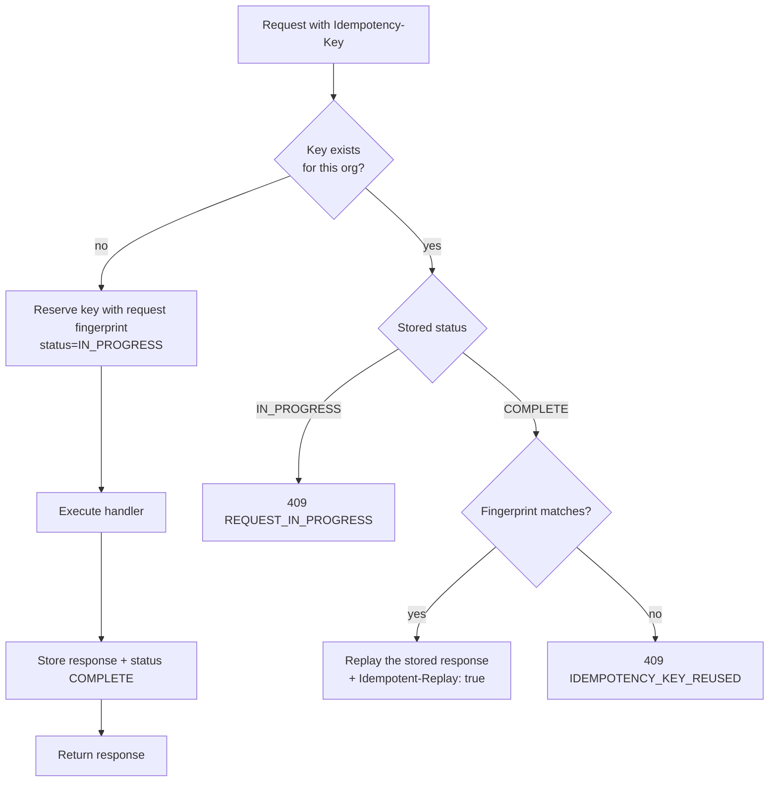

# 10 — API Specification

**Status:** Baseline v1.0 — 2026-08-29
**Base URL:** `/v1` · **Executable form:** `packages/contracts` (Zod schemas) and the generated
OpenAPI document at `/v1/openapi.json`.

---

## 1. Principles

1. **REST over HTTP/JSON**, versioned in the path. `/v1` is a stability contract: no breaking
   change ships inside a version.
2. **The server is authoritative.** Amounts, totals, statuses, permissions, and policy verdicts
   are computed or verified server-side. A client-supplied total is _ignored_, not validated —
   validation would imply the client's figure could ever be used.
3. **`organizationId` is never accepted from the client.** It is resolved from the session's
   membership. If a body or query contains one that disagrees, the request is rejected.
4. **Every mutation is authorised, validated, and audited.** No exceptions, no "internal"
   endpoints exempted.
5. **Every collection is paginated.** There is no unbounded list endpoint.
6. **Errors are machine-readable.** A stable `code`, a human `message`, and a `correlationId`.
7. **Retries are safe.** Every non-`GET` endpoint accepts `Idempotency-Key`.

---

## 2. Conventions

### 2.1 Request headers

| Header                           | Required                          | Purpose                          |
| -------------------------------- | --------------------------------- | -------------------------------- |
| `Cookie: financy_session=…`      | Yes (authenticated routes)        | Opaque session token             |
| `Content-Type: application/json` | On body requests                  | —                                |
| `Idempotency-Key`                | Recommended on all non-`GET`      | UUID; 24-hour retention          |
| `X-Correlation-Id`               | Optional                          | Echoed back; generated if absent |
| `If-Match`                       | On optimistic-concurrency updates | Record `version`                 |

Cookie auth is used because the browser is the primary client and `httpOnly` cookies remove the
XSS token-theft class entirely. CSRF is handled by `SameSite=Lax` plus an `Origin` check on all
state-changing requests. A bearer-token scheme for machine clients arrives with the public API in
Phase 7.

### 2.2 Money in JSON

```jsonc
{ "amount": "2400.0000", "currency": "USD" }
```

**Always a string.** IEEE-754 doubles cannot represent every decimal value exactly, and
`JSON.parse` produces doubles. A monetary value is never a JSON number anywhere in this API —
request or response.

### 2.3 Timestamps

ISO-8601 with an explicit offset, always UTC: `2026-08-29T14:32:11.482Z`. Date-only fields
(`dueDate`, `periodStart`) are `YYYY-MM-DD` with no timezone.

### 2.4 Naming

`camelCase` in JSON, `snake_case` in the database, mapped by Prisma. Collections are plural
nouns. Non-CRUD operations are sub-resources or explicit actions:
`POST /v1/approvals/{stepId}/approve`, not `PATCH` with a magic status.

### 2.5 Pagination

**Cursor** (default for large or append-heavy collections — transactions, audit events,
notifications):

```http
GET /v1/transactions?limit=50&cursor=eyJpZCI6IjAxOTIu…
```

```jsonc
{
  "data": [/* … */],
  "pagination": { "nextCursor": "eyJpZCI6…", "hasMore": true, "limit": 50 },
}
```

**Offset** (small bounded collections — departments, entities, roles):

```jsonc
{
  "data": [/* … */],
  "pagination": { "page": 1, "pageSize": 50, "totalCount": 137, "totalPages": 3 },
}
```

`limit` maximum is 200. A larger value is clamped, not rejected.

### 2.6 Filtering and sorting

| Pattern          | Example                                          |
| ---------------- | ------------------------------------------------ |
| Equality         | `?status=PENDING_APPROVAL`                       |
| Multi-value (OR) | `?status=APPROVED&status=FULFILLED`              |
| Range            | `?amountMin=100&amountMax=5000`                  |
| Date range       | `?occurredFrom=2026-08-01&occurredTo=2026-08-31` |
| Search           | `?q=acme`                                        |
| Sort             | `?sort=occurredAt:desc`                          |
| Field selection  | `?fields=id,amount,merchantName`                 |

Filters are declared per endpoint in `packages/contracts`; an unknown filter parameter is a
`422`, not silently ignored — silent ignoring is how a user ends up trusting an unfiltered export.

### 2.7 Idempotency



The fingerprint is a hash of method, path, and canonicalised body. Keys are scoped to the
organisation and retained 24 hours.

### 2.8 Optimistic concurrency

Mutable records return a `version`. Updates send `If-Match: <version>`. A mismatch returns `409
STALE_VERSION` with the current representation, so the client can show a real diff rather than a
generic "try again".

---

## 3. Response envelopes

**Single resource**

```jsonc
{ "data": { "id": "0192…", "…": "…" }, "meta": { "correlationId": "…" } }
```

**Collection**

```jsonc
{ "data": [/* … */], "pagination": {/* … */}, "meta": { "correlationId": "…" } }
```

**Error**

```jsonc
{
  "error": {
    "code": "VALIDATION_FAILED",
    "message": "The request could not be processed.",
    "details": {
      "fields": {
        "amount": ["must be greater than 0"],
        "currency": ["must be a valid ISO-4217 code"],
      },
    },
    "correlationId": "8b1c…",
  },
}
```

---

## 4. Authentication and authorisation

Every route declares its requirement in code, and a test enumerates the Nest route table to assert
that **no route is missing a declaration** — including one added tomorrow by someone who forgot.

```typescript
@Post()
@RequirePermission('spend_request:create')
@Scoped(ScopeStrategy.SELF)
@Audited('spend_request.submitted')
@Idempotent()
create(@Body() dto: CreateSpendRequestDto) { /* … */ }
```

| Decorator                 | Effect                                                                                             |
| ------------------------- | -------------------------------------------------------------------------------------------------- |
| `@Public()`               | No session required (login, register, accept invitation). Explicit — the default is authenticated. |
| `@RequirePermission(...)` | Permission must be present on the membership's role.                                               |
| `@Scoped(strategy)`       | Attaches the mandatory row-scope predicate.                                                        |
| `@RequireStepUp()`        | Re-authentication within 5 minutes for high-risk actions.                                          |
| `@Audited(action)`        | Audit event emitted within the handler's transaction.                                              |
| `@Idempotent()`           | Enables the idempotency interceptor.                                                               |
| `@RateLimit(n, window)`   | Per-endpoint limit.                                                                                |

---

## 5. Endpoint catalogue

`Auth` column: `—` public · `S` session required. `Perm` is the required permission.

### 5.1 Authentication — `/v1/auth`

| Method | Path                        | Auth | Perm | Notes                                                                                             |
| ------ | --------------------------- | :--: | ---- | ------------------------------------------------------------------------------------------------- |
| POST   | `/auth/register`            |  —   | —    | Creates org + user + `ORG_ADMIN` membership + default entity, atomically. Rate-limited 3/hour/IP. |
| POST   | `/auth/login`               |  —   | —    | 5/15 min per IP+email. Returns session cookie or `MFA_REQUIRED`.                                  |
| POST   | `/auth/mfa/verify`          |  —   | —    | Completes an MFA challenge.                                                                       |
| POST   | `/auth/logout`              |  S   | —    | Revokes the current session.                                                                      |
| GET    | `/auth/session`             |  S   | —    | Current user, membership, role, **resolved permission set**, scope.                               |
| POST   | `/auth/session/switch`      |  S   | —    | Switch active organisation; resets scoped state.                                                  |
| GET    | `/auth/sessions`            |  S   | —    | The caller's own active sessions.                                                                 |
| DELETE | `/auth/sessions/{id}`       |  S   | —    | Revoke one.                                                                                       |
| DELETE | `/auth/sessions`            |  S   | —    | Revoke all others.                                                                                |
| POST   | `/auth/password/forgot`     |  —   | —    | Always `202`, regardless of account existence.                                                    |
| POST   | `/auth/password/reset`      |  —   | —    | Single-use token; revokes all sessions.                                                           |
| POST   | `/auth/password/change`     |  S   | —    | Requires the current password; revokes other sessions.                                            |
| POST   | `/auth/invitations/accept`  |  —   | —    | Token + (password if new user).                                                                   |
| GET    | `/auth/invitations/{token}` |  —   | —    | Validity check for the acceptance screen. Returns no PII beyond org name.                         |

### 5.2 Organisation — `/v1/organization`, `/v1/entities`, `/v1/departments`, `/v1/projects`, `/v1/categories`

| Method         | Path                                             | Perm                                    |
| -------------- | ------------------------------------------------ | --------------------------------------- |
| GET            | `/organization`                                  | `organization:read`                     |
| PATCH          | `/organization`                                  | `organization:update`                   |
| GET/POST       | `/entities`                                      | `entity:read` / `entity:manage`         |
| GET/PATCH/POST | `/entities/{id}`, `/entities/{id}/archive`       | `entity:read` / `entity:manage`         |
| GET/POST       | `/departments`                                   | `department:read` / `department:manage` |
| GET            | `/departments/tree`                              | `department:read`                       |
| GET/PATCH/POST | `/departments/{id}`, `/departments/{id}/archive` | `department:read` / `department:manage` |
| GET/POST/PATCH | `/projects`, `/projects/{id}`                    | `department:read` / `department:manage` |
| GET/POST/PATCH | `/categories`, `/categories/{id}`                | `policy:read` / `policy:manage`         |

`PATCH /organization` rejects a `baseCurrency` change once any financial record exists →
`409 CURRENCY_LOCKED`.

### 5.3 People — `/v1/memberships`

| Method   | Path                                   | Perm                        | Notes                                                  |
| -------- | -------------------------------------- | --------------------------- | ------------------------------------------------------ |
| GET      | `/memberships`                         | `user:read`                 | Filters: role, department, status, `q`. Scope-limited. |
| GET      | `/memberships/{id}`                    | `user:read`                 |                                                        |
| PATCH    | `/memberships/{id}`                    | `user:update`               | Department, manager, entity scope.                     |
| POST     | `/memberships/{id}/role`               | `membership:manage_role`    | **Step-up required.** Enforces INV-03 and INV-04.      |
| POST     | `/memberships/{id}/deactivate`         | `user:deactivate`           | Revokes sessions; reassigns pending steps.             |
| POST     | `/memberships/{id}/reactivate`         | `user:update`               |                                                        |
| GET      | `/memberships/{id}/sessions`           | `session:revoke_any`        |                                                        |
| DELETE   | `/memberships/{id}/sessions`           | `session:revoke_any`        | **Step-up required.**                                  |
| GET/POST | `/memberships/invitations`             | `user:read` / `user:invite` |                                                        |
| DELETE   | `/memberships/invitations/{id}`        | `user:invite`               | Revoke.                                                |
| POST     | `/memberships/invitations/{id}/resend` | `user:invite`               | Rate-limited 3/day.                                    |
| GET      | `/roles` · `/permissions`              | `user:read`                 | The catalogue, for the invite UI.                      |

### 5.4 Policies — `/v1/policies`

| Method | Path                      | Perm            | Notes                                                                            |
| ------ | ------------------------- | --------------- | -------------------------------------------------------------------------------- |
| GET    | `/policies`               | `policy:read`   |                                                                                  |
| POST   | `/policies`               | `policy:manage` | Creates version 1.                                                               |
| GET    | `/policies/{id}`          | `policy:read`   | Includes the current version's rules.                                            |
| PATCH  | `/policies/{id}`          | `policy:manage` | Header only (name, priority, status, window).                                    |
| POST   | `/policies/{id}/versions` | `policy:manage` | New immutable version.                                                           |
| GET    | `/policies/{id}/versions` | `policy:read`   |                                                                                  |
| POST   | `/policies/simulate`      | `policy:read`   | Evaluate a hypothetical context. Persists nothing.                               |
| POST   | `/policies/{id}/backtest` | `policy:manage` | Run a draft version against historical records; returns what would have changed. |
| POST   | `/policies/{id}/archive`  | `policy:manage` |                                                                                  |

### 5.5 Spend requests — `/v1/spend-requests`

| Method | Path                          | Perm                   | Notes                                                   |
| ------ | ----------------------------- | ---------------------- | ------------------------------------------------------- |
| GET    | `/spend-requests`             | `spend_request:read`   | Scope-limited. Filter `awaitingMyApproval=true`.        |
| POST   | `/spend-requests`             | `spend_request:create` | Idempotent. Creates a draft or submits directly.        |
| POST   | `/spend-requests/evaluate`    | `spend_request:create` | **Dry run.** Returns verdict + chain. Persists nothing. |
| GET    | `/spend-requests/{id}`        | `spend_request:read`   | Includes decision, chain, budget impact.                |
| PATCH  | `/spend-requests/{id}`        | `spend_request:update` | `DRAFT`/`CHANGES_REQUESTED` only. `If-Match`.           |
| POST   | `/spend-requests/{id}/submit` | `spend_request:create` | Authoritative evaluation. Idempotent.                   |
| POST   | `/spend-requests/{id}/cancel` | `spend_request:cancel` |                                                         |
| DELETE | `/spend-requests/{id}`        | `spend_request:update` | Drafts only; soft delete.                               |
| GET    | `/spend-requests/{id}/audit`  | `spend_request:read`   |                                                         |

`POST /spend-requests` request body — note what is **absent**:

```jsonc
{
  "entityId": "…",
  "departmentId": "…",
  "categoryId": "…",
  "projectId": null,
  "vendorId": null,
  "merchantName": "Acme Software",
  "amount": "2400.0000",
  "currency": "USD",
  "purpose": "Annual licence renewal for the design team",
  "neededBy": "2026-09-15",
  "items": [
    { "description": "Design suite, 12 seats", "quantity": "12", "unitAmount": "200.0000" },
  ],
  "submit": true,
}
```

There is no `total` field. The header amount is validated against the sum of `items` computed
**by the server**; a mismatch is `422 AMOUNT_MISMATCH`. There is no `status`, no `policyVerdict`,
and no `approvers` field — those are outputs, and accepting them as inputs would be the
vulnerability.

### 5.6 Approvals — `/v1/approvals`

| Method   | Path                                 | Perm                | Notes                                                  |
| -------- | ------------------------------------ | ------------------- | ------------------------------------------------------ |
| GET      | `/approvals/queue`                   | `approval:read`     | Steps the caller may action, across all subject types. |
| GET      | `/approvals/instances/{id}`          | `approval:read`     | Full chain with every action.                          |
| POST     | `/approvals/steps/{id}/approve`      | `approval:act`      | Idempotent. Enforces INV-02.                           |
| POST     | `/approvals/steps/{id}/reject`       | `approval:act`      | `reason` required.                                     |
| POST     | `/approvals/steps/{id}/return`       | `approval:act`      | `comment` required.                                    |
| POST     | `/approvals/steps/{id}/delegate`     | `approval:delegate` |                                                        |
| POST     | `/approvals/instances/{id}/override` | `approval:override` | **Step-up + mandatory reason.**                        |
| GET/POST | `/approvals/delegations`             | `approval:delegate` |                                                        |
| DELETE   | `/approvals/delegations/{id}`        | `approval:delegate` |                                                        |

### 5.7 Cards — `/v1/cards`

| Method | Path                           | Perm                | Notes                                        |
| ------ | ------------------------------ | ------------------- | -------------------------------------------- |
| GET    | `/cards`                       | `card:read`         | Scope-limited. Never returns a PAN.          |
| POST   | `/cards`                       | `card:create`       | Idempotent. Goes through `CardProvider`.     |
| GET    | `/cards/{id}`                  | `card:read`         | `provider`, `lastFour`, `isSandbox` present. |
| PATCH  | `/cards/{id}`                  | `card:update_limit` | Limit change → new `spend_limits` row.       |
| POST   | `/cards/{id}/lock` · `/unlock` | `card:lock`         |                                              |
| POST   | `/cards/{id}/terminate`        | `card:terminate`    | **Step-up.** Irreversible.                   |
| GET    | `/cards/{id}/transactions`     | `transaction:read`  |                                              |
| GET    | `/cards/{id}/limits`           | `card:read`         | Limit history.                               |

Every card response carries `"isSandbox": true` while a mock provider is configured. The UI
renders a sandbox badge from it. This is a product rule, not a debug affordance.

### 5.8 Transactions — `/v1/transactions`

| Method | Path                             | Perm                     | Notes                                                                                           |
| ------ | -------------------------------- | ------------------------ | ----------------------------------------------------------------------------------------------- |
| GET    | `/transactions`                  | `transaction:read`       | Cursor-paginated. The full filter set.                                                          |
| GET    | `/transactions/{id}`             | `transaction:read`       |                                                                                                 |
| PATCH  | `/transactions/{id}`             | `transaction:categorize` | **Only** category, project, memo, department. Financial fields → `409 POSTED_RECORD_IMMUTABLE`. |
| POST   | `/transactions/{id}/review`      | `transaction:review`     |                                                                                                 |
| POST   | `/transactions/{id}/exception`   | `transaction:review`     | Flag with a reason.                                                                             |
| POST   | `/transactions/{id}/match`       | `transaction:review`     | Link to a spend request.                                                                        |
| POST   | `/transactions/{id}/adjustments` | `transaction:review`     | The only way to correct a posted amount.                                                        |
| POST   | `/transactions/import`           | `transaction:import`     | Multipart CSV. Idempotent. Per-row results.                                                     |
| POST   | `/transactions/bulk/categorize`  | `transaction:categorize` | Per-row permission check.                                                                       |
| POST   | `/transactions/bulk/review`      | `transaction:review`     |                                                                                                 |
| GET    | `/transactions/export`           | `report:export`          | Honours filters + scope. Audited.                                                               |

### 5.9 Receipts — `/v1/receipts`

| Method | Path                      | Perm             | Notes                                                    |
| ------ | ------------------------- | ---------------- | -------------------------------------------------------- |
| POST   | `/receipts/upload-intent` | `receipt:upload` | Returns a 15-minute signed upload URL + receipt id.      |
| POST   | `/receipts/{id}/complete` | `receipt:upload` | Server-side magic-byte validation; queues scan.          |
| GET    | `/receipts/{id}`          | `receipt:read`   | Metadata only.                                           |
| GET    | `/receipts/{id}/download` | `receipt:read`   | Fresh short-TTL signed URL after an authorisation check. |
| POST   | `/receipts/{id}/attach`   | `receipt:upload` | To a transaction or expense.                             |
| POST   | `/receipts/{id}/detach`   | `receipt:upload` | History preserved.                                       |
| DELETE | `/receipts/{id}`          | `receipt:delete` | Unattached only.                                         |

### 5.10 Expenses and reimbursements — `/v1/expenses`, `/v1/reimbursements`

| Method    | Path                             | Perm                                          |
| --------- | -------------------------------- | --------------------------------------------- |
| GET/POST  | `/expenses`                      | `expense:read` / `expense:create`             |
| GET/PATCH | `/expenses/{id}`                 | `expense:read` / `expense:create` (own draft) |
| POST      | `/expenses/{id}/submit`          | `expense:create`                              |
| POST      | `/expenses/{id}/cancel`          | `expense:create`                              |
| GET/POST  | `/reimbursements`                | `reimbursement:read` / `reimbursement:create` |
| GET       | `/reimbursements/{id}`           | `reimbursement:read`                          |
| POST      | `/reimbursements/{id}/submit`    | `reimbursement:create`                        |
| POST      | `/reimbursements/{id}/mark-paid` | `reimbursement:mark_paid`                     |

`POST /reimbursements` takes `expenseIds[]` and computes the total server-side. A duplicated
expense yields `409 EXPENSE_ALREADY_REIMBURSED` from the unique constraint.

### 5.11 Budgets — `/v1/budgets`

| Method    | Path                           | Perm                            |
| --------- | ------------------------------ | ------------------------------- |
| GET/POST  | `/budgets`                     | `budget:read` / `budget:manage` |
| GET/PATCH | `/budgets/{id}`                | `budget:read` / `budget:manage` |
| GET       | `/budgets/{id}/lines`          | `budget:read`                   |
| GET       | `/budgets/{id}/movements`      | `budget:read`                   |
| GET       | `/budgets/{id}/utilization`    | `budget:read`                   |
| PATCH     | `/budgets/{id}/lines/{lineId}` | `budget:manage`                 |

### 5.12 Reports — `/v1/reports`

| Method | Path                                                       | Perm            | Notes                               |
| ------ | ---------------------------------------------------------- | --------------- | ----------------------------------- |
| GET    | `/reports`                                                 | `report:read`   | The registry of available reports.  |
| GET    | `/reports/{reportKey}`                                     | `report:read`   | Shared filter model; scope-limited. |
| GET    | `/reports/{reportKey}/export`                              | `report:export` | Audited. Queued above 5,000 rows.   |
| GET    | `/dashboard/summary`                                       | _(membership)_  | Role-aware KPI aggregates.          |
| GET    | `/dashboard/spend-trend` · `/budget-status` · `/attention` | _(membership)_  |                                     |

### 5.13 Vendors, bills, procurement (Phase 5) · Accounting (Phase 6)

`/vendors`, `/vendors/{id}`, `/vendors/{id}/merge`;
`/bills`, `/bills/{id}`, `/bills/{id}/submit|approve|mark-paid|credit-notes`;
`/purchase-orders`, `/purchase-orders/{id}`, `/purchase-orders/{id}/submit|receive|close`;
`/accounting/codes`, `/accounting/mappings`, `/accounting/mappings/test`,
`/accounting/exports`, `/accounting/exports/{id}/download`, `/accounting/unmapped`.

Approval endpoints for bills and POs are **the shared `/v1/approvals/*` routes**. There is no
`/bills/{id}/approvals` — that would be a second approval implementation.

### 5.14 Audit, notifications, platform

| Method    | Path                                                   | Perm                    |
| --------- | ------------------------------------------------------ | ----------------------- |
| GET       | `/audit-events`                                        | `audit_event:read`      |
| GET       | `/audit-events/{id}`                                   | `audit_event:read`      |
| GET       | `/audit-events/export`                                 | `audit_event:export`    |
| GET       | `/security-events`                                     | `security_event:read`   |
| GET       | `/notifications`                                       | `notification:read_own` |
| POST      | `/notifications/{id}/read` · `/notifications/read-all` | `notification:read_own` |
| GET/PATCH | `/notifications/preferences`                           | `notification:read_own` |
| GET       | `/health/live` · `/health/ready`                       | —                       |
| GET       | `/openapi.json`                                        | —                       |

`audit-events` supports **no** `POST`, `PATCH`, `PUT`, or `DELETE`. The absence is the control.

### 5.15 Webhooks — `/v1/webhooks/{provider}`

| Method | Path                   | Auth                                       |
| ------ | ---------------------- | ------------------------------------------ |
| POST   | `/webhooks/{provider}` | HMAC signature verification, not a session |

Processing rules: verify the signature before parsing; reject a timestamp outside a 5-minute
window (replay defence); persist the raw event with a unique `(provider, provider_event_id)`;
return `202` immediately and process asynchronously; a duplicate event id is a `200` no-op.

---

## 6. Error codes

Stable, machine-readable, and part of the public contract.

| Code                                  |   HTTP    | Meaning                                                           |
| ------------------------------------- | :-------: | ----------------------------------------------------------------- |
| `UNAUTHENTICATED`                     |    401    | No valid session.                                                 |
| `SESSION_EXPIRED`                     |    401    | Session idle or absolute expiry reached.                          |
| `MFA_REQUIRED`                        |    401    | Second factor needed to complete login.                           |
| `STEP_UP_REQUIRED`                    |    403    | Re-authentication required for this action.                       |
| `FORBIDDEN`                           |    403    | Permission absent.                                                |
| `SELF_APPROVAL_FORBIDDEN`             |    403    | INV-02.                                                           |
| `SELF_ELEVATION_FORBIDDEN`            |    403    | INV-03.                                                           |
| `AUDITOR_READ_ONLY`                   |    403    | INV-05.                                                           |
| `RESOURCE_NOT_FOUND`                  |    404    | Also returned for cross-tenant access.                            |
| `VALIDATION_FAILED`                   |    422    | Field-keyed error map in `details.fields`.                        |
| `AMOUNT_MISMATCH`                     |    422    | Header amount does not equal the server-computed line total.      |
| `CURRENCY_MISMATCH`                   |    422    | Operation would combine differing currencies.                     |
| `INVALID_FILE`                        |    422    | Upload failed content validation.                                 |
| `INVALID_STATE_TRANSITION`            |    409    | Names `currentState` and `attemptedState` in `details`.           |
| `POSTED_RECORD_IMMUTABLE`             |    409    | Attempt to edit a posted financial value.                         |
| `STALE_VERSION`                       |    409    | `If-Match` mismatch; current representation returned.             |
| `IDEMPOTENCY_KEY_REUSED`              |    409    | Same key, different payload.                                      |
| `REQUEST_IN_PROGRESS`                 |    409    | Same key, still executing.                                        |
| `STEP_NOT_ACTIONABLE`                 |    409    | Step already decided or not yet active.                           |
| `EXPENSE_ALREADY_REIMBURSED`          |    409    | Unique-constraint guarantee.                                      |
| `BUDGET_EXCEEDED`                     |    409    | Budget behaviour is `BLOCK`.                                      |
| `LAST_ADMIN`                          |    409    | INV-04.                                                           |
| `CURRENCY_LOCKED`                     |    409    | Base currency change after financial records exist.               |
| `MEMBERSHIP_EXISTS`                   |    409    | Already a member of this organisation.                            |
| `POLICY_BLOCKED`                      |    409    | Policy verdict is `BLOCK`; `details.matchedRules` explains why.   |
| `RATE_LIMITED`                        |    429    | With `Retry-After`.                                               |
| `PROVIDER_ERROR` / `PROVIDER_TIMEOUT` | 502 / 504 | Upstream provider.                                                |
| `INTERNAL_ERROR`                      |    500    | Generic. Never leaks internals; the correlation ID is the handle. |

**`404` versus `403`.** A record in another organisation returns `404 RESOURCE_NOT_FOUND`. A `403`
would confirm the record exists, which is an information leak across a tenant boundary. Within the
caller's own organisation, a permission failure correctly returns `403`.

---

## 7. Rate limits

| Endpoint group               | Limit                           |
| ---------------------------- | ------------------------------- |
| `POST /auth/login`           | 5 per 15 min per IP+email       |
| `POST /auth/register`        | 3 per hour per IP               |
| `POST /auth/password/forgot` | 3 per hour per email            |
| Invitation resend            | 3 per day per invitation        |
| Export endpoints             | 10 per hour per membership      |
| Upload endpoints             | 100 per hour per membership     |
| All write endpoints          | 300 per minute per membership   |
| All read endpoints           | 1,000 per minute per membership |

Responses carry `X-RateLimit-Limit`, `X-RateLimit-Remaining`, `X-RateLimit-Reset`, and
`Retry-After` on `429`.

---

## 8. Audit implications per operation

Every mutating endpoint declares its audit action, written **inside** the handler's transaction.

| Operation                            | Audit action(s)                                                    |
| ------------------------------------ | ------------------------------------------------------------------ |
| Register                             | `organization.created`, `user.created`, `membership.created`       |
| Invite / accept                      | `invitation.created` / `invitation.accepted`, `membership.created` |
| Role change                          | `membership.role_changed` **+ security event**                     |
| Deactivate                           | `membership.deactivated`, `session.revoked` **+ security event**   |
| Policy create / version              | `policy.created`, `policy.version_created`                         |
| Spend submit                         | `spend_request.submitted`, `policy.evaluated`                      |
| Approve / reject / return            | `approval.approved` / `.rejected` / `.returned`                    |
| Override                             | `approval.overridden` (reason mandatory)                           |
| Card issue / limit / terminate       | `card.issued`, `card.limit_changed`, `card.terminated`             |
| Transaction import / review / adjust | `transaction.imported`, `.reviewed`, `.adjusted`                   |
| Receipt upload / attach              | `receipt.uploaded`, `receipt.attached`                             |
| Reimbursement paid                   | `reimbursement.paid`                                               |
| Budget change / movement             | `budget.updated`, `budget.committed`, `budget.actualized`          |
| Any export                           | `<resource>.exported` with filters and row count                   |
| Settings change                      | `settings.updated` with a field-level diff                         |

---

## 9. Versioning and deprecation

- Additive changes (new optional field, new endpoint) ship within `/v1`.
- Breaking changes require `/v2`. `/v1` is then supported for a minimum of six months.
- Deprecated endpoints return `Deprecation` and `Sunset` headers and are logged so real usage is
  known before removal.
- The OpenAPI document is generated from `packages/contracts` and published per version. A schema
  change that is not reflected there fails the build.
