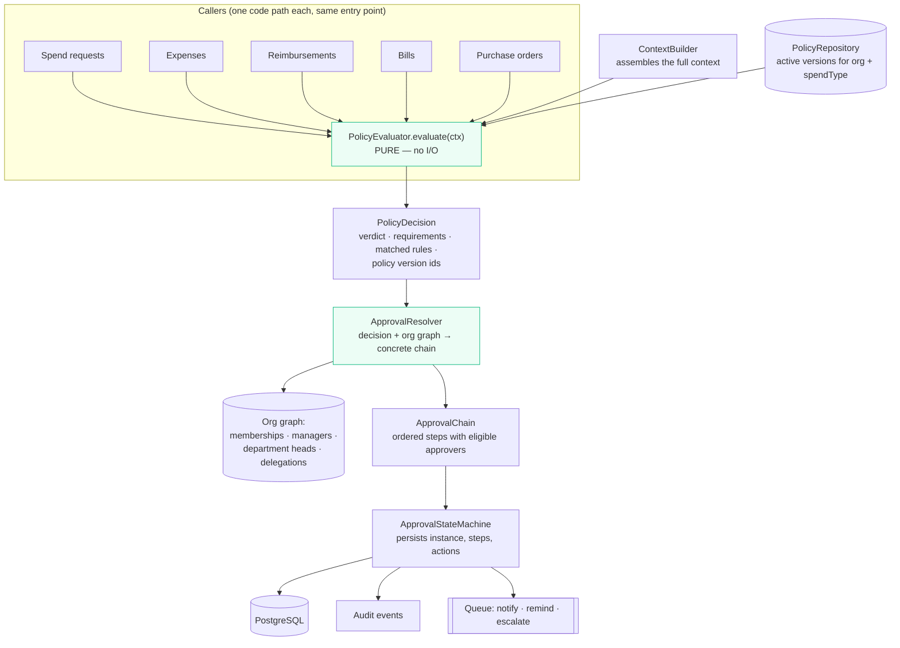
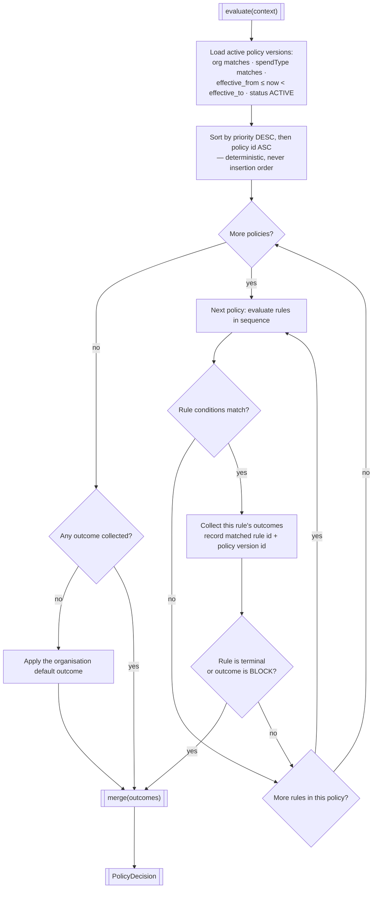
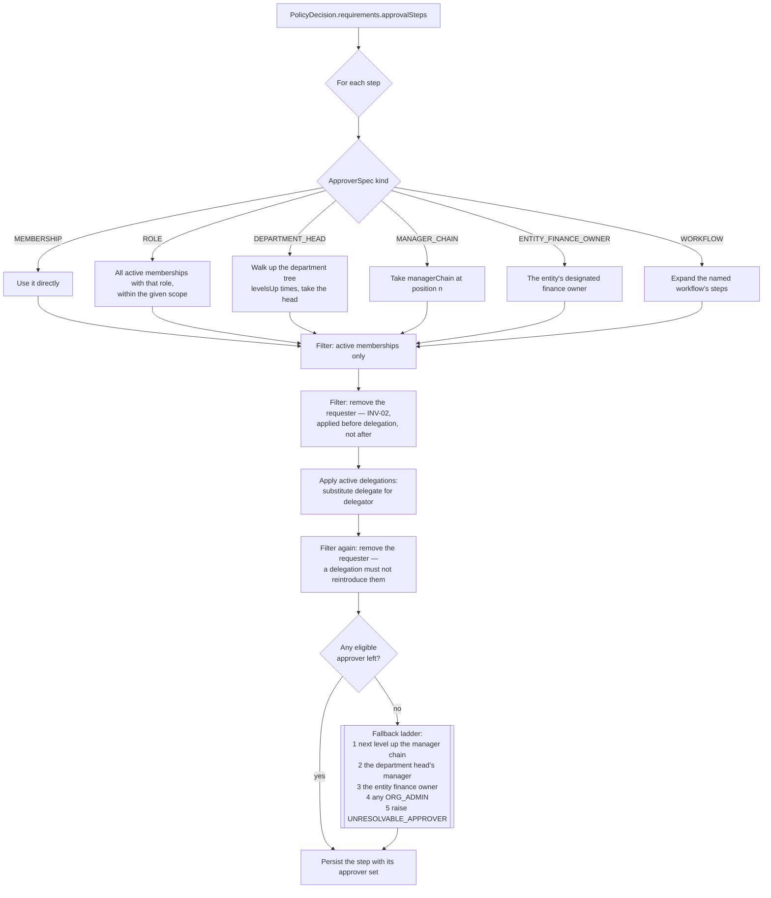
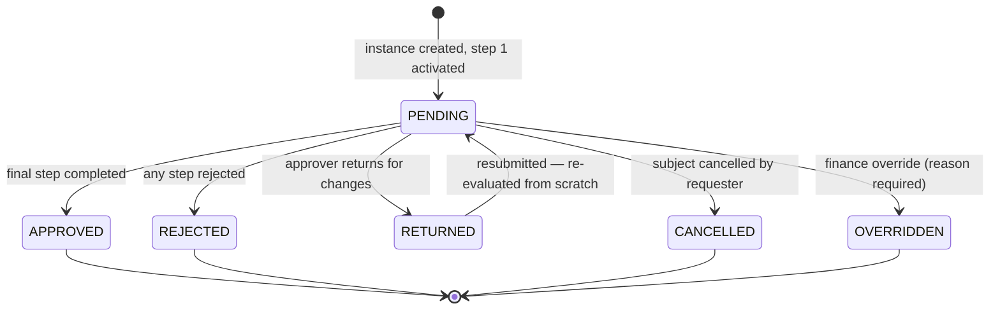
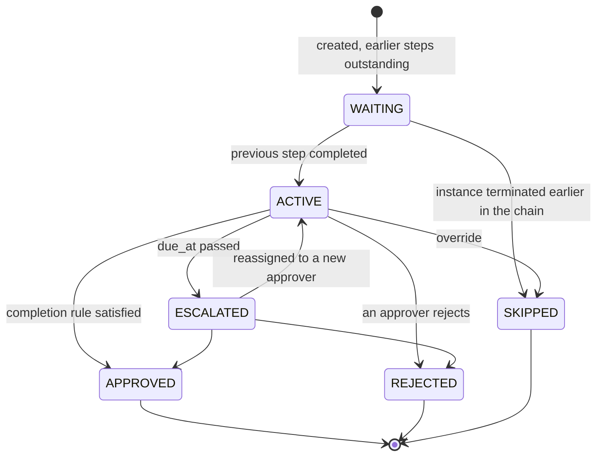

# 11 — Approval and Policy Engine

**Status:** Baseline v1.0 — 2026-08-29
**Module:** `backend/src/modules/policies` and `backend/src/modules/approvals`
**Criticality:** Highest. This subsystem decides whether company money may be spent.

---

## 1. Why this is a separate subsystem

The failure mode this design exists to prevent is the one every spend system falls into:

```typescript
// What this codebase must never contain
if (request.amount > 1000 && request.department === 'engineering') {
  approvers.push(financeLead);
} else if (request.category === 'travel' && request.amount > 500) {
  // …and now the rule for bills is somewhere else entirely, and slightly different
}
```

Conditionals scattered through controllers are untestable in combination, impossible to audit
("which rule applied to this approval in March?"), impossible to change without a deploy, and
guaranteed to diverge between spend types. A finance customer will ask _"why was this approved?"_
and the honest answer must be a record, not an archaeology exercise.

**The design response**, in four parts:

1. **Policy is data.** Rules are rows, authored in the UI, versioned, effective-dated.
2. **Evaluation is pure.** A deterministic function of `(context, policy versions) → decision`,
   with no I/O, exhaustively testable.
3. **The decision is snapshotted.** The verdict, the matched rule IDs, and the policy _version_
   IDs are frozen onto the record. Editing a policy tomorrow never rewrites yesterday's history.
4. **One engine, five spend types.** Spend requests, expenses, reimbursements, bills, and purchase
   orders differ by a `spendType` discriminator and nothing else.

---

## 2. Architecture



Everything in green is pure. That is what makes 10,000 generated test cases feasible.

---

## 3. The evaluation context

The complete, explicit input. Nothing is read from ambient state — if the evaluator needs it, it
is in the context, which is why the evaluator can be a pure function.

```typescript
interface PolicyContext {
  readonly organizationId: OrganizationId;
  readonly spendType: 'CARD' | 'REIMBURSEMENT' | 'BILL' | 'PURCHASE_ORDER' | 'SPEND_REQUEST';

  readonly amount: Money; // decimal + currency, never a number
  readonly amountInBaseCurrency: Money; // converted at a stored, recorded rate

  readonly requester: {
    membershipId: MembershipId;
    roleKey: RoleKey;
    departmentId: DepartmentId | null;
    departmentPath: string; // materialised path, enables subtree matching
    entityId: EntityId;
    managerChain: readonly MembershipId[]; // nearest first
    tenureDays: number;
  };

  readonly classification: {
    categoryId: CategoryId | null;
    categoryPath: string;
    projectId: ProjectId | null;
    vendorId: VendorId | null;
    merchantName: string | null;
  };

  readonly budget: {
    budgetLineId: BudgetLineId | null;
    allocated: Money;
    committed: Money;
    actual: Money;
    remaining: Money;
    utilizationAfterThisSpend: number; // 0..n, where 1.0 is fully consumed
    wouldExceed: boolean;
  } | null;

  readonly evidence: {
    hasReceipt: boolean;
    hasMemo: boolean;
    memoLength: number;
    receiptCount: number;
  };

  readonly temporal: {
    now: Date; // injected — never Date.now() inside the evaluator
    neededBy: Date | null;
    fiscalPeriod: string;
  };

  readonly history: {
    requesterSpendThisMonth: Money;
    requesterSpendThisMonthInCategory: Money;
    similarRequestsLast30Days: number;
  };
}
```

`now` is injected rather than read, so a test can evaluate an end-of-quarter rule without
manipulating the system clock.

---

## 4. Rule schema

A rule is a **condition tree** and a set of **outcomes**, both stored as validated JSONB with a
Zod schema in `packages/contracts`.

### 4.1 Conditions

```typescript
type Condition = ComparisonCondition | ConditionGroup;

interface ConditionGroup {
  operator: 'ALL' | 'ANY' | 'NONE';
  conditions: Condition[]; // nesting limited to depth 3
}

interface ComparisonCondition {
  field: PolicyField; // a closed union — not an arbitrary path
  operator: ComparisonOperator;
  value: PolicyValue;
}
```

**Fields** (closed set — a typo is a validation error, not a rule that never fires):

| Group          | Fields                                                                                                                                                 |
| -------------- | ------------------------------------------------------------------------------------------------------------------------------------------------------ |
| Amount         | `amount`, `amountInBaseCurrency`, `currency`                                                                                                           |
| Requester      | `requester.roleKey`, `requester.departmentId`, `requester.departmentPath`, `requester.entityId`, `requester.tenureDays`, `requester.managerChainDepth` |
| Classification | `category.id`, `category.path`, `project.id`, `vendor.id`, `merchant.name`                                                                             |
| Budget         | `budget.remaining`, `budget.utilizationAfter`, `budget.wouldExceed`, `budget.exists`                                                                   |
| Evidence       | `evidence.hasReceipt`, `evidence.hasMemo`, `evidence.memoLength`                                                                                       |
| Temporal       | `temporal.dayOfWeek`, `temporal.dayOfMonth`, `temporal.fiscalPeriod`                                                                                   |
| History        | `history.requesterSpendThisMonth`, `history.similarRequestsLast30Days`                                                                                 |
| Type           | `spendType`                                                                                                                                            |

**Operators**, typed to the field's type:

| Type        | Operators                                                                           |
| ----------- | ----------------------------------------------------------------------------------- |
| Money       | `EQ` `NEQ` `GT` `GTE` `LT` `LTE` `BETWEEN`                                          |
| Number      | `EQ` `NEQ` `GT` `GTE` `LT` `LTE` `BETWEEN`                                          |
| String / ID | `EQ` `NEQ` `IN` `NOT_IN`                                                            |
| Path (tree) | `EQ` `IN` `IS_DESCENDANT_OF` — so "Engineering and everything under it" is one rule |
| Boolean     | `IS_TRUE` `IS_FALSE`                                                                |
| Nullable    | `IS_NULL` `IS_NOT_NULL`                                                             |

**Money comparisons are currency-aware.** Comparing `1000 USD` to `1000 EUR` raises
`CurrencyMismatchError` at evaluation time rather than silently comparing magnitudes. Rules
authored against `amountInBaseCurrency` avoid the problem entirely, and the UI steers authors
there.

### 4.2 Outcomes

```typescript
type Outcome =
  | { type: 'ALLOW' }
  | { type: 'BLOCK'; reasonCode: string; message: string }
  | { type: 'AUTO_APPROVE' }
  | {
      type: 'REQUIRE_APPROVER';
      approver: ApproverSpec;
      stepType: StepType;
      sequence: number;
      timeoutHours?: number;
      escalation?: EscalationSpec;
    }
  | { type: 'REQUIRE_RECEIPT' }
  | { type: 'REQUIRE_MEMO'; minLength?: number }
  | { type: 'REQUIRE_FINANCE_REVIEW' }
  | { type: 'FLAG_EXCEPTION'; exceptionCode: string }
  | { type: 'SET_VALIDITY'; days: number };

type ApproverSpec =
  | { kind: 'MEMBERSHIP'; membershipId: MembershipId }
  | { kind: 'ROLE'; roleKey: RoleKey; scope: 'ORGANIZATION' | 'ENTITY' | 'DEPARTMENT' }
  | { kind: 'DEPARTMENT_HEAD'; levelsUp?: number }
  | { kind: 'MANAGER_CHAIN'; position: number }
  | { kind: 'ENTITY_FINANCE_OWNER' }
  | { kind: 'WORKFLOW'; workflowId: ApprovalWorkflowId };
```

`ApproverSpec` resolves against the organisation graph at chain-resolution time, so a rule says
"the requester's manager", not a person's ID that will be wrong after the next reorganisation.

---

## 5. Evaluation algorithm



### 5.1 Merge semantics — the precedence table

Multiple rules across multiple policies can fire. The merge is the part that must be
unambiguous, because ambiguity here means the same request could be approved differently on two
days.

| Rule                                | Behaviour                                                                                                                                           |
| ----------------------------------- | --------------------------------------------------------------------------------------------------------------------------------------------------- |
| **1. BLOCK dominates**              | If any outcome is `BLOCK`, the verdict is `BLOCK`. Every blocking reason is returned, not just the first — the user should fix all of them at once. |
| **2. Approvers union**              | `REQUIRE_APPROVER` outcomes are unioned and de-duplicated by resolved approver identity, then grouped by `sequence`.                                |
| **3. Sequence groups become steps** | Same `sequence` ⇒ one step. Its `stepType` is the strictest present (`PARALLEL_ALL` > `QUORUM` > `PARALLEL_ANY`).                                   |
| **4. Evidence: strictest wins**     | If any rule requires a receipt, a receipt is required. `REQUIRE_MEMO` takes the maximum `minLength`.                                                |
| **5. AUTO_APPROVE is conditional**  | Applies only if **no** rule required an approver. An explicit approval requirement always beats an auto-approval.                                   |
| **6. Finance review is sticky**     | Once required by any rule, it cannot be cleared by another.                                                                                         |
| **7. Timeouts: shortest wins**      | Two rules on the same step ⇒ the shorter timeout applies.                                                                                           |
| **8. Validity: shortest wins**      | The most conservative expiry applies.                                                                                                               |
| **9. Exceptions accumulate**        | All `FLAG_EXCEPTION` codes are retained.                                                                                                            |

Every one of these nine rules has a dedicated unit test with an explicitly constructed conflict.

### 5.2 The decision object

```typescript
interface PolicyDecision {
  readonly verdict: 'ALLOWED' | 'ALLOWED_WITH_APPROVAL' | 'AUTO_APPROVED' | 'BLOCKED';
  readonly requirements: {
    approvalSteps: ResolvedStepSpec[];
    requireReceipt: boolean;
    requireMemo: { required: boolean; minLength: number };
    requireFinanceReview: boolean;
    validityDays: number | null;
  };
  readonly blocks: Array<{ reasonCode: string; message: string; ruleId: PolicyRuleId }>;
  readonly exceptions: Array<{ exceptionCode: string; ruleId: PolicyRuleId }>;
  readonly evaluation: {
    matchedRuleIds: PolicyRuleId[];
    policyVersionIds: PolicyVersionId[];
    evaluatedAt: string;
    engineVersion: string; // bump on any semantic change to the evaluator
    durationMs: number;
  };
}
```

`engineVersion` matters: if the merge semantics ever change, historical decisions remain
interpretable because they record which semantics produced them.

**This object is persisted verbatim** onto `spend_requests.policy_decision` (and the equivalent on
expenses, bills, and POs) and copied to `approval_instances.policy_decision_snapshot`. It is never
recomputed for display. The screen showing "why was this approved?" reads the snapshot.

---

## 6. Approval chain resolution

Turning approver _specifications_ into approver _people_.



The requester filter is applied **twice** — before and after delegation — because a delegation
from the requester's manager back to the requester would otherwise let someone approve their own
spend through a legitimate-looking path. That is the kind of hole that only shows up when someone
is deliberately looking for it.

`UNRESOLVABLE_APPROVER` is a hard failure that blocks the request and alerts an admin. A silent
auto-approval when no approver can be found would be the worst possible default in a spend
system.

---

## 7. Approval state machine

### 7.1 Instance



Resubmission after `RETURNED` re-runs policy evaluation completely. The amount or category may
have changed, and the previous chain may no longer be correct. Reusing the old chain would be a
way to launder a larger amount through a smaller approval.

### 7.2 Step



### 7.3 Completion rules

| Step type      | Completes when                                |
| -------------- | --------------------------------------------- |
| `SEQUENTIAL`   | Its single approver approves                  |
| `PARALLEL_ALL` | Every eligible approver has approved          |
| `PARALLEL_ANY` | Any one eligible approver approves            |
| `QUORUM(n)`    | `n` distinct eligible approvers have approved |

A rejection at any step terminates the entire instance immediately, regardless of step type.

### 7.4 Concurrency

Two approvers acting on the same `PARALLEL_ANY` step at the same instant must not both complete
it and both advance the chain.

```sql
BEGIN;
  SELECT * FROM approval_steps WHERE id = $1 FOR UPDATE;   -- serialise on the step
  -- re-check status inside the lock; the first transaction has already changed it
  IF status <> 'ACTIVE' THEN RAISE 'STEP_NOT_ACTIONABLE'; END IF;
  INSERT INTO approval_actions (...);
  UPDATE approval_steps SET status = 'APPROVED' WHERE id = $1;
  -- activate the next step, or complete the instance
  INSERT INTO audit_events (...);
COMMIT;
```

The status re-check **inside** the lock is the essential part. Checking before acquiring the lock
is the classic time-of-check-to-time-of-use bug, and in this system it would produce a
double-advanced approval chain. Covered by FR-APR-011's concurrency test.

---

## 8. Worked examples

### 8.1 The brief's example, expressed as data

> _Engineering + Software + amount > 2000 → Manager + Finance_
> _Engineering + Software + amount ≤ 2000 → Manager_

```jsonc
{
  "name": "Engineering software spend",
  "spendTypes": ["SPEND_REQUEST", "CARD", "PURCHASE_ORDER"],
  "priority": 100,
  "rules": [
    {
      "sequence": 1,
      "conditions": {
        "operator": "ALL",
        "conditions": [
          {
            "field": "requester.departmentPath",
            "operator": "IS_DESCENDANT_OF",
            "value": "/engineering",
          },
          { "field": "category.path", "operator": "IS_DESCENDANT_OF", "value": "/software" },
          {
            "field": "amountInBaseCurrency",
            "operator": "GT",
            "value": { "amount": "2000.0000", "currency": "USD" },
          },
        ],
      },
      "outcomes": [
        {
          "type": "REQUIRE_APPROVER",
          "sequence": 1,
          "stepType": "SEQUENTIAL",
          "approver": { "kind": "MANAGER_CHAIN", "position": 0 },
          "timeoutHours": 48,
          "escalation": { "action": "ESCALATE", "to": { "kind": "MANAGER_CHAIN", "position": 1 } },
        },
        {
          "type": "REQUIRE_APPROVER",
          "sequence": 2,
          "stepType": "SEQUENTIAL",
          "approver": { "kind": "ROLE", "roleKey": "FINANCE_ADMIN", "scope": "ENTITY" },
          "timeoutHours": 72,
        },
        { "type": "REQUIRE_RECEIPT" },
      ],
      "isTerminal": true,
    },
    {
      "sequence": 2,
      "conditions": {
        "operator": "ALL",
        "conditions": [
          {
            "field": "requester.departmentPath",
            "operator": "IS_DESCENDANT_OF",
            "value": "/engineering",
          },
          { "field": "category.path", "operator": "IS_DESCENDANT_OF", "value": "/software" },
        ],
      },
      "outcomes": [
        {
          "type": "REQUIRE_APPROVER",
          "sequence": 1,
          "stepType": "SEQUENTIAL",
          "approver": { "kind": "MANAGER_CHAIN", "position": 0 },
          "timeoutHours": 48,
        },
      ],
      "isTerminal": true,
    },
  ],
}
```

Rule 1 is terminal, so a £2,400 request never reaches rule 2. Rule ordering carries meaning, and
the editor makes that ordering visible.

### 8.2 Missing receipt blocks a reimbursement

```jsonc
{
  "name": "Reimbursements require evidence",
  "spendTypes": ["REIMBURSEMENT"],
  "priority": 900,
  "rules": [
    {
      "sequence": 1,
      "conditions": {
        "operator": "ALL",
        "conditions": [
          { "field": "evidence.hasReceipt", "operator": "IS_FALSE" },
          {
            "field": "amountInBaseCurrency",
            "operator": "GTE",
            "value": { "amount": "25.0000", "currency": "USD" },
          },
        ],
      },
      "outcomes": [
        {
          "type": "BLOCK",
          "reasonCode": "RECEIPT_REQUIRED",
          "message": "A receipt is required for reimbursements of $25 or more.",
        },
      ],
      "isTerminal": true,
    },
  ],
}
```

High priority (900) so it evaluates before departmental rules and short-circuits.

### 8.3 Budget breach injects a finance step

```jsonc
{
  "name": "Budget overspend control",
  "spendTypes": ["SPEND_REQUEST", "PURCHASE_ORDER", "BILL"],
  "priority": 800,
  "rules": [
    {
      "sequence": 1,
      "conditions": { "field": "budget.wouldExceed", "operator": "IS_TRUE" },
      "outcomes": [
        {
          "type": "REQUIRE_APPROVER",
          "sequence": 99,
          "stepType": "SEQUENTIAL",
          "approver": { "kind": "ROLE", "roleKey": "FINANCE_ADMIN", "scope": "ORGANIZATION" },
        },
        { "type": "FLAG_EXCEPTION", "exceptionCode": "BUDGET_EXCEEDED" },
        { "type": "REQUIRE_FINANCE_REVIEW" },
      ],
      "isTerminal": false,
    },
  ],
}
```

Non-terminal, and `sequence: 99` so the finance step lands **after** whatever departmental steps
other policies contribute. Merge rule 2 unions it in.

---

## 9. Testing requirements

This subsystem carries the highest coverage floor in the codebase: **95 % branch coverage**, and
CI fails below it.

| Layer                     | What is tested                                                                                          |
| ------------------------- | ------------------------------------------------------------------------------------------------------- |
| **Field/operator matrix** | Every `(field, operator)` pair, including null handling and type mismatch                               |
| **Merge semantics**       | Each of the nine precedence rules in §5.1, with a constructed conflict                                  |
| **Determinism**           | Property-based: 10,000 generated contexts × shuffled policy insertion order ⇒ identical decisions       |
| **Currency safety**       | Cross-currency comparison raises rather than silently comparing magnitudes                              |
| **Resolution**            | Every `ApproverSpec` kind; the fallback ladder; `UNRESOLVABLE_APPROVER`                                 |
| **INV-02**                | Self-approval blocked directly, via delegation, via role membership, and via department-head resolution |
| **State machine**         | Every legal transition succeeds; **every illegal transition is enumerated and asserted to fail**        |
| **Concurrency**           | Simultaneous approvals on one step: exactly one succeeds                                                |
| **Versioning**            | Editing a policy does not change a persisted decision                                                   |
| **Cross-type**            | All five spend types provably reach the same evaluator entry point                                      |
| **Performance**           | 100 policies / 1,000 rules evaluates within 50 ms p95                                                   |

**Golden-file tests.** A directory of `(context, policies) → expected decision` fixtures in JSON.
Any change to the evaluator that alters a fixture's output fails the build and must be
deliberately re-approved, with a note. This is what stops a "harmless refactor" from silently
changing who has to approve a £50,000 purchase.

---

## 10. Operational concerns

**Caching.** Active policy versions are cached per organisation with a 60-second TTL and explicit
invalidation on publish. Policy versions are immutable, so caching them is safe by construction.

**Observability.** Every evaluation emits a span with policy count, rule count, matched rule
count, duration, and verdict. Counters track blocks by reason code and auto-approvals — an
unexpected rise in auto-approvals is a signal worth alerting on.

**Failure mode.** If evaluation throws, the request is **blocked**, not allowed. The error is
logged, the user sees `POLICY_EVALUATION_FAILED`, and an alert fires. Failing open in a spend
control system is not an acceptable degradation.

**Schema evolution.** Rule JSONB is versioned by `schemaVersion`. A migration that changes the
rule shape must upgrade every stored rule and every golden fixture in the same pull request.
