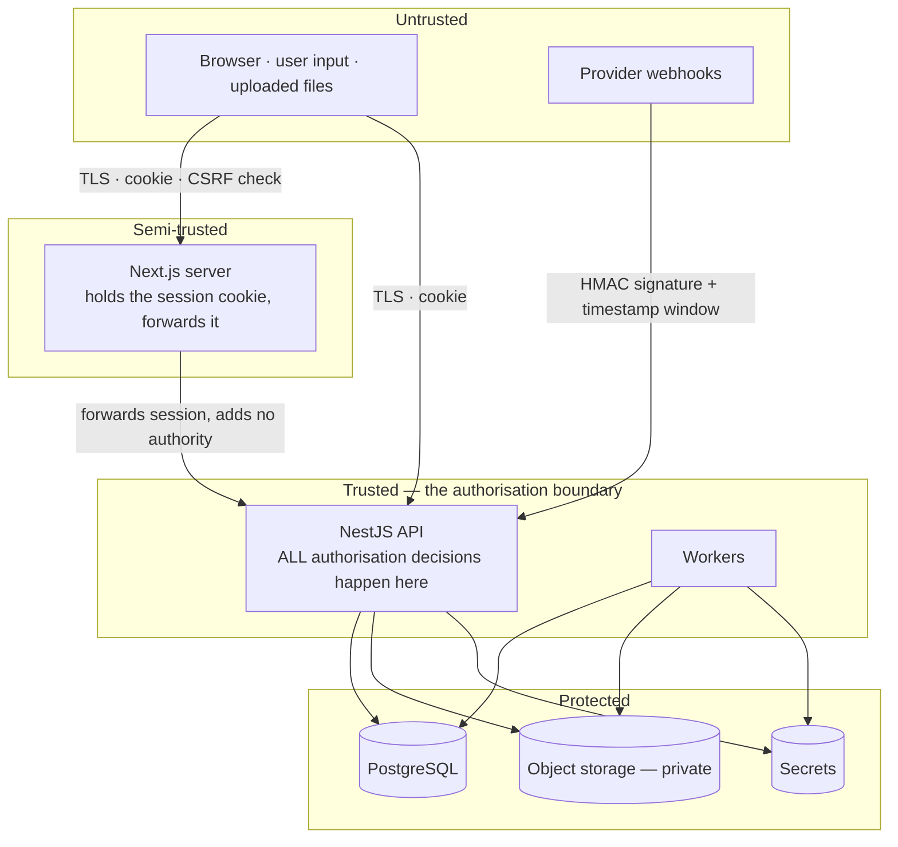
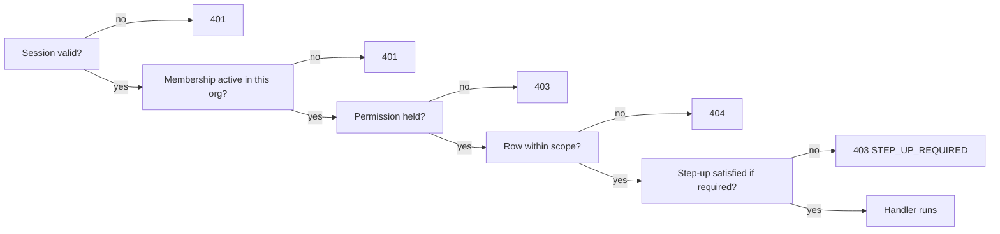
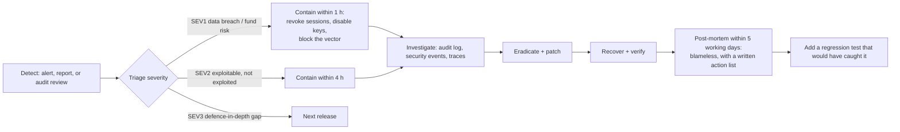

# 12 — Security Model

**Status:** Baseline v1.0 — 2026-08-29
**Scope:** Application security. Infrastructure hardening is in `17-DEPLOYMENT.md`.

---

## 1. Security principles

1. **Fail closed.** Missing tenant context, missing permission declaration, unresolvable approver,
   or a policy evaluation error all result in denial, never in a permissive default.
2. **The server decides.** The browser is untrusted input, always. Nothing it computes, claims,
   or omits changes an authorisation outcome.
3. **Defence in depth.** Every critical control has at least two independent layers, and the
   layers do not share a failure mode.
4. **Least privilege.** Roles, database grants, storage policies, and provider credentials are all
   scoped to the minimum that works.
5. **Auditable by construction.** Security-relevant actions are recorded as data, in the same
   transaction as the action.
6. **No security through obscurity.** The design is documented here precisely because it should
   survive being known.

---

## 2. Trust boundaries



**The Next.js server adds no authority.** It forwards the user's session and receives exactly what
that user is entitled to. It has no service account, no elevated key, and no ability to read data
on a user's behalf that the user could not read directly. This matters because it means an SSRF or
template injection in the web tier cannot escalate into a data breach.

---

## 3. Authentication

### 3.1 Credentials

| Control    | Implementation                                                                                                          |
| ---------- | ----------------------------------------------------------------------------------------------------------------------- |
| Hashing    | argon2id, m=19456 KiB, t=2, p=1, 16-byte salt — OWASP 2024 baseline                                                     |
| Policy     | ≥ 12 characters; checked against a breached-password corpus; **no composition rules** (they reduce entropy in practice) |
| Storage    | Hash only. Never logged, never returned, never in an error message                                                      |
| Comparison | Constant-time, via the argon2 verifier                                                                                  |
| Rehashing  | Transparent on login when parameters change                                                                             |

### 3.2 Sessions

Opaque, server-side, and revocable — see ADR-0005.

| Property        | Value                                                                                                                                                                                                     |
| --------------- | --------------------------------------------------------------------------------------------------------------------------------------------------------------------------------------------------------- |
| Token           | 32 random bytes, base64url                                                                                                                                                                                |
| Storage         | SHA-256 hash only. A database leak yields no usable session                                                                                                                                               |
| Cookie          | `httpOnly`, `Secure`, `SameSite=Lax`, `Path=/`, host-only                                                                                                                                                 |
| Idle expiry     | 30 minutes, sliding                                                                                                                                                                                       |
| Absolute expiry | 12 hours, hard                                                                                                                                                                                            |
| Revocation      | Individually, all-but-current, or all — effective on the next request                                                                                                                                     |
| Rotation        | New token on privilege change and on password change                                                                                                                                                      |
| Binding         | IP and user-agent recorded; a change is logged and surfaced to the user, but does not auto-invalidate (mobile networks change IPs routinely, and forcing logout there trains users to ignore the warning) |

**Why not JWT.** A stateless token cannot be revoked before it expires. In a system where
deactivating an employee must immediately stop them spending money, that is disqualifying. The
usual mitigation — a short-lived access token plus a revocation list — reintroduces the database
lookup that JWTs were meant to avoid, while keeping their complexity.

### 3.3 MFA and step-up

- Schema and service support TOTP (RFC 6238) with encrypted secrets and hashed single-use backup
  codes from Phase 1; enrolment UI lands in Phase 6.
- **Step-up authentication** requires re-authentication within the last 5 minutes for:
  role changes, session revocation for another user, card termination, approval override,
  integration credential changes, and audit export.
- An organisation may require MFA for all members; non-enrolled members are then forced through
  enrolment at next login.

### 3.4 Brute force and enumeration

| Control            | Detail                                                                                                                                                                             |
| ------------------ | ---------------------------------------------------------------------------------------------------------------------------------------------------------------------------------- |
| Rate limit         | 5 attempts / 15 min per IP+email, sliding window                                                                                                                                   |
| Lockout            | 15 minutes after 5 consecutive failures; the counter resets on success                                                                                                             |
| Enumeration        | Identical response body and status for unknown account and wrong password; a dummy hash verification runs on the unknown-account path so response timing does not distinguish them |
| Reset / invitation | Always `202`, regardless of whether the address exists                                                                                                                             |
| Monitoring         | `login.failed` spikes alert                                                                                                                                                        |

---

## 4. Authorisation

Four ordered checks, all server-side, on every request (see `08 §4.4`).



**Route coverage is verified mechanically.** A test enumerates the NestJS route table and asserts
every route carries either `@Public()` or `@RequirePermission()`. A new endpoint without an access
declaration fails CI — which is the only reliable defence against the endpoint someone adds in a
hurry.

**Row scope is a query predicate**, injected in the repository, never a filter applied after
fetching. Post-fetch filtering means the rows were already read, and one forgotten filter leaks
them.

---

## 5. Tenant isolation

The highest-severity risk class in a multi-tenant financial system. Three independent layers.

### Layer 1 — Request context

```typescript
// Organisation identity comes from the session's membership. Full stop.
const organizationId = session.membership.organizationId;
requestContext.run({ organizationId, membershipId, correlationId }, handler);
```

A client-supplied `organizationId` in a body, query, or header is **ignored**. If present and
different from the session's, the request is rejected with `403` and a security event is written —
because that request is either a bug worth finding or an attack worth knowing about.

### Layer 2 — Prisma client extension

```typescript
prisma.$extends({
  query: {
    $allModels: {
      async $allOperations({ model, operation, args, query }) {
        if (!TENANT_SCOPED_MODELS.has(model)) return query(args);
        const orgId = requestContext.get()?.organizationId;
        if (!orgId) throw new TenantContextMissingError(model, operation); // fail closed
        if (isRead(operation)) args.where = { ...args.where, organizationId: orgId };
        if (isWrite(operation)) args.data = { ...args.data, organizationId: orgId };
        return query(args);
      },
    },
  },
});
```

The `throw` on missing context is the important line. A query issued outside a request context
(a job that forgot to establish one) fails loudly rather than silently returning every tenant's
rows.

### Layer 3 — PostgreSQL RLS (Phase 6)

```sql
CREATE POLICY tenant_isolation ON transactions
  USING (organization_id = current_setting('app.current_organization_id', true)::uuid);
```

The only layer that still holds if the application is wrong.

### Layer 0 — Schema

Composite foreign keys carrying `organization_id` (see `09 §7.5`) make a cross-tenant reference
physically impossible, independent of any application code.

### Verification

| Test               | Assertion                                                                                                                |
| ------------------ | ------------------------------------------------------------------------------------------------------------------------ |
| Cross-tenant read  | Valid session for org B, ID from org A ⇒ `404` on **every** resource endpoint (parameterised over the whole route table) |
| Cross-tenant write | Same ⇒ `404`, and no row is modified                                                                                     |
| Injected org ID    | Body/query/header `organizationId` for org A with a session for org B ⇒ `403` + security event                           |
| Missing context    | A repository call outside a request context throws                                                                       |
| Fuzz               | Randomised ID substitution across all endpoints, asserting no `200` ever returns another tenant's data                   |

---

## 6. Threat model

Assessed with STRIDE. Severity is post-mitigation residual risk.

| ID         | Threat                       | Vector                                          | Mitigation                                                                                                                                                                                                                                                                           | Residual |
| ---------- | ---------------------------- | ----------------------------------------------- | ------------------------------------------------------------------------------------------------------------------------------------------------------------------------------------------------------------------------------------------------------------------------------------ | -------- |
| **THR-01** | Cross-tenant data access     | Manipulated IDs, forged org ID                  | Four layers (§5); `404` not `403`; automated fuzz suite                                                                                                                                                                                                                              | Low      |
| **THR-02** | Privilege escalation         | Self role change, crafted invitation            | INV-03, INV-04; step-up on role change; a role may not grant permissions the granter lacks; every change audited + security event                                                                                                                                                    | Low      |
| **THR-03** | IDOR                         | Enumerating UUIDs                               | UUIDv7 (non-sequential); scope predicate on every query; `404` for out-of-scope                                                                                                                                                                                                      | Low      |
| **THR-04** | Session theft                | XSS, network capture, shared device             | `httpOnly` (JS cannot read it); TLS + HSTS; strict CSP; short idle expiry; revocation; session list visible to the user                                                                                                                                                              | Medium   |
| **THR-05** | Malicious upload             | Web shell, polyglot, zip bomb, SVG XSS          | Magic-byte sniffing (not declared MIME); allow-list of types; 20 MB cap; EXIF strip; malware-scan hook; stored in a private bucket on a **separate origin**; served only via signed URL with `Content-Disposition: attachment` and `X-Content-Type-Options: nosniff`; never executed | Low      |
| **THR-06** | Webhook replay               | Captured payload resent                         | HMAC signature verified before parsing; 5-minute timestamp window; unique `(provider, event_id)`; duplicates are `200` no-ops                                                                                                                                                        | Low      |
| **THR-07** | Duplicate payment / callback | Provider retry, double click, race              | Idempotency keys; unique provider reference; `UNIQUE(expense_id)` on reimbursement lines; state machine guards                                                                                                                                                                       | Low      |
| **THR-08** | Unauthorised export          | Over-broad role, scraping                       | Export permission separate from read; scope applies; rate-limited 10/hour; every export audited with filters and row count; volume anomaly alert                                                                                                                                     | Medium   |
| **THR-09** | Approval manipulation        | Self-approval, delegation loop, chain tampering | INV-02 enforced twice (before and after delegation); chain persisted at creation and never client-supplied; step guard re-checks eligibility inside the lock; every action immutable and audited                                                                                     | Low      |
| **THR-10** | Race conditions              | Concurrent approvals or budget consumption      | `SELECT ... FOR UPDATE` on steps and budget lines; status re-check inside the lock; unique indexes on movements; concurrency tests                                                                                                                                                   | Low      |
| **THR-11** | Financial tampering          | Editing posted values, forged totals            | Immutability trigger; corrections as adjustments; totals server-computed from line items; audit before/after diff                                                                                                                                                                    | Low      |
| **THR-12** | SQL injection                | Raw query construction                          | Prisma parameterisation; `$queryRaw` only as a tagged template; string-concatenated SQL is a lint error                                                                                                                                                                              | Low      |
| **THR-13** | XSS                          | Stored or reflected                             | React auto-escaping; `dangerouslySetInnerHTML` forbidden by lint; CSP without `unsafe-inline` for scripts; user content never rendered as HTML                                                                                                                                       | Low      |
| **THR-14** | CSRF                         | Cross-site state change                         | `SameSite=Lax`; `Origin`/`Referer` verified on all state-changing requests; no state change on `GET`                                                                                                                                                                                 | Low      |
| **THR-15** | Secret exposure              | Committed keys, logged credentials              | Secret scanning in CI (pre-commit and pipeline); config from env/secret manager; Pino redaction; `.env` git-ignored from the first commit                                                                                                                                            | Medium   |
| **THR-16** | Insider abuse                | Legitimate access, illegitimate purpose         | Least privilege; separation of configuration and transaction authority (`03 §2.1`); complete audit trail; anomaly alerting on exports and overrides                                                                                                                                  | Medium   |
| **THR-17** | DoS                          | Expensive queries, large uploads, report abuse  | Mandatory pagination; query timeouts; body size limits; rate limits; large exports queued not synchronous                                                                                                                                                                            | Medium   |
| **THR-18** | Dependency compromise        | Malicious or vulnerable package                 | Lockfile committed; `pnpm audit` gating CI; Dependabot; provenance checked for new dependencies; new dependencies justified in the PR                                                                                                                                                | Medium   |
| **THR-19** | Card data exposure           | Storing or logging PAN/CVV                      | **No column exists** to store them; provider tokenisation only; a schema test asserts no such column; a log test asserts no card-shaped value is emitted                                                                                                                             | Low      |
| **THR-20** | Audit tampering              | Deleting or editing history                     | No API surface; no application code path; DB role lacks `UPDATE`/`DELETE`; grant assertion test                                                                                                                                                                                      | Low      |

---

## 7. Input validation and output encoding

- **Validation at the boundary.** Every request body, query, and parameter parses through a Zod
  schema from `packages/contracts`. Unknown keys are stripped, not ignored.
- **Type coercion is explicit.** No implicit string-to-number. Money parses through the `Money`
  value object, which rejects anything not exactly representable.
- **Output.** JSON responses are serialised from typed DTOs; entities are never returned raw, so a
  new sensitive column cannot leak by default. A response-shape test asserts that no endpoint ever
  emits `passwordHash`, `tokenHash`, `mfaSecret`, or `bankDetailsEncrypted`.
- **File names** are never used as storage keys or paths; the key is a generated UUID and the
  original name is stored as metadata.

---

## 8. Secrets and cryptography

| Concern                                                                                                              | Approach                                                                                                                                                        |
| -------------------------------------------------------------------------------------------------------------------- | --------------------------------------------------------------------------------------------------------------------------------------------------------------- |
| Source                                                                                                               | Environment variables locally; a secret manager in staging and production. Never in git.                                                                        |
| Validation                                                                                                           | Config schema fails startup on a missing or malformed secret.                                                                                                   |
| Rotation                                                                                                             | Session signing key, storage HMAC key, and encryption keys are versioned so rotation is non-breaking.                                                           |
| At rest                                                                                                              | Database, object storage, and backups encrypted by the platform.                                                                                                |
| Application-level                                                                                                    | AES-256-GCM envelope encryption for vendor bank details, MFA secrets, and integration credentials — these stay ciphertext even to someone with a database dump. |
| In transit                                                                                                           | TLS 1.2+; HSTS with preload in production.                                                                                                                      |
| Randomness                                                                                                           | `crypto.randomBytes` only. `Math.random` is a lint error.                                                                                                       |
| Hashing                                                                                                              | argon2id for passwords; SHA-256 for session and invitation tokens (they are already                                                                             |
| high-entropy random, so a slow KDF adds latency without adding security); HMAC-SHA-256 for signed URLs and webhooks. |

---

## 9. Personal data inventory

| Data                                              | Where                                         | Basis                          | Retention                   |
| ------------------------------------------------- | --------------------------------------------- | ------------------------------ | --------------------------- |
| Name, email                                       | `users`                                       | Contract                       | Life of account + 30 days   |
| Password hash                                     | `users`                                       | Contract                       | Life of account             |
| IP, user agent                                    | `sessions`, `audit_events`, `security_events` | Legitimate interest (security) | 90 days / 7 years / 2 years |
| Employment attributes (department, manager, role) | `memberships`                                 | Contract                       | 7 years (financial record)  |
| Spend behaviour                                   | `transactions`, `expenses`                    | Contract / legal obligation    | 7 years                     |
| Receipt images                                    | Object storage                                | Legal obligation               | 7 years                     |
| Bank details (reimbursement payee)                | Encrypted column                              | Contract                       | Life of account + 7 years   |

**Erasure** pseudonymises personal identifiers (name → `Former member #1234`, email → a
non-routable tombstone) while retaining the financial record and its audit trail, which statute
requires. The audit event for the erasure itself is retained.

---

## 10. Logging and monitoring

**Never logged:** passwords or hashes, session tokens, MFA secrets or codes, PAN/CVV, full receipt
contents, encryption keys, or full request bodies containing personal data. A Pino redaction
configuration enforces this, and a test asserts that a request containing each forbidden value
produces no log line containing it.

**Always logged:** correlation ID, membership ID, organisation ID, route, status, duration, and
the error code on failure.

**Security events** (a product feature, separate from telemetry): login success and failure,
lockout, password change, MFA enrolment and challenge, session revocation, role and permission
change, membership deactivation, step-up challenge, export, approval override, and every rejected
cross-tenant attempt.

**Alerts:** failed-login spike, cross-tenant rejection (any occurrence — there should be zero),
privilege-change burst, export volume anomaly, approval-override rate, dead-letter arrival, and
`TenantContextMissingError` (any occurrence — it means a code path escaped the context).

---

## 11. Security testing

| Type                   | Cadence                                    | Content                                                            |
| ---------------------- | ------------------------------------------ | ------------------------------------------------------------------ |
| SAST                   | Every PR                                   | ESLint security rules, `semgrep`                                   |
| Secret scanning        | Pre-commit + every PR                      | `gitleaks`                                                         |
| Dependency audit       | Every PR + daily                           | `pnpm audit`, Dependabot; critical/high blocks merge               |
| Authorisation suite    | Every PR                                   | Every endpoint × every role: allowed and denied paths              |
| Tenant isolation suite | Every PR                                   | The five tests in §5                                               |
| Invariant suite        | Every PR                                   | INV-01 … INV-10                                                    |
| Upload suite           | Every PR                                   | Polyglot, renamed executable, zip bomb, oversized, SVG with script |
| DAST                   | Nightly on staging                         | OWASP ZAP baseline                                                 |
| Penetration test       | Before any production pilot, then annually | External; critical/high remediated before launch                   |

---

## 12. Incident response



The audit log is the primary investigative tool, which is why its completeness and immutability
are treated as security controls rather than as a feature.

**Notification.** Customer notification obligations are determined case by case with legal input.
This document does not assert a statutory timeline, because the applicable one depends on
jurisdiction and contract.

---

## 13. Explicit non-claims

- Financy holds **no compliance certification**. Not SOC 2, not PCI DSS, not ISO 27001.
  `07 §6` describes the engineering posture; that is a different statement and is worded as such.
- Financy is **not a regulated financial institution** and holds no customer funds.
- Card issuing in Phases 1–6 is a **mock provider**, labelled as sandbox in the API and the UI.
- No claim of PCI scope reduction is made, because Financy never enters PCI scope: it does not
  store, process, or transmit cardholder data.

Any marketing or UI copy contradicting this section is a defect.
