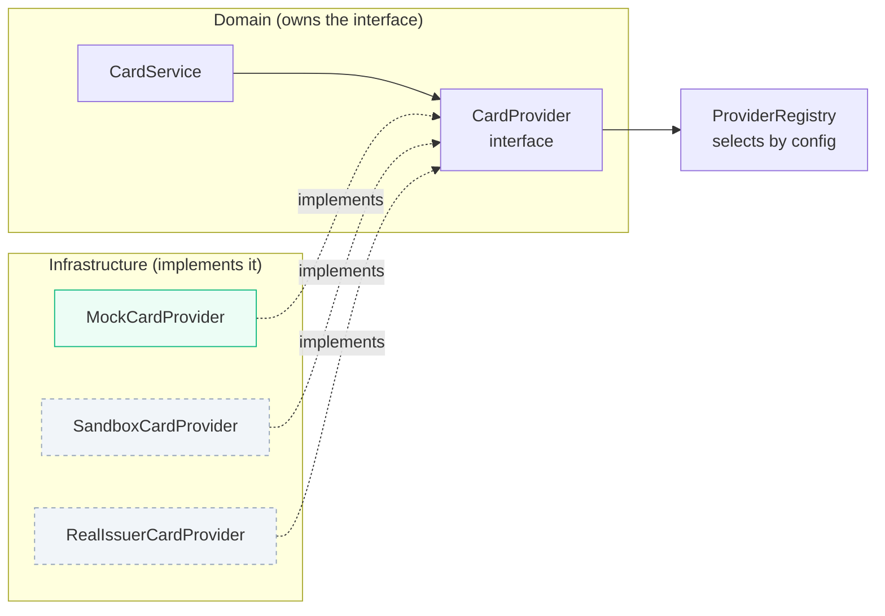
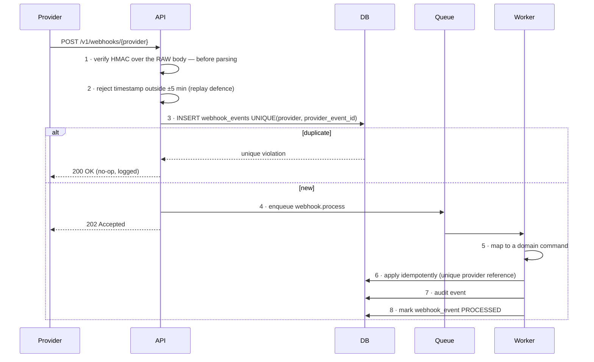

# 13 — Integrations and Provider Abstraction

**Status:** Baseline v1.0 — 2026-08-29
**Module:** `apps/api/src/modules/integrations`

---

## 1. The rule

**No domain code ever imports a provider SDK.** Every external system sits behind a port — a
TypeScript interface owned by the domain — with adapters implementing it. The domain depends on
the interface; the adapter depends on the vendor.

This is not architectural decoration. In this product it is a commercial requirement: the card
provider, the payment rail, and the accounting system will all change, and a customer will demand
a specific one. If `CardService` imports a vendor SDK, that change is a rewrite. If it depends on
`CardProvider`, it is a new file and a config value.



---

## 2. Port catalogue

| Port | Purpose | MVP adapter | Later |
|---|---|---|---|
| `CardProvider` | Issue and control spend authorisations | **Mock** — deterministic, in-DB | Licensed issuer (Phase 7) |
| `PaymentProvider` | Execute and track payouts | **Manual** — records a human-executed payment | Real rail (Phase 7) |
| `AccountingProvider` | Push coded records to the book of record | **CSV** export | QuickBooks / Xero / NetSuite |
| `NotificationProvider` | Deliver messages | **SMTP + in-app** | ESP, Slack, Teams |
| `DocumentProvider` | Private object storage with signed URLs | **Filesystem** (local) / **S3** | S3, GCS, Azure Blob |
| `OCRProvider` | Extract fields from receipts | **No-op** | Vision service (Phase 7) |
| `IdentityProvider` | Authenticate a user | **Local** (password + TOTP) | OIDC, SAML, SCIM |
| `FxRateProvider` | Currency conversion rates | **Static table** | Live rate feed |

---

## 3. Common adapter contract

Every adapter obeys the same rules, so operational behaviour is uniform regardless of vendor.

| Rule | Detail |
|---|---|
| **Idempotency** | Every mutating call takes an idempotency key. The adapter forwards it where the vendor supports it and enforces it locally where it does not. |
| **Timeouts** | Every call has an explicit timeout. There is no unbounded wait anywhere. |
| **Retries** | Exponential backoff with jitter, maximum 3, and **only for idempotent operations**. A non-idempotent call that times out is escalated, never blindly retried. |
| **Circuit breaker** | Opens after 5 consecutive failures, half-opens after 30 seconds. |
| **Error mapping** | Vendor errors map to the `ProviderError` taxonomy. A vendor error string never reaches a user. |
| **Sandbox flag** | Every adapter declares `isSandbox`. The value propagates into API responses and the UI. |
| **Observability** | Every call is a span with provider, operation, duration, and outcome. |
| **No PII beyond need** | An adapter sends only the fields the operation requires. |

```typescript
interface ProviderAdapter {
  readonly providerKey: string;      // 'mock' | 'stripe-issuing' | 'quickbooks' …
  readonly isSandbox: boolean;
  healthCheck(): Promise<HealthStatus>;
}
```

---

## 4. `CardProvider`

```typescript
interface CardProvider extends ProviderAdapter {
  issueCard(cmd: IssueCardCommand): Promise<IssuedCard>;
  updateLimit(providerCardId: string, limit: Money, period: LimitPeriod): Promise<void>;
  setStatus(providerCardId: string, status: 'ACTIVE' | 'LOCKED' | 'TERMINATED'): Promise<void>;
  getCard(providerCardId: string): Promise<ProviderCardSnapshot>;
  listTransactions(providerCardId: string, since: Date): Promise<ProviderTransaction[]>;
}

interface IssuedCard {
  providerCardId: string;
  lastFour: string;          // display only
  network: 'VISA' | 'MASTERCARD' | 'MOCK';
  expiryMonth: number;       // month/year only — never the full expiry with PAN
  expiryYear: number;
  status: 'PENDING' | 'ACTIVE';
}
```

**The return type is the control.** There is no field in `IssuedCard` that could carry a PAN or a
CVV, so an adapter cannot hand one to the domain even by accident, and a future adapter author
cannot "helpfully" add it without changing a shared interface that a reviewer will see.

**`MockCardProvider`** generates a deterministic provider ID, a random last-four, and
`network: 'MOCK'`, `isSandbox: true`. It maintains no external state. Its purpose is to let the
control, evidence, and reporting domains be built, tested, and demonstrated completely — while
being **unmistakably labelled** as not a real card, everywhere it surfaces.

Real issuing (Phase 7) requires a licensed partner, a signed agreement, and a compliance review.
It is gated behind that, not behind engineering effort.

---

## 5. `PaymentProvider`

```typescript
interface PaymentProvider extends ProviderAdapter {
  initiatePayment(cmd: InitiatePaymentCommand): Promise<PaymentResult>;
  getPaymentStatus(providerPaymentId: string): Promise<PaymentStatus>;
  cancelPayment(providerPaymentId: string): Promise<void>;
}
```

**`ManualPaymentProvider`** (MVP) does not move money. It records that a human executed a payment
outside the system, requires a payment reference, and marks the record paid. Its `isSandbox` is
`true` and the UI states plainly that Financy recorded the payment rather than made it.

This is the honest implementation of "prepare the architecture for future real payment
integrations" without claiming a rail we do not have.

---

## 6. `AccountingProvider`

```typescript
interface AccountingProvider extends ProviderAdapter {
  validateMapping(m: AccountingMapping): Promise<ValidationResult>;
  exportBatch(batch: ExportBatch): Promise<ExportResult>;
  fetchChartOfAccounts(): Promise<AccountingCode[]>;
  getExportStatus(providerBatchId: string): Promise<ExportStatus>;
}
```

**`CsvAccountingProvider`** (MVP) generates a CSV in a configurable column layout, computes a
checksum, and returns a storage key. Records are marked `EXPORTED` with the batch ID, so a re-run
excludes them and is therefore idempotent.

Real adapters (Phase 7) implement the same interface against the vendor API. Because export
eligibility, mapping, batching, and marking all live in the domain, a new adapter implements only
transport and format.

---

## 7. `DocumentProvider`

```typescript
interface DocumentProvider extends ProviderAdapter {
  createUploadUrl(key: string, contentType: string, maxBytes: number, ttlSeconds: number): Promise<SignedUrl>;
  createDownloadUrl(key: string, ttlSeconds: number, fileName: string): Promise<SignedUrl>;
  getObjectMetadata(key: string): Promise<ObjectMetadata>;
  deleteObject(key: string): Promise<void>;
}
```

| Adapter | Use | Notes |
|---|---|---|
| `S3DocumentProvider` | Staging, production | Private bucket, presigned URLs, SSE, separate origin from the app |
| `LocalDocumentProvider` | Local development | Files under `.storage/`, "signed URLs" are HMAC-signed, expiring tokens served by an API route that re-checks authorisation |

The local adapter exists because the audit found no S3 and no Docker on the development host
(ADR-0008). It deliberately emulates the *security semantics* — expiry, signature, authorisation
check — not just the storage, so that code which works locally is code that is safe in production.

**Invariants for both adapters:** objects are never publicly readable; keys are generated UUIDs
and never derived from a user-supplied filename; download URLs are issued only after an
authorisation check on the owning record, with a maximum TTL of 15 minutes and
`Content-Disposition: attachment`.

---

## 8. `NotificationProvider`, `OCRProvider`, `IdentityProvider`, `FxRateProvider`

**`NotificationProvider`** — `send(message)` where the message is a typed template key plus
variables, never pre-rendered HTML from the domain. `SmtpNotificationProvider` for email plus a
built-in in-app channel. Delivery always goes through the queue.

**`OCRProvider`** — `extract(receiptId, storageKey) → ExtractedFields`. The MVP `NoOpOcrProvider`
returns empty fields immediately. Crucially, **OCR never blocks submission**: it runs
asynchronously and populates suggestions afterwards, so a provider outage cannot stop an employee
filing an expense.

**`IdentityProvider`** — `authenticate`, `getUserInfo`, `supportsMfa`. `LocalIdentityProvider`
(password + TOTP) in the MVP; OIDC and SAML in Phase 7. The port exists from Phase 1 so that
adding SSO does not touch the session, membership, or authorisation code.

**`FxRateProvider`** — `getRate(from, to, asOf) → RateQuote`. The MVP adapter reads a
manually-maintained rate table. **Every converted amount stores its rate, source, and as-of date**
on the record, so a historical figure is explainable and reproducible. A converted value is never
the source of truth.

---

## 9. Webhook handling



Signature verification happens **before** parsing, on the raw bytes — parsing an unverified
payload is executing attacker-controlled input in your JSON parser. The endpoint returns
immediately and processes asynchronously, so a slow domain operation cannot cause the provider to
time out and retry, which would multiply the work.

---

## 10. Configuration and registry

```bash
CARD_PROVIDER=mock              # mock | <issuer>
PAYMENT_PROVIDER=manual         # manual | <rail>
ACCOUNTING_PROVIDER=csv         # csv | quickbooks | xero
DOCUMENT_PROVIDER=local         # local | s3
OCR_PROVIDER=noop               # noop | <vision>
NOTIFICATION_PROVIDER=smtp      # smtp | <esp>
IDENTITY_PROVIDER=local         # local | oidc | saml
```

The registry resolves each port at startup and **fails fast** if a selected adapter is
misconfigured. A production environment configured with a sandbox adapter logs a prominent
warning at startup and surfaces `isSandbox: true` throughout the API — so nobody can quietly run a
demo configuration against real customers and believe otherwise.

---

## 11. Testing providers

| Level | Approach |
|---|---|
| Unit | Domain services test against an in-memory fake implementing the port. No network, no vendor. |
| Contract | A **shared test suite runs against every adapter of a port**, asserting identical semantics for success, failure, timeout, and idempotency. A new adapter is not done until it passes the existing suite unchanged. |
| Integration | Adapters tested against the vendor's sandbox where one exists, in a nightly job, not in PR CI. |
| Resilience | Fault injection: timeout, 500, malformed response, and slow response — asserting the circuit breaker opens and the domain degrades correctly. |

The contract suite is what makes swapping providers safe. Without it, "implements the interface"
means only that the types line up, which is the weakest possible guarantee.

---

## 12. Honesty rules for provider integrations

These are product rules, and violating them is a defect regardless of how the code behaves.

1. A mock or sandbox adapter is **labelled as such** in API responses (`isSandbox`) and visibly in
   the UI.
2. A record created by a mock provider stores `provider = 'MOCK'` permanently. It is never
   rewritten to look real.
3. The product never states or implies that money moved when only a record was created.
4. `ManualPaymentProvider` is described as "payment recorded", never "payment sent".
5. Real financial rails ship only after a signed partner agreement and a compliance review — an
   engineering gate, written into `02 §2` as the Phase 7 entry condition.
