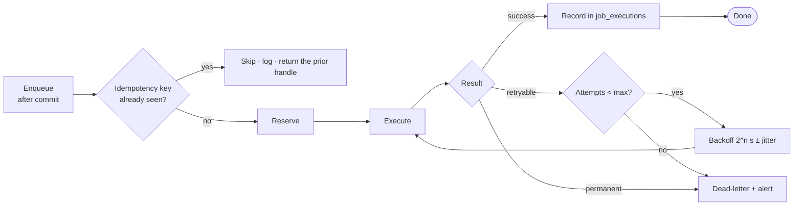
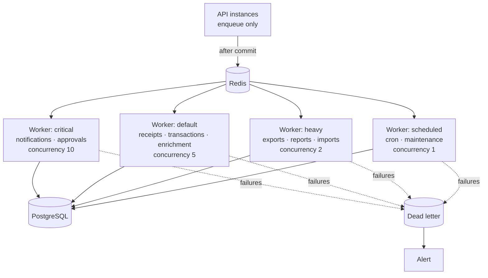

# 14 — Async Jobs and Queues

**Status:** Baseline v1.0 — 2026-08-29
**Module:** `apps/api/src/platform/queue` and `apps/api/src/modules/*/jobs`

---

## 1. What belongs in a job

A job, not a request handler, whenever the work is: slow, external, retryable, scheduled, or
fan-out. A job is **never** used for something a user is waiting on synchronously that must
succeed for the request to be correct.

| Belongs in a job                         | Belongs in the request       |
| ---------------------------------------- | ---------------------------- |
| Sending email                            | Writing the financial record |
| OCR extraction                           | Evaluating policy            |
| Generating a large export                | Recording an approval action |
| Provider webhook processing              | Updating a budget balance    |
| Scheduled reminders, escalations, expiry | Writing the audit event      |
| Accounting export generation             | Any state transition         |

**The dividing line is the transaction.** Anything that must commit atomically with a financial
change stays in the request. Everything else is enqueued _after_ the commit — a job scheduled
inside a transaction that then rolls back would otherwise process a record that does not exist.

---

## 2. The queue port

The audit found no Redis on the development host, and no Docker or WSL to run one (ADR-0006).
Writing directly against BullMQ would make the codebase undevelopable here and untestable in CI
without a service dependency. So:

```typescript
interface QueuePort {
  enqueue<T extends JobName>(
    name: T,
    payload: JobPayload<T>,
    opts?: EnqueueOptions,
  ): Promise<JobHandle>;

  schedule<T extends JobName>(
    name: T,
    payload: JobPayload<T>,
    runAt: Date,
    opts?: EnqueueOptions,
  ): Promise<JobHandle>;

  registerRecurring<T extends JobName>(
    name: T,
    cron: string,
    payload: JobPayload<T>,
  ): Promise<void>;
  getJob(id: JobId): Promise<JobState | null>;
}

interface EnqueueOptions {
  idempotencyKey?: string; // de-duplicates before the job is ever created
  maxAttempts?: number; // default 5
  backoff?: BackoffStrategy; // default exponential with jitter
  priority?: number;
  delayMs?: number;
}
```

| Adapter              | Environment                                   | Behaviour                                                                                                                                                                            |
| -------------------- | --------------------------------------------- | ------------------------------------------------------------------------------------------------------------------------------------------------------------------------------------ |
| `InlineQueueAdapter` | Local development, unit and integration tests | Executes after the current transaction commits, in-process, on a microtask. Delays are honoured with a timer; recurring jobs are triggerable manually. Fully deterministic in tests. |
| `BullMqQueueAdapter` | Staging, production                           | Redis-backed, separate worker processes, real concurrency, dead-letter queue.                                                                                                        |

Selection is by configuration: `REDIS_URL` present ⇒ BullMQ, absent ⇒ inline. A **production
environment with no `REDIS_URL` fails startup** — the inline adapter is a development convenience,
not an acceptable production configuration.

An architecture lint rule forbids importing `bullmq` anywhere except the adapter.

---

## 3. The job contract

Every job satisfies all six, and each is verified by a test in the job's own suite.



| #   | Requirement                                                                                                                                                                                                                                                           |
| --- | --------------------------------------------------------------------------------------------------------------------------------------------------------------------------------------------------------------------------------------------------------------------- |
| 1   | **Idempotent.** Running twice has the same effect as running once. Enforced by a natural key or a unique constraint on the effect, not by hoping delivery is exactly-once.                                                                                            |
| 2   | **Typed.** Payload and result are Zod-validated. A malformed payload dead-letters immediately rather than throwing deep inside the handler.                                                                                                                           |
| 3   | **Tenant-scoped.** The payload carries `organizationId`, and the handler establishes a request context from it before any repository call. A job without a context hits `TenantContextMissingError` — which is the intended failure.                                  |
| 4   | **Bounded.** Every job has a timeout. A job that can run indefinitely blocks a worker indefinitely.                                                                                                                                                                   |
| 5   | **Observable.** A span, a `job_executions` row, and metrics for duration, attempts, and outcome.                                                                                                                                                                      |
| 6   | **Failure-classified.** Retryable (network, 5xx, lock contention) versus permanent (validation, not-found, business-rule violation). Permanent failures dead-letter on the first attempt — retrying a validation error five times is pure waste and delays the alert. |

**Retry policy:** exponential backoff `2^attempt` seconds with full jitter, capped at 5 attempts
and 15 minutes. Jitter matters: without it, a provider outage produces synchronised retry storms
from every job that failed at the same moment.

**Dead letter:** the job, its payload, every attempt, and the final error are retained. An alert
fires on arrival. The dead-letter queue is reviewable and jobs are individually replayable after
the cause is fixed.

---

## 4. Job catalogue

`Idem key` is what makes a duplicate delivery a no-op.

### 4.1 Notifications

| Job                               | Trigger              | Idem key                             | Retry | Notes                         |
| --------------------------------- | -------------------- | ------------------------------------ | ----- | ----------------------------- |
| `notification.approval_requested` | Step activated       | `step:{stepId}:requested`            | 5     | In-app + email                |
| `notification.approval_decided`   | Step decided         | `step:{stepId}:{action}`             | 5     | To the requester              |
| `notification.receipt_missing`    | Daily sweep          | `txn:{txnId}:{date}`                 | 3     | Digest, not per-transaction   |
| `notification.budget_threshold`   | Threshold crossed    | `line:{lineId}:{threshold}:{period}` | 3     | Once per threshold per period |
| `notification.reimbursement_paid` | Batch marked paid    | `reimb:{id}:paid`                    | 5     |                               |
| `notification.digest_daily`       | Cron 08:00 org-local | `digest:{memId}:{date}`              | 2     | Opt-in                        |

### 4.2 Approvals

| Job                                 | Trigger                | Idem key                     | Notes                                    |
| ----------------------------------- | ---------------------- | ---------------------------- | ---------------------------------------- |
| `approval.reminder`                 | Cron hourly            | `step:{stepId}:reminder:{n}` | At 50 % and 80 % of the timeout          |
| `approval.escalate`                 | Cron every 15 min      | `step:{stepId}:escalated`    | Applies the configured escalation action |
| `approval.reassign_on_deactivation` | Membership deactivated | `mem:{id}:reassign`          | Re-resolves every pending step           |

### 4.3 Receipts and documents

| Job                        | Trigger            | Idem key             | Notes                                             |
| -------------------------- | ------------------ | -------------------- | ------------------------------------------------- |
| `receipt.scan`             | Upload completed   | `receipt:{id}:scan`  | Malware hook; quarantine on detection             |
| `receipt.ocr`              | After a clean scan | `receipt:{id}:ocr`   | No-op adapter in MVP; **never blocks submission** |
| `receipt.match_suggest`    | After OCR          | `receipt:{id}:match` | Suggests a transaction by amount, merchant, date  |
| `document.cleanup_orphans` | Cron daily         | `cleanup:{date}`     | Removes objects with no row, older than 24 h      |

### 4.4 Transactions and providers

| Job                        | Trigger             | Idem key                          | Notes                                                  |
| -------------------------- | ------------------- | --------------------------------- | ------------------------------------------------------ |
| `webhook.process`          | Webhook received    | `webhook:{provider}:{eventId}`    | The unique constraint is the guarantee                 |
| `transaction.sync`         | Cron hourly         | `sync:{providerAccountId}:{hour}` | Pulls provider transactions since a cursor             |
| `transaction.enrich`       | Transaction created | `txn:{id}:enrich`                 | Merchant normalisation, vendor and category suggestion |
| `transaction.auto_match`   | Transaction created | `txn:{id}:match`                  | Matches to an approved spend request                   |
| `transaction.import_batch` | CSV uploaded        | `import:{batchId}`                | Chunked; per-row results                               |

### 4.5 Budgets

| Job                      | Trigger      | Idem key                 | Notes                                                                                                     |
| ------------------------ | ------------ | ------------------------ | --------------------------------------------------------------------------------------------------------- |
| `budget.recalculate`     | Cron nightly | `budget:{lineId}:{date}` | Verifies materialised balance against the movement sum; **alerts on drift, does not silently correct it** |
| `budget.rollover`        | Period end   | `budget:{id}:{period}`   | Creates the next period's lines                                                                           |
| `budget.release_expired` | Cron daily   | `req:{id}:release`       | Releases commitments for expired requests                                                                 |

Drift between the materialised balance and the movement ledger means something wrote a balance
outside the sanctioned path. Silently repairing it would hide the bug; alerting surfaces it.

### 4.6 Accounting and reporting

| Job                     | Trigger             | Idem key                      | Notes                                      |
| ----------------------- | ------------------- | ----------------------------- | ------------------------------------------ |
| `accounting.export`     | User request        | `export:{batchId}`            | Generates the file, marks records exported |
| `accounting.sync_coa`   | Cron daily          | `coa:{connectionId}:{date}`   | Phase 7                                    |
| `report.generate_large` | Export > 5,000 rows | `report:{requestId}`          | Streamed; signed link on completion        |
| `report.scheduled`      | Cron per schedule   | `sched:{scheduleId}:{period}` | Emailed                                    |

### 4.7 Maintenance

| Job                                 | Cron            | Purpose                                                             |
| ----------------------------------- | --------------- | ------------------------------------------------------------------- |
| `maintenance.purge_sessions`        | Daily 02:00 UTC | Sessions expired > 90 days                                          |
| `maintenance.purge_idempotency`     | Hourly          | Keys older than 24 h                                                |
| `maintenance.purge_webhooks`        | Daily           | Processed events older than 30 days                                 |
| `maintenance.archive_audit`         | Monthly         | Audit events older than 2 years to cold storage (7-year retention)  |
| `maintenance.expire_invitations`    | Daily           | Marks expired invitations                                           |
| `maintenance.expire_spend_requests` | Daily           | Expires approved-but-unused requests; releases commitments          |
| `maintenance.integrity_check`       | Nightly         | Budget drift, orphaned records, audit gaps, immutability violations |

---

## 5. Worker topology



Separate queues so a slow 50,000-row export cannot delay an approval notification. Concurrency is
inversely proportional to job weight. The scheduled worker runs at concurrency 1 with a
distributed lock, so a cron job never runs twice when two instances are deployed.

Workers are **the same build artefact** as the API with a different entrypoint — so a job and a
request cannot see different versions of a business rule.

---

## 6. Scheduling

Cron expressions are evaluated in **UTC**, with per-organisation local-time jobs (daily digests)
computed by offsetting from the organisation's timezone. A distributed lock in Redis, keyed by
`{jobName}:{scheduledTime}`, ensures single execution across instances. The inline adapter
registers recurring jobs but does not run them automatically — a developer triggers them
explicitly, which makes local behaviour deterministic.

---

## 7. Observability and alerting

**Metrics:** `job_enqueued_total`, `job_completed_total`, `job_failed_total`,
`job_duration_seconds` (histogram), `job_attempts` (histogram), `queue_depth`, `queue_oldest_job_age`.

**Alerts:**

| Condition                                       | Severity                                                                  |
| ----------------------------------------------- | ------------------------------------------------------------------------- |
| Any dead-letter arrival                         | High                                                                      |
| Queue depth > 1,000 for 5 min                   | High                                                                      |
| Oldest job age > 15 min                         | High                                                                      |
| Job failure rate > 5 % over 10 min              | Medium                                                                    |
| `budget.recalculate` reports drift              | **Critical** — a financial figure was written outside the sanctioned path |
| `maintenance.integrity_check` finds a violation | **Critical**                                                              |
| Scheduled job missed its window                 | Medium                                                                    |

**Tracing:** the enqueueing request's trace context propagates into the job, so a receipt upload
and its OCR job appear on one trace.

---

## 8. Testing

| Level       | Approach                                                                                        |
| ----------- | ----------------------------------------------------------------------------------------------- |
| Unit        | Handler tested directly with a fake context and fake providers                                  |
| Idempotency | **Every job has a test that runs it twice and asserts the effect occurred once.** No exceptions |
| Failure     | Retryable versus permanent classification asserted per job                                      |
| Integration | With the inline adapter: enqueue, execute, assert database state                                |
| Ordering    | Jobs enqueued inside a transaction do not run before commit — asserted explicitly               |
| Load        | BullMQ adapter under sustained enqueue rate; queue drains, no growth                            |

The double-run test is the one that matters most. At-least-once delivery means duplicate execution
_will_ happen in production; a job that has not been proven idempotent is a job that will
eventually double-pay a reimbursement or double-commit a budget.
