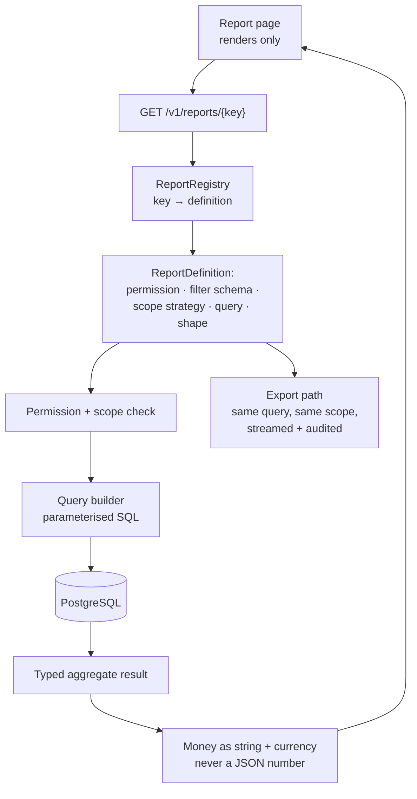
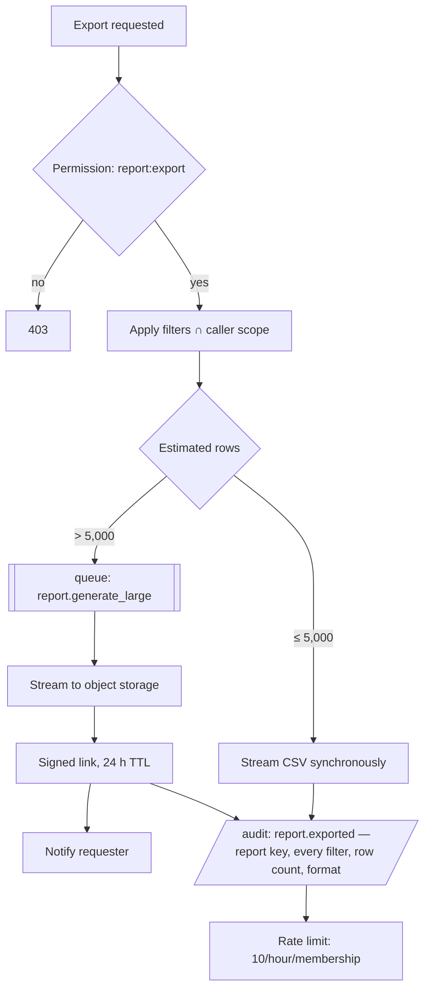

# 15 — Reporting and Analytics

**Status:** Baseline v1.0 — 2026-08-29
**Module:** `apps/api/src/modules/reports`

---

## 1. The governing rule

> **No financial figure is ever computed in the browser.**

Every number a user sees — a KPI, a chart point, a table subtotal, a budget remaining, an export
cell — is produced by a backend query. The frontend receives values and formats them.

This is enforced three ways:

1. A lint rule forbids arithmetic on `Money`/`Decimal` types in `apps/web`.
2. Report responses contain no raw rows that would tempt a client to aggregate them.
3. Every report has a backend test asserting the returned totals against known fixture data.

**Why it is stated this strongly.** A client-side sum is unauditable (nobody can reproduce what
the browser did), scope-blind (it can only aggregate what was fetched, and pagination silently
truncates it), and inconsistent (two components will drift). In a system whose purpose is
answering "how much did we spend?", a number that cannot be reproduced is worse than no number.

---

## 2. Architecture



Reports are **registry entries, not routes**. Adding a report is one definition object; it
inherits filtering, permission checking, scope enforcement, pagination, export, and audit for
free. That is what stops the fifteenth report from being the one that forgot a scope check.

```typescript
interface ReportDefinition<F extends FilterSchema> {
  key: string;
  name: string;
  permission: PermissionKey;
  scope: ScopeStrategy;
  filters: F; // Zod — unknown filters are rejected
  execute(ctx: ReportContext, filters: z.infer<F>): Promise<ReportResult>;
  exportColumns: ExportColumn[];
}
```

---

## 3. Report catalogue (MVP)

| Key                          | Name                       | Permission           | Answers                                                    |
| ---------------------------- | -------------------------- | -------------------- | ---------------------------------------------------------- |
| `spend-total`                | Total spend                | `report:read`        | How much did we spend, over time, versus the prior period? |
| `spend-by-department`        | Spend by department        | `report:read`        | Which teams are spending?                                  |
| `spend-by-category`          | Spend by category          | `report:read`        | What are we buying?                                        |
| `spend-by-vendor`            | Spend by vendor            | `report:read`        | Who are we paying, and is it concentrating?                |
| `spend-by-person`            | Spend by person            | `report:read`        | Who is spending? Scope-limited.                            |
| `budget-vs-actual`           | Budget vs actual           | `budget:read`        | Are we on plan? Where will we breach?                      |
| `pending-approvals`          | Pending approvals          | `approval:read`      | What is stuck, with whom, and for how long?                |
| `outstanding-reimbursements` | Outstanding reimbursements | `reimbursement:read` | What do we owe employees?                                  |
| `open-bills`                 | Open bills (AP ageing)     | `bill:read`          | What do we owe suppliers, and when?                        |
| `policy-exceptions`          | Policy exceptions          | `report:read`        | Where is policy being bypassed or breached?                |
| `uncategorised-transactions` | Uncategorised transactions | `transaction:read`   | What is blocking close?                                    |
| `missing-receipts`           | Missing receipts           | `transaction:read`   | What evidence is outstanding, and from whom?               |

The last four are **close-readiness reports**. They exist because Priya's actual daily question is
not "how much did we spend" — it is "what is still incomplete", and that is the report most spend
tools under-serve.

---

## 4. The shared filter model

One schema, applied consistently across every report, list, and export.

| Filter                                             | Type     | Notes                                                            |
| -------------------------------------------------- | -------- | ---------------------------------------------------------------- |
| `dateFrom` / `dateTo`                              | date     | Required on spend reports; maximum span 24 months                |
| `datePreset`                                       | enum     | `MTD` `QTD` `YTD` `LAST_30D` `LAST_QUARTER` `LAST_YEAR` `CUSTOM` |
| `entityIds`                                        | uuid[]   | Intersected with the caller's entity scope                       |
| `departmentIds`                                    | uuid[]   | Includes descendants via the materialised path                   |
| `memberIds`                                        | uuid[]   | Scope-limited                                                    |
| `categoryIds`                                      | uuid[]   | Includes descendants                                             |
| `vendorIds` / `projectIds`                         | uuid[]   |                                                                  |
| `paymentMethods`                                   | enum[]   | `CARD` `REIMBURSEMENT` `BILL` `PO`                               |
| `approvalStates` / `policyStates` / `reviewStates` | enum[]   |                                                                  |
| `currency`                                         | ISO-4217 | Required when a report returns a single total                    |
| `amountMin` / `amountMax`                          | money    |                                                                  |
| `groupBy`                                          | enum     | Per report                                                       |
| `interval`                                         | enum     | `DAY` `WEEK` `MONTH` `QUARTER`                                   |

**Scope intersection, not replacement.** If a manager requests `departmentIds=[Sales]` but their
scope is Engineering, the result is empty — not Sales' data, and not an error that reveals Sales
exists. The requested filter is intersected with the enforced scope, always in that direction.

**Unknown filters are `422`.** Silently ignoring an unrecognised parameter means a user can
believe an export was filtered when it was not — and then send it to someone who should not see
all of it.

---

## 5. Currency handling in reports

Money in different currencies is never summed. Reports handle this explicitly:

1. **Single-currency mode (default).** The caller supplies `currency`; only records in that
   currency are included, and the response states the currency and the excluded row count.
2. **Grouped mode.** Results are grouped by currency, returning one total per currency.
3. **Converted mode (opt-in).** Amounts convert to the organisation's base currency using the
   rate stored on each record. The response includes `"converted": true`, the rate source, and a
   note that converted figures are indicative. A converted figure is never used for reconciliation
   or accounting export.

The third mode returning an unlabelled single number would be the easy, wrong choice — it hides a
material assumption inside a figure someone will paste into a board deck.

---

## 6. Query strategy and performance

| Technique                                          | Applied to                                                                                   |
| -------------------------------------------------- | -------------------------------------------------------------------------------------------- |
| Parameterised SQL via `$queryRaw` tagged templates | All aggregates — the ORM's grouping is not expressive enough, and explicit SQL is reviewable |
| Mandatory `organization_id` predicate              | Every query, added by the report base class, not by each author                              |
| Index-aligned filters                              | `(organization_id, occurred_at DESC)` and dimension-specific composites                      |
| Partial indexes                                    | Queue reports (unreviewed, missing receipt, unexported)                                      |
| `LATERAL` joins                                    | Per-group top-N without N+1                                                                  |
| Materialised views                                 | Only after measurement; Phase 6, refreshed nightly, for the heaviest dashboard aggregates    |
| Statement timeout                                  | 10 s for interactive reports, 120 s for queued exports                                       |
| Streaming                                          | Exports use a server-side cursor; memory is bounded regardless of row count                  |

**Targets** (NFR-PERF-004/005/007): dashboard aggregates p95 ≤ 500 ms and report queries
p95 ≤ 1 s at 100,000 transactions per organisation. CI runs `EXPLAIN` assertions on every report
query and fails on a sequential scan of a seeded table over 10,000 rows.

---

## 7. The dashboard

Role-aware, and every value from `GET /v1/dashboard/*`.

| Widget                     | Employee     | Manager                | Finance / Admin           | Auditor      |
| -------------------------- | ------------ | ---------------------- | ------------------------- | ------------ |
| Spend MTD                  | Own          | Department             | Organisation              | Organisation |
| Pending approvals          | Own requests | Awaiting them          | All pending               | All pending  |
| Uncategorised transactions | —            | Department             | Organisation              | Organisation |
| Missing receipts           | Own          | Department             | Organisation              | Organisation |
| Budget utilisation         | —            | Their budgets          | All budgets               | All budgets  |
| Outstanding reimbursements | Own          | Department             | Organisation              | Organisation |
| Spend trend                | Own          | Department             | Organisation              | Organisation |
| Needs attention            | Own actions  | Approvals + exceptions | Review queue + exceptions | —            |

Role-awareness is applied **server-side by scope**, not by rendering different components against
the same full dataset. The employee's dashboard endpoint returns only the employee's data.

---

## 8. Accounting dimensions

Reporting and accounting export share one dimension model, so a figure in a report and the same
figure in an export are derived identically.

| Dimension       | Source                                      | Required for export |
| --------------- | ------------------------------------------- | ------------------- |
| GL account      | Mapping rule from category                  | Yes                 |
| Cost centre     | Department, or an explicit override         | Yes                 |
| Legal entity    | On the record                               | Yes                 |
| Department      | On the record                               | Yes                 |
| Project         | On the record                               | Optional            |
| Tax code        | Mapping rule from category and jurisdiction | Where applicable    |
| Vendor          | On the record                               | For AP              |
| Custom tracking | Org-defined key/value                       | Optional            |

Every dimension is filterable and groupable in reports. A record missing a required dimension
appears in the **unmapped queue** and blocks export until resolved — which is deliberate: a
silently-defaulted GL account produces a clean-looking export that is wrong, and nobody discovers
it until the accountant does.

---

## 9. Export



The audit event records the **exact filter set**, not just that an export happened. "Who exported
company spend data, and what did it contain?" is a question an auditor will ask, and the answer
must not require re-running the query against changed data.

**Format:** UTF-8 with BOM (so Excel opens it correctly), RFC 4180 quoting, ISO dates, money as an
unformatted decimal string with a separate currency column. Values beginning `= + - @` are prefixed
with a single quote to defeat CSV formula injection — an export opened in a spreadsheet is an
execution context, and a merchant name is user-controlled input.

---

## 10. Testing

| Level          | What is tested                                                                            |
| -------------- | ----------------------------------------------------------------------------------------- |
| Correctness    | Every report against a known fixture set with hand-calculated expected totals             |
| Scope          | Each report run as each role; a manager's totals never include another department         |
| Cross-tenant   | A second organisation's data never appears in any report, under any filter                |
| Currency       | Mixed-currency data never produces an unlabelled single total                             |
| Filters        | Every filter individually and in combination; unknown filter ⇒ `422`                      |
| Rounding       | Sum of group subtotals equals the reported grand total exactly (NFR-FIN-004)              |
| Performance    | `EXPLAIN` assertions; p95 benchmarks against a seeded dataset                             |
| Export         | Row count matches the report; escaping and formula-injection defence; audit event written |
| No-client-math | A static check asserts no money arithmetic exists in `apps/web`                           |

The subtotal-equals-total test is the one that catches rounding bugs. If group subtotals are each
rounded and then summed, they will not equal a separately-rounded grand total, and a controller
will notice immediately — and stop trusting every other number on the page.
