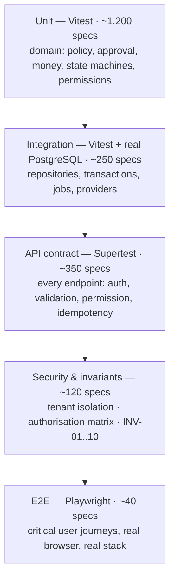

# 16 — Testing Strategy

**Status:** Baseline v1.0 — 2026-08-29

---

## 1. What testing is for here

This is a system that decides whether company money may be spent, and that produces the record an
auditor will rely on. Tests exist to make three claims defensible:

1. **The money is right.** Arithmetic, rounding, currency, and balances.
2. **The rules are right.** Policy, approval, permissions, and state transitions.
3. **The boundaries hold.** Tenant isolation, authorisation, and immutability.

Everything else is ordinary software testing. These three are the ones that must not have gaps,
and they are why coverage floors are set higher for the domain than for the application as a
whole.

---

## 2. Shape of the suite



Weighted toward the bottom, because the domain layer is pure and therefore cheap and fast to test
exhaustively — which is exactly why the domain was made pure.

| Level       | Tool                      | Data                              | Speed       | Runs on                             |
| ----------- | ------------------------- | --------------------------------- | ----------- | ----------------------------------- |
| Unit        | Vitest                    | In-memory fixtures                | < 5 s total | Every save, every PR                |
| Integration | Vitest + real PostgreSQL  | Per-test transaction, rolled back | < 90 s      | Every PR                            |
| API         | Supertest + Nest test app | Seeded per suite                  | < 3 min     | Every PR                            |
| Security    | Supertest                 | Multi-tenant fixture              | < 2 min     | Every PR                            |
| E2E         | Playwright                | Seeded database                   | < 10 min    | Every PR (critical), nightly (full) |
| Performance | k6                        | Large seeded dataset              | ~15 min     | Nightly                             |

---

## 3. Unit tests — the domain

No database, no framework, no network. Everything is a function of its inputs.

### 3.1 Money (`packages/core`) — coverage floor 100 %

| Concern         | Cases                                                                                     |
| --------------- | ----------------------------------------------------------------------------------------- |
| Construction    | Valid decimals; rejects `NaN`, `Infinity`, `1.23456` (over-precision), non-ISO currency   |
| Arithmetic      | Add, subtract, multiply by a scalar, allocate across shares                               |
| Currency safety | `USD + EUR` throws `CurrencyMismatchError`                                                |
| Rounding        | Half-to-even at every boundary: `2.5→2`, `3.5→4`, `2.345→2.34`, `2.355→2.36`              |
| Allocation      | `100.00 / 3` allocates `33.34 + 33.33 + 33.33` — the remainder is distributed, never lost |
| Serialisation   | Round-trips as a string; **never** produced as a JSON number                              |
| Comparison      | Ordering, equality, zero, and negative handling                                           |

The allocation test is the one that catches real bugs: naive division loses a cent, and a lost
cent in a reimbursement split is a support ticket and a trust problem.

### 3.2 Policy engine — coverage floor 95 %

Per `11 §9`: the full field × operator matrix, all nine merge precedence rules, property-based
determinism over 10,000 generated contexts with shuffled policy ordering, currency safety, and
golden-file fixtures that fail the build if a decision output changes.

### 3.3 Approval resolution and state machine — coverage floor 95 %

Every `ApproverSpec` kind; the fallback ladder; `UNRESOLVABLE_APPROVER`; INV-02 through four
distinct paths (direct, delegation, role membership, department-head resolution); every legal
transition succeeds; **every illegal transition is enumerated and asserted to throw**.

```typescript
// The pattern that matters: exhaustive, not representative.
const ILLEGAL: Array<[SpendStatus, SpendStatus]> = [
  ['DRAFT', 'APPROVED'],
  ['REJECTED', 'APPROVED'],
  ['APPROVED', 'DRAFT'],
  ['CANCELLED', 'SUBMITTED'],
  ['FULFILLED', 'PENDING_APPROVAL'] /* …all of them */,
];
it.each(ILLEGAL)('FR-SPD-005: %s → %s is rejected', (from, to) => {
  expect(() => machine.transition(from, to)).toThrow(InvalidStateTransitionError);
});
```

### 3.4 Permissions — coverage floor 100 %

The matrix from `03 §3` is encoded as a fixture and asserted cell by cell. Scope predicate
construction for each strategy. INV-03, INV-04, and INV-05.

---

## 4. Integration tests — real PostgreSQL

Against a real database, because the guarantees being tested _are_ database guarantees. A mocked
repository cannot demonstrate that a unique index prevents a double reimbursement.

Each test runs inside a transaction that is rolled back, so the suite is order-independent and
parallelisable.

| Area                 | What is proven                                                                                  |
| -------------------- | ----------------------------------------------------------------------------------------------- |
| Tenant predicate     | Every repository method includes `organizationId`; a call without context throws                |
| Transactions         | Multi-record operations are atomic; an injected fault leaves no partial state                   |
| Audit atomicity      | Rolling back the change also rolls back its audit event                                         |
| Constraints          | Unique, check, and composite-FK violations behave as specified and map to the right error code  |
| Immutability trigger | Updating a posted transaction's amount raises; updating its category succeeds                   |
| Concurrency          | 50 parallel budget movements produce a correct final balance                                    |
| Locking              | Two simultaneous approvals of one step: exactly one succeeds                                    |
| Jobs                 | Inline adapter: enqueue, run, assert effect; **run twice, assert the effect happened once**     |
| Providers            | Every adapter passes the shared per-port contract suite unchanged                               |
| Migrations           | Applying all migrations to an empty database yields the expected schema; the seed is idempotent |

---

## 5. API tests

Every endpoint, driven through real HTTP against a real Nest application.

**Per endpoint, always:**

| Check                                      | Expectation                                                                               |
| ------------------------------------------ | ----------------------------------------------------------------------------------------- |
| Unauthenticated                            | `401`                                                                                     |
| Authenticated, permission absent           | `403`                                                                                     |
| Auditor on a non-`GET`                     | `403 AUDITOR_READ_ONLY`                                                                   |
| Out-of-scope resource                      | `404`                                                                                     |
| Cross-tenant resource                      | `404`, never `403`                                                                        |
| Invalid body                               | `422` with a field-keyed map                                                              |
| Unknown filter parameter                   | `422`                                                                                     |
| Valid request                              | Correct status, envelope, and audit event written                                         |
| Repeated `Idempotency-Key`, same body      | Original response replayed                                                                |
| Repeated `Idempotency-Key`, different body | `409 IDEMPOTENCY_KEY_REUSED`                                                              |
| Stale `If-Match`                           | `409 STALE_VERSION`                                                                       |
| Response shape                             | Contains no `passwordHash`, `tokenHash`, `mfaSecret`, `bankDetailsEncrypted`, PAN, or CVV |

**Route coverage is mechanical.** A meta-test enumerates the Nest route table and fails if any
route lacks `@Public()` or `@RequirePermission()`, or if any mutating route lacks `@Audited()`.
This is what protects against the endpoint added under time pressure six months from now.

---

## 6. Financial correctness tests

The suite that justifies calling this a finance system.

| ID     | Scenario                                                                  | Assertion                                                                             |
| ------ | ------------------------------------------------------------------------- | ------------------------------------------------------------------------------------- |
| FIN-01 | Rounding across a 3-way expense split                                     | Sum of parts equals the whole, exactly                                                |
| FIN-02 | Multi-currency report                                                     | No unlabelled cross-currency total is ever produced                                   |
| FIN-03 | Duplicate webhook, same event ID                                          | One transaction row; second call is a `200` no-op                                     |
| FIN-04 | Same CSV imported twice                                                   | No duplicate rows; per-row "already imported" results                                 |
| FIN-05 | 50 concurrent approvals against one budget line                           | Final balance equals the exact expected sum; no lost update                           |
| FIN-06 | Two simultaneous reimbursements of one expense                            | One succeeds, one `409 EXPENSE_ALREADY_REIMBURSED`                                    |
| FIN-07 | Budget consumption to exactly the limit, then one more                    | `BLOCK` behaviour blocks; `REQUIRE_APPROVAL` injects a step; `WARN` allows and alerts |
| FIN-08 | Update a posted transaction's amount                                      | `409 POSTED_RECORD_IMMUTABLE`; the trigger fires even for direct SQL                  |
| FIN-09 | Adjustment against a posted transaction                                   | Original unchanged; adjustment linked; report reflects the net                        |
| FIN-10 | Payment job times out then retries                                        | Exactly one payment recorded                                                          |
| FIN-11 | Client submits a total that disagrees with its line items                 | `422 AMOUNT_MISMATCH`; the client's figure is never persisted                         |
| FIN-12 | Commitment released after request expiry                                  | Budget returns to its prior balance exactly                                           |
| FIN-13 | Movement ledger versus materialised balance, across the whole fixture set | Always equal, for every line                                                          |
| FIN-14 | Report group subtotals versus grand total                                 | Exactly equal — no rounding drift                                                     |
| FIN-15 | Approval instance re-evaluated after `RETURNED` and an amount increase    | A new, larger chain is resolved; the old chain is not reused                          |

---

## 7. Security tests

| ID     | Scenario                                                                                     | Expected                                        |
| ------ | -------------------------------------------------------------------------------------------- | ----------------------------------------------- |
| SEC-01 | Org B session, org A resource ID — **parameterised across every resource endpoint**          | `404` on all                                    |
| SEC-02 | `organizationId` for org A injected in body, query, and header, with an org B session        | `403` + security event                          |
| SEC-03 | Employee attempts every admin endpoint                                                       | `403` on all                                    |
| SEC-04 | Member sets their own role to `ORG_ADMIN`                                                    | `403 SELF_ELEVATION_FORBIDDEN`                  |
| SEC-05 | Demote the last `ORG_ADMIN`                                                                  | `409 LAST_ADMIN`                                |
| SEC-06 | Auditor attempts every non-`GET` endpoint                                                    | `403 AUDITOR_READ_ONLY` on all                  |
| SEC-07 | Requester approves their own request — direct, via delegation, via role, via department head | `403 SELF_APPROVAL_FORBIDDEN` on all four       |
| SEC-08 | Revoked session reused                                                                       | `401`                                           |
| SEC-09 | Expired session (idle and absolute)                                                          | `401`                                           |
| SEC-10 | Password change                                                                              | All other sessions invalidated                  |
| SEC-11 | Upload: renamed executable, polyglot, zip bomb, oversized, SVG with script                   | All rejected; nothing stored                    |
| SEC-12 | Direct object-storage access without a signed URL                                            | Denied                                          |
| SEC-13 | Expired signed URL                                                                           | Denied                                          |
| SEC-14 | Webhook with an invalid signature                                                            | `401`; body never parsed                        |
| SEC-15 | Webhook replayed outside the timestamp window                                                | Rejected                                        |
| SEC-16 | Webhook replayed with a duplicate event ID                                                   | `200` no-op; no second effect                   |
| SEC-17 | Export without `report:export`                                                               | `403`                                           |
| SEC-18 | Export by a manager                                                                          | Contains only their department's rows           |
| SEC-19 | Any attempt to `UPDATE` or `DELETE` `audit_events` via the app role                          | Denied by grant                                 |
| SEC-20 | Login rate limit and lockout                                                                 | `429`, then lockout, then recovery              |
| SEC-21 | Enumeration: unknown vs. wrong password                                                      | Identical response and comparable timing        |
| SEC-22 | Repository call outside a request context                                                    | `TenantContextMissingError`                     |
| SEC-23 | Fuzz: random ID substitution across all endpoints                                            | No response ever contains another tenant's data |
| SEC-24 | Log scan after a request containing a password, token, and card-shaped value                 | None appear in any log line                     |

---

## 8. E2E tests

Real browser, real API, real database, seeded organisation.

**Critical path (blocks merge):**

| Spec                 | Flow                                                                   |
| -------------------- | ---------------------------------------------------------------------- |
| `vertical-slice`     | The complete flow from `05 §0`, with all six end-state assertions      |
| `auth`               | Register, invite, accept, login, MFA challenge, logout, session revoke |
| `spend-approval`     | Draft, dry-run preview, submit, approve, reject, return-and-resubmit   |
| `receipt-expense`    | Upload, attach, submit expense, approve, reimburse                     |
| `transaction-review` | Import CSV, categorise, review, flag exception                         |
| `budget-dashboard`   | Create budget, consume it, see the dashboard and report update         |
| `permissions`        | Each role sees only its permitted navigation, screens, and actions     |

**Full suite (nightly):** every module's list, detail, create, edit, filter, sort, paginate, bulk
action, and export path; plus the four required states on every screen; plus `axe` on every route.

**E2E rules.** Test user journeys, not implementation. Select by role and accessible name, never
by CSS class. No arbitrary waits — wait for a condition. Each spec seeds and cleans its own data.
A flaky spec is quarantined and fixed within one sprint, never retried into green.

---

## 9. Frontend tests

| Level     | Scope                                                                                                |
| --------- | ---------------------------------------------------------------------------------------------------- |
| Component | Every `packages/ui` component: rendering, variants, states, keyboard interaction, `axe`, both themes |
| Hook      | Data hooks against a mocked API client: loading, success, error, and cache invalidation              |
| Form      | Validation, submission, server-error surfacing, and the disabled/loading state                       |
| Static    | The lint rule asserting no money arithmetic exists anywhere in `apps/web`                            |

---

## 10. Coverage and CI gates

| Scope                                   | Line  | Branch |
| --------------------------------------- | ----- | ------ |
| `packages/core`                         | 100 % | 100 %  |
| `modules/policies`, `modules/approvals` | 95 %  | 95 %   |
| `modules/*` (other domain)              | 90 %  | 85 %   |
| `apps/api` overall                      | 85 %  | 80 %   |
| `packages/ui`                           | 85 %  | 80 %   |
| `apps/web`                              | 70 %  | 65 %   |

Coverage is a floor, not a target. A module at 90 % with no test for its illegal state transitions
is worse tested than one at 80 % that has them, so review asks _what_ is covered — the numbers only
catch regressions.

**Pull request gate (all must pass):** lint · typecheck · unit · integration · API · security ·
critical E2E · build · `pnpm audit` (no critical/high) · secret scan · coverage floors · bundle
size · architecture lint. Under 15 minutes total (NFR-OPS-005).

**Nightly:** full E2E, performance (k6), DAST, dependency audit, `EXPLAIN` assertions, integrity
checks.

---

## 11. Test data

| Fixture    | Contents                                                                                                                                                                 |
| ---------- | ------------------------------------------------------------------------------------------------------------------------------------------------------------------------ |
| `minimal`  | One org, one admin. Fast unit and API setup.                                                                                                                             |
| `standard` | Two orgs (**tenant isolation depends on the second existing in every fixture**), 5 departments, 20 members across all roles, 10 policies, budgets, 200 transactions.     |
| `large`    | One org, 100,000 transactions, 500 members. Performance only.                                                                                                            |
| `edge`     | Deliberately awkward: mixed currencies, exact budget limits, expired approvals, orphaned receipts, deep department trees, unicode and RTL names, maximum-length strings. |

Fixtures are built by typed factories with sensible defaults and explicit overrides, so a test
states only what it cares about. Data is deterministic — seeded faker, fixed clock — because a
test that fails one run in fifty teaches people to re-run rather than to investigate.
