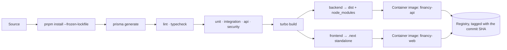
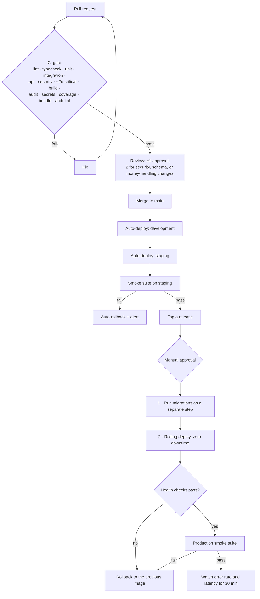
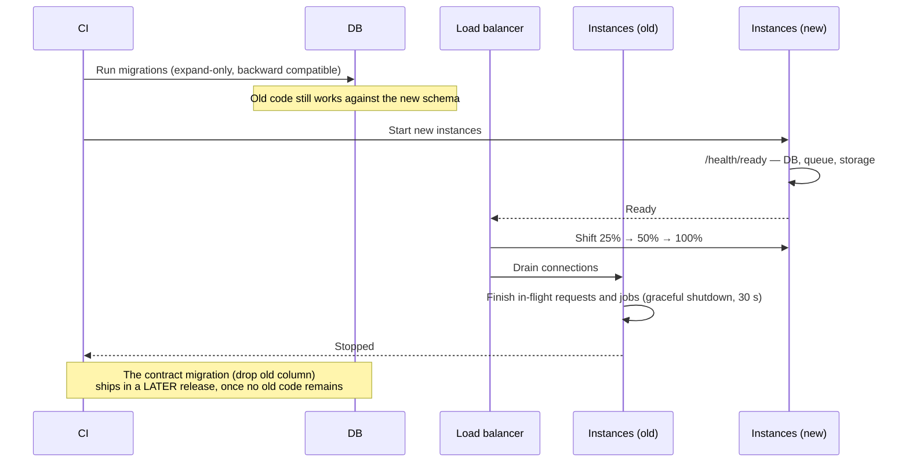

# 17 — Deployment and Environments

**Status:** Baseline v1.0 — 2026-08-29
**Constraints from:** `REPOSITORY_AUDIT.md` §5 (no Docker, no WSL, no Redis on the development host)

---

## 1. Environments

| Environment     | Purpose                         | Data                         | Providers             | Who deploys                     |
| --------------- | ------------------------------- | ---------------------------- | --------------------- | ------------------------------- |
| **local**       | Development on a workstation    | Seeded demo                  | All mock/local        | Developer                       |
| **test**        | Automated suites (CI and local) | Ephemeral, per-run           | All fake              | CI                              |
| **development** | Shared integration              | Seeded, resettable           | Mock + sandbox        | Auto on merge to `main`         |
| **staging**     | Production rehearsal            | Anonymised production-shaped | Sandbox               | Auto on merge to `main`         |
| **production**  | Customers                       | Real                         | Real where configured | Manual approval, tagged release |

**Staging is a rehearsal, not a demo.** Same topology, same migration path, same configuration
mechanism, same deploy procedure. A release that has not run on staging does not go to production.

---

## 2. Local development

### 2.1 The constraint and the response

The audit found **no Docker, no WSL, and no Redis** on the development host, plus PostgreSQL 18.1
already running on `:5432` and ports `3000` and `5433` occupied by unrelated processes.

Rather than making Docker a prerequisite, local development uses the native PostgreSQL and the
adapters designed for exactly this case:

| Dependency           | Local approach                                                                 |
| -------------------- | ------------------------------------------------------------------------------ |
| PostgreSQL           | Native install already present                                                 |
| Redis / queue        | `InlineQueueAdapter` — in-process, runs after commit (ADR-0006)                |
| Object storage       | `LocalDocumentProvider` — filesystem with HMAC-signed expiring URLs (ADR-0008) |
| Email                | `ConsoleNotificationProvider` — renders to stdout and to a local outbox viewer |
| Card / payment / OCR | Mock adapters                                                                  |

Docker is **supported but optional**. `infra/docker-compose.yml` gives PostgreSQL, Redis, MinIO,
and Mailpit to developers who have Docker — and it is what CI uses. It is never the only path.

### 2.2 Setup

```bash
git clone https://github.com/Fute-Services/financy.git
cd financy
pnpm install
cp .env.example .env            # then set DATABASE_URL
pnpm db:migrate                 # applies migrations
pnpm db:seed                    # system seed + demo organisation
pnpm dev                        # web :3100 · api :4100
```

Six steps, per NFR-OPS-004.

**Database provisioning** — resolves audit finding P1. Run once, as a PostgreSQL superuser:

```sql
CREATE ROLE financy_app WITH LOGIN PASSWORD '<generated>';
CREATE DATABASE financy_dev  OWNER financy_app;
CREATE DATABASE financy_test OWNER financy_app;
\c financy_dev
CREATE EXTENSION IF NOT EXISTS pgcrypto;
CREATE EXTENSION IF NOT EXISTS citext;
CREATE EXTENSION IF NOT EXISTS pg_trgm;
CREATE EXTENSION IF NOT EXISTS btree_gin;
```

The application never connects as `postgres`, in any environment.

**Ports** (audit finding P2 — `3000` and `5433` are occupied by unrelated processes):

| Service                     | Port              |
| --------------------------- | ----------------- |
| Web                         | `3100`            |
| API                         | `4100`            |
| PostgreSQL                  | `5432` (existing) |
| Redis (if Docker is used)   | `6479`            |
| MinIO (if Docker is used)   | `9100` / `9101`   |
| Mailpit (if Docker is used) | `8125`            |

All are environment-driven; nothing is hard-coded.

### 2.3 Cross-platform rules

The development host is Windows with no WSL, so:

- No bash-specific syntax in `package.json` scripts. Anything non-trivial is a Node script under
  `scripts/`.
- Paths built with `node:path`, never string concatenation.
- `.gitattributes` enforces `LF` for all text files.
- Long-path support assumed; nested `node_modules` depth kept in check by pnpm's flat store.

---

## 3. Configuration

Validated at startup by a Zod schema. A missing or malformed variable **crashes the process
immediately** — a service that boots with broken configuration and fails later, under load, is a
worse outcome than one that refuses to start.

```bash
# ─── Application ───────────────────────────────────────────
NODE_ENV=development                    # development | test | production
APP_ENV=local                           # local | test | development | staging | production
API_PORT=4100
WEB_PORT=3100
API_BASE_URL=http://localhost:4100
WEB_BASE_URL=http://localhost:3100

# ─── Database ──────────────────────────────────────────────
DATABASE_URL=postgresql://financy_app:<pw>@localhost:5432/financy_dev?schema=public
DATABASE_POOL_SIZE=10
DATABASE_STATEMENT_TIMEOUT_MS=10000

# ─── Session & crypto ──────────────────────────────────────
SESSION_COOKIE_NAME=financy_session
SESSION_IDLE_TIMEOUT_MINUTES=30
SESSION_ABSOLUTE_TIMEOUT_HOURS=12
SESSION_SECRET=<32+ bytes, base64>      # rotate-able; versioned
ENCRYPTION_KEY=<32 bytes, base64>       # AES-256-GCM envelope key
SIGNED_URL_SECRET=<32 bytes, base64>

# ─── Queue ─────────────────────────────────────────────────
REDIS_URL=                              # empty ⇒ InlineQueueAdapter (non-production only)
QUEUE_PREFIX=financy

# ─── Storage ───────────────────────────────────────────────
DOCUMENT_PROVIDER=local                 # local | s3
STORAGE_LOCAL_PATH=./.storage
S3_BUCKET=
S3_REGION=
S3_ENDPOINT=
S3_ACCESS_KEY_ID=
S3_SECRET_ACCESS_KEY=

# ─── Providers ─────────────────────────────────────────────
CARD_PROVIDER=mock
PAYMENT_PROVIDER=manual
ACCOUNTING_PROVIDER=csv
OCR_PROVIDER=noop
NOTIFICATION_PROVIDER=console           # console | smtp
IDENTITY_PROVIDER=local
SMTP_URL=
MAIL_FROM="Financy <no-reply@example.test>"

# ─── Observability ─────────────────────────────────────────
LOG_LEVEL=debug
OTEL_EXPORTER_OTLP_ENDPOINT=
OTEL_SERVICE_NAME=financy-api
SENTRY_DSN=

# ─── Feature flags ─────────────────────────────────────────
FEATURE_MFA_ENROLLMENT=false
FEATURE_RLS_ENFORCED=false
```

**Production guards, enforced at startup:**

| Condition                                              | Result                                                                           |
| ------------------------------------------------------ | -------------------------------------------------------------------------------- |
| `APP_ENV=production` and no `REDIS_URL`                | **Startup fails.** The inline adapter is a development convenience only.         |
| `APP_ENV=production` and `DOCUMENT_PROVIDER=local`     | **Startup fails.**                                                               |
| `APP_ENV=production` and any sandbox provider selected | Prominent startup warning; `isSandbox: true` surfaces throughout the API and UI. |
| Any secret shorter than its minimum length             | **Startup fails.**                                                               |

**Secrets are never committed.** `.env` is git-ignored from the first commit; `.env.example`
carries names and shapes but no values; secret scanning runs pre-commit and in CI.

---

## 4. Build and artefacts



The API image has **two entrypoints** — `node dist/main.js` (HTTP) and `node dist/worker.js`
(jobs) — from **one artefact**. This is deliberate: a job and a request can never see different
versions of a business rule.

Images are Alpine-based multi-stage builds, run as a non-root user, contain no build toolchain,
and are scanned for vulnerabilities before push.

---

## 5. Release process



**Migrations run as a separate step, before the application rolls** — never on process start.
Running them on boot means N instances race to migrate, and a failure leaves the deploy in an
indeterminate state. Because migrations are expand/contract (`09 §10`), the old code keeps working
against the new schema during the roll.

**Rollback.** The application rolls back by redeploying the previous image. The _database does
not roll back_ — this is why every migration must be backward-compatible with the previous
release. A bad migration is corrected forward.

---

## 6. Zero-downtime deployment



Workers drain differently from the API: they stop accepting new jobs, finish the current one, and
exit. A job killed mid-execution must be safe to retry — which is guaranteed by the idempotency
requirement in `14 §3`.

---

## 7. Infrastructure

### 7.1 Recommended production topology

| Component      | Sizing (pilot)                    | Notes                                    |
| -------------- | --------------------------------- | ---------------------------------------- |
| Web            | 2 × 1 vCPU / 1 GB                 | Stateless; CDN in front of static assets |
| API            | 2 × 2 vCPU / 2 GB                 | Stateless; no sticky sessions needed     |
| Workers        | 2 × 1 vCPU / 2 GB                 | Split by queue class (`14 §5`)           |
| PostgreSQL     | 2 vCPU / 8 GB, 100 GB SSD         | Managed, with PITR                       |
| Redis          | 1 GB, managed                     | Persistence enabled                      |
| Object storage | S3-compatible, private, versioned | Separate origin from the app             |

Hosting is intentionally not prescribed — the architecture is standard containers plus managed
PostgreSQL, Redis, and object storage, available from every major provider. The Vercel CLI present
on the development host makes Vercel a natural fit for `frontend`; the API and workers need a
container platform, since they are long-running and stateful in the queue sense.

### 7.1.1 Deploying `frontend` to Vercel

Configuration lives in `frontend/vercel.json`, which Vercel reads **from the Root Directory** —
so the one setting that is not in the repository has to be made first:

| Setting            | Value      | Why                                                                 |
| ------------------ | ---------- | ------------------------------------------------------------------- |
| **Root Directory** | `frontend` | Not expressible in `vercel.json`, and not settable from the CLI     |

Leaving it at the repository root fails during install, because the commands then resolve one level
above the checkout:

```
Running "install" command: `cd .. && pnpm install --frozen-lockfile`...
ERR_PNPM_NO_PKG_MANIFEST  No package.json found in /vercel
```

With the Root Directory set, `cd ..` reaches the workspace root, where the lockfile and the sibling
packages are.

**The build command must go through turbo.** `pnpm --filter @financy/web build` runs `next build`
alone, and `@financy/contracts` is consumed as built output rather than as source — it is absent
from `transpilePackages`, unlike `@financy/ui` and `@financy/core`. On a developer machine the
build passes because `dist/` is already there from an earlier run; on a clean checkout it fails:

```
Module not found: Can't resolve '@financy/contracts'
```

`turbo run build --filter=@financy/web` resolves `build → ^build`, so config, core, contracts and
ui are built first. That ordering is the whole reason the command is not the simpler one.

**Environment variables.** `API_BASE_URL` must point at the deployed API. Without it the client
falls back to `http://127.0.0.1:4100`, which on Vercel is the function itself — so every
authenticated screen fails while the marketing pages, which call no API, keep working. That is the
expected shape of a frontend-only deployment, not a defect.

**What a frontend-only deployment serves.** The public site — `/`, `/product`, `/solutions`,
`/pricing`, `/docs`, `/company`, `/careers`, `/security`, `/writing`, `/changelog`, `/contact`,
`/privacy`, `/terms` — renders fully. `/contact` submits to `POST /v1/leads` and will report that
it could not reach the server until the API is deployed. Everything under `(app)` requires the API.

### 7.2 Network and hardening

- TLS terminated at the load balancer; TLS 1.2+; HSTS with preload in production.
- The database and Redis are **not publicly routable** — private networking only.
- Object storage is private, on a separate origin, reachable only by signed URL.
- Egress from the application tier is allow-listed to configured provider endpoints.
- Security headers set at the edge and re-asserted by the application.

---

## 8. Observability in production

| Signal     | Implementation                                                                                                        |
| ---------- | --------------------------------------------------------------------------------------------------------------------- |
| Logs       | Structured JSON (Pino) to the platform collector; correlation ID on every line; 30-day retention                      |
| Traces     | OpenTelemetry OTLP; context propagated from request into jobs                                                         |
| Metrics    | Prometheus-compatible; the RED method for HTTP, plus the queue and business metrics in `07 §8`                        |
| Errors     | Sentry-compatible, release-tagged, with source maps                                                                   |
| Uptime     | External probe against `/health/ready` from two regions                                                               |
| Dashboards | Service health · queue health · database health · **business health** (approvals pending, exports run, policy blocks) |

**On-call alerts** (page immediately): availability below target, error rate > 1 % for 5 minutes,
p95 latency > 2× target for 10 minutes, database connection saturation, any dead-letter arrival,
any cross-tenant rejection, any `TenantContextMissingError`, and any budget-drift finding.

The last three are paged because each means a safety property may have been violated, which is a
different class of urgency from a slow endpoint.

---

## 9. Backup and recovery

| Aspect                | Policy                                                             |
| --------------------- | ------------------------------------------------------------------ |
| Database              | Nightly full + continuous WAL archiving; 30-day PITR               |
| Object storage        | Versioning enabled; cross-region replication in production         |
| Retention             | Daily for 30 days, weekly for 12 weeks, monthly for 12 months      |
| Encryption            | All backups encrypted at rest                                      |
| **Restore rehearsal** | **Quarterly, into an isolated environment, with a written result** |
| RPO / RTO             | ≤ 5 minutes / ≤ 1 hour                                             |

The rehearsal is the policy. An untested backup is a belief, not a control, and the moment it
matters is the worst possible moment to discover it does not restore.

---

## 10. Runbooks

Each of these lives in `docs/runbooks/` and is written before the situation arises, not during it.

| Runbook                | Covers                                                      |
| ---------------------- | ----------------------------------------------------------- |
| `deploy.md`            | Standard release and rollback                               |
| `migration-failure.md` | A migration fails mid-deploy                                |
| `db-restore.md`        | Point-in-time restore                                       |
| `queue-backlog.md`     | Depth alert: diagnose, scale, drain                         |
| `dead-letter.md`       | Inspect, fix, replay                                        |
| `incident-security.md` | The `12 §12` process, with contacts                         |
| `provider-outage.md`   | Circuit breaker open; degraded operation                    |
| `budget-drift.md`      | Integrity check failed — investigate, never silently repair |
| `tenant-leak.md`       | A cross-tenant rejection or context error fired             |

---

## 11. Environment parity

| Aspect          | Local      | CI                    | Staging    | Production     |
| --------------- | ---------- | --------------------- | ---------- | -------------- |
| PostgreSQL      | Native 18  | Container 16          | Managed 16 | Managed 16     |
| Queue           | Inline     | Inline + BullMQ suite | BullMQ     | BullMQ         |
| Storage         | Filesystem | MinIO                 | S3         | S3             |
| Card / payment  | Mock       | Fake                  | Sandbox    | Real (Phase 7) |
| Email           | Console    | Fake                  | Mailpit    | ESP            |
| RLS             | Off        | On (Phase 6)          | On         | On             |
| Debug endpoints | On         | On                    | Off        | Off            |

The differences are deliberate and each one is a documented adapter boundary, not an accident. The
things that must be identical — schema, migration path, domain code, authorisation, and audit —
are identical everywhere.
