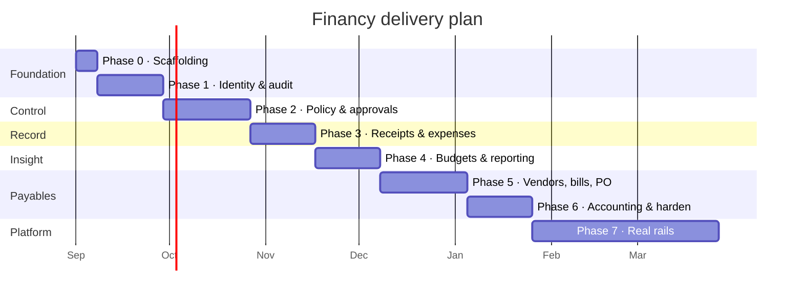

# 18 — Development Roadmap and Backlog

**Status:** Baseline v1.0 — 2026-08-29
**Governed by:** `02-PRODUCT-SCOPE.md` · **Completion defined by:** `19-DEFINITION-OF-DONE.md`

---

## 1. Sequencing principle

The build order is **dependency order, not demo order**.

Starting with a dashboard would be the fastest route to something that looks finished and the
slowest route to something that works — a dashboard has no data until transactions exist,
transactions have no meaning until approvals exist, and approvals have no authority until identity
and permissions exist. So identity comes first and the dashboard comes fourth.

Every phase ends with a **vertical slice** — schema through UI, with tests — not a horizontal
layer. There is no phase that delivers "the backend" or "the screens".

Durations assume one focused engineer. They are estimates for sequencing, not commitments.

---

## 2. Phase 0 — Foundation

**Goal:** a clean clone builds, lints, tests, and runs. No product code.

**Status: complete.**

| ID    | Task                                                                                   | Status | Notes                                                              |
| ----- | -------------------------------------------------------------------------------------- | ------ | ------------------------------------------------------------------ |
| P0-01 | pnpm workspace + Turborepo pipeline                                                    | ✅     | `apps/*`, `packages/*`, `tests`                                    |
| P0-02 | `.gitignore`, `.gitattributes` (LF), `.env.example`                                    | ✅     | **First commit** — audit finding P5                                |
| P0-03 | `packages/config` — tsconfig bases, ESLint flat config, Prettier, Vitest base          | ✅     | `strict`, `noUncheckedIndexedAccess`, `exactOptionalPropertyTypes` |
| P0-04 | Architecture lint rules                                                                | ✅     | Boundaries, restricted imports, no-money-math-in-web               |
| P0-05 | `packages/core` — `Money`, `Result`, error taxonomy, ID types, state-machine helper    | ✅     | 100 % coverage from day one                                        |
| P0-06 | `packages/contracts` skeleton — envelopes, error codes, pagination, filters            | ✅     | Endpoint schemas ship with their endpoints                         |
| P0-07 | `packages/db` — Prisma init, connection, tenant client extension skeleton              | ✅     | Scoping rules are a pure function; models land in 1.1              |
| P0-08 | `apps/api` — NestJS bootstrap, config validation, health endpoints, error filter, Pino | ✅     |                                                                    |
| P0-09 | `apps/web` — Next.js bootstrap, Tailwind, token layer, base layout                     | ✅     |                                                                    |
| P0-10 | `packages/ui` — token layer + first three primitives                                   | ✅     |                                                                    |
| P0-11 | Test harness — Vitest projects, PostgreSQL test setup, Supertest, Playwright           | ✅     | Integration suites arrive with the schema in 1.1                   |
| P0-12 | CI workflow — the full PR gate                                                         | ✅     | Under 15 min                                                       |
| P0-13 | `infra/docker-compose.yml` (optional local, used by CI)                                | ✅     | Audit finding P4                                                   |
| P0-14 | Root `README.md` — six-step setup                                                      | ✅     | NFR-OPS-004                                                        |

**Exit:** `pnpm install && pnpm lint && pnpm typecheck && pnpm test && pnpm build` succeeds from a
clean clone; CI runs the same.

**Carried into Phase 1.** Three pieces of Phase 0 are deliberately incomplete because they have
nothing to describe until the schema exists, and inventing a placeholder for them would be
scaffolding nobody could test:

- The Prisma schema holds the datasource, the generator, and the conventions — no models. The
  model registry and its architecture test are wired and pass vacuously; the test starts biting on
  the first model (task 1.1.1).
- Integration tests against a real PostgreSQL. The harness and the CI service exist; there is no
  table to assert a constraint on yet (epic 1.8).
- Readiness reports the database only. The queue and document-store probes arrive with their ports
  (tasks 1.2.5 and 1.2.6) — reporting `ok` for a dependency nothing probed would be worse than
  omitting it.

---

## 3. Phase 1 — Identity, tenancy, audit

**Goal:** multi-tenant identity with enforced RBAC and a complete audit trail. No money.

### Epic 1.1 — Data foundation

| ID    | Task                                                                                            | Status                 |
| ----- | ----------------------------------------------------------------------------------------------- | ---------------------- |
| 1.1.1 | Prisma schema: organisations, users, memberships, roles, permissions, role_permissions          | ✅                     |
| 1.1.2 | Prisma schema: entities, departments (tree + path), projects, categories                        | ✅                     |
| 1.1.3 | Prisma schema: sessions, mfa_factors, invitations, security_events                              | ✅                     |
| 1.1.4 | Prisma schema: audit_events with the actor `CHECK` constraint                                   | ⚠️ no CHECK on Mongo   |
| 1.1.5 | Composite unique keys `(id, organization_id)` on every tenant parent; composite FKs on children | ⚠️ no composite FKs    |
| 1.1.6 | Initial migration; extensions; `REVOKE UPDATE, DELETE ON audit_events`                          | ⚠️ db push, no grants  |
| 1.1.7 | System seed: the full permission catalogue, five system roles, default categories — idempotent  | ✅                     |
| 1.1.8 | Demo seed: a realistic organisation                                                             | ✅ with a demo account |

**1.1.4 through 1.1.6 are marked with a warning, and the warning is the point.** The schema is
written and applied, but the system runs on MongoDB (ADR-0017), which has no `CHECK` constraints,
no composite foreign keys, and no grants to revoke. Those three rows were complete against
PostgreSQL and would be again; today the guarantees they name are carried by the Prisma tenant
extension, the Zod schemas, and `AuditService` — application code, all of it fallible.

`packages/db/test/constraints.integration.test.ts` is the honest record. Under PostgreSQL it
proved thirteen database guarantees; those thirteen assertions are now **inverted** rather than
deleted, asserting that the database accepts what it used to refuse and naming what carries each
rule instead. Marking these tasks done would have been the easy lie.

The development cluster built for this — a second PostgreSQL 18 instance under the user profile on
port **5443**, created with `initdb`, needing no administrator rights and leaving the machine-wide
service on 5432 untouched — still works, and is how PostgreSQL comes back.

**The role model was corrected here.** `roles.organization_id` was specified as nullable for system
roles, which cannot satisfy the composite foreign key from `memberships` — no membership could have
held a role at all. Every organisation now owns its five, provisioned at registration. See
`docs/09 §7.4a`; the integration suite is what caught it.

**1.1.8 now creates a person**, which it could not before 1.3.1 existed: a membership needs a
user, a user needs an argon2id hash, and the hasher cannot live in `@financy/core` because that
package is compiled into the browser bundle. With authentication built, the demo account is created
through the real registration endpoint rather than by inserting a row — an account seeded with a
hash the real verifier cannot read is worse than no account at all.

**1.4.1 (the permission catalogue as typed constants) was brought forward**, because 1.1.7 seeds
from it. It lives in `@financy/contracts` and is the single definition shared by the seed, the
guard, and the frontend.

**Phase 1 screens are real, and `BUILT_PHASES` says so.** People, Settings, and the Audit log
each read a live endpoint — `GET /v1/people`, `GET /v1/organization`, `GET /v1/audit-events` —
enforce their permission at the route as well as in the navigation, and show the caller’s own
organisation and nobody else’s. The shell marker was raised from `0` to `1` only once those
three rendered real data; raising it earlier would have turned every honest "not built yet"
into a promise the application does not keep.

All three are **read-only**, deliberately. Inviting a member, changing a role, editing the
department tree, and renaming the organisation are writes that need optimistic concurrency, an
audit event each, and a self-elevation refusal for role changes. They are task 1.5. A save
button without those would silently discard a colleague’s concurrent edit, which is worse than
no button at all (docs/19 §5).

**Two tenant-isolation bugs were caught by the end-to-end suite here, not by review.** A bare
`organization.findFirst()` returned _another tenant’s_ organisation, because `Organization` is
a global model in the tenant registry — scoping the tenant by its own id would be circular, so
the extension adds no predicate and the caller must pass one. And `where: { archivedAt: null }`
silently returned nothing at all, because on MongoDB an unset optional field is absent rather
than null (ADR-0017). Both were plausible code that a reader would have approved.

### Epic 1.2 — Platform layer

| ID     | Task                                                                            |
| ------ | ------------------------------------------------------------------------------- |
| 1.2.1  | `RequestContext` via `AsyncLocalStorage` (org, membership, correlation ID)      |
| 1.2.2  | Prisma tenant extension — inject `organizationId`, throw when context is absent |
| 1.2.3  | `AuditService` — writes inside the caller's transaction                         |
| 1.2.4  | `AuditInterceptor` + `@Audited()`                                               |
| 1.2.5  | `QueuePort` + `InlineQueueAdapter`                                              |
| 1.2.6  | `DocumentProvider` port + `LocalDocumentProvider`                               |
| 1.2.7  | Global exception filter mapping the error taxonomy                              |
| 1.2.8  | Idempotency interceptor + `idempotency_keys`                                    |
| 1.2.9  | Rate limiting (in-memory locally, Redis when available)                         |
| 1.2.10 | OpenTelemetry + Pino with redaction                                             |

### Epic 1.3 — Authentication

| ID    | Task                                                   | FR               |
| ----- | ------------------------------------------------------ | ---------------- |
| 1.3.1 | argon2id hashing + breached-password check             | FR-AUTH-002/003  |
| 1.3.2 | Registration — atomic org + user + membership + entity | FR-AUTH-001      |
| 1.3.3 | Login, lockout, rate limit, enumeration defence        | FR-AUTH-008/009  |
| 1.3.4 | Session lifecycle: create, validate, refresh, revoke   | FR-AUTH-004..007 |
| 1.3.5 | Password reset and change                              | FR-AUTH-011      |
| 1.3.6 | MFA schema + service + step-up guard (no enrolment UI) | FR-AUTH-010      |
| 1.3.7 | Organisation switching                                 | FR-AUTH-012      |
| 1.3.8 | `IdentityProvider` port + `LocalIdentityProvider`      | FR-AUTH-014      |

### Epic 1.4 — Authorisation

| ID    | Task                                                                       | FR / INV            |
| ----- | -------------------------------------------------------------------------- | ------------------- |
| 1.4.1 | Permission catalogue as typed constants                                    | FR-USR-005          |
| 1.4.2 | `AuthGuard`, `TenantGuard`, `PermissionGuard`, `ScopeGuard`, `StepUpGuard` | —                   |
| 1.4.3 | Scope predicate builder in the repository base                             | FR-USR-006 / INV-07 |
| 1.4.4 | Auditor read-only guard                                                    | INV-05              |
| 1.4.5 | **Meta-test: every route declares access**                                 | §5 of `12`          |

### Epic 1.5 — Organisation and people

| ID    | Task                                                                            | Status                |
| ----- | ------------------------------------------------------------------------------- | --------------------- |
| 1.5.1 | Organisation CRUD + currency lock                                               | ✅ API; no screen yet |
| 1.5.2 | Entities CRUD + archive                                                         | ✅ API; no screen yet |
| 1.5.3 | Departments: tree, path maintenance, cycle rejection, head                      | ✅ API; no screen yet |
| 1.5.4 | Projects and categories CRUD                                                    | ✅ API; no screen yet |
| 1.5.5 | Memberships: list, detail, update, role change (step-up), deactivate/reactivate | ✅ API; no screen yet |
| 1.5.6 | Invitations: create, accept, revoke, resend, expiry                             | ✅ API; no screen yet |
| 1.5.7 | Last-admin and self-elevation guards (INV-03, INV-04)                           | ✅ see the note below |
| 1.5.8 | Session management for another user (step-up)                                   | ✅ API; no screen yet |

**1.5.1 and 1.5.2 are the API only, and the status column says so.** The endpoints exist, enforce
their permission, take a mandatory `If-Match`, and write an audit event inside the same
transaction as the change; the settings screen still renders them read-only. Marking the rows
plainly done would claim a form that does not exist.

**The currency lock is a method, not a `false`.** `isBaseCurrencyLocked()` is called by both the
read — which sets `baseCurrencyLocked` on the payload — and the write, so the field the screen
disables and the change the endpoint refuses can never disagree. It answers `false` today because
nothing financial exists before Phase 2; when transactions and bills arrive it becomes an
existence check across them and every caller is already asking the right question.

**The department `path` is the reason 1.5.3 is not a CRUD table.** It is `/root-id/child-id/`,
delimited at both ends, and every scope check reads it — a manager sees their subtree because
their department's path is a prefix of the rows they may see. PostgreSQL enforced the delimiters
with a `CHECK`; on MongoDB nothing does, so `pathUnder()` in `@financy/contracts` is the only
thing that builds one and is shared with the client. Moving a node rewrites the path of its whole
subtree in the same transaction as the move: a partial rewrite leaves descendants claiming an
ancestry that no longer exists, and every scope check beneath them then answers wrongly rather
than failing. A cycle — re-parenting a node beneath its own descendant — is refused before
anything is written, by one path comparison rather than by walking parents.

**Archiving a department refuses rather than cascades.** A parent with live children or active
members is a `409` naming what is in the way. Cascading would archive rows nobody asked about,
and restoring the parent afterwards cannot know which children the cascade archived and which
were already archived on their own.

**`@RequireStepUp()` was a lock with no key, and 1.5.5 could not ship without cutting one.**
Nothing in the application set `steppedUpAt`, so every route carrying that decorator would have
answered `403` to everybody, forever — which reads to an operator as a bug and to a developer as a
reason to delete the decorator. `POST /v1/auth/step-up` (part of 1.3.6, brought forward) re-proves
the password on the session already held: it issues nothing, changes no cookie, stamps
`steppedUpAt`, and a failure counts towards the same lockout as a failed login and writes a
`STEP_UP_FAILED` event. It is session-scoped rather than permission-gated, and the route-access
meta-test names it alongside `session` and `logout` — requiring step-up to obtain step-up is a
lock whose key is inside it, and borrowing a permission every role happens to hold would have
satisfied the meta-test while teaching the next reader that permissions here are decorative.

**INV-03 is enforced as a self-rule, and the "cannot grant what you lack" companion was written
and then removed.** Nobody changes their own role — refused before the target role is even read,
so the message cannot vary with what was requested — and nobody deactivates their own membership.

The companion rule from `docs/12` THR-02 ("a role may not grant permissions the granter lacks")
was implemented as a permission-set comparison, and the end-to-end suite refuted it on the first
real promotion: **this catalogue is deliberately not nested.** `docs/03` implements separation of
duties, so `ORG_ADMIN` administers people and structure and holds neither `approval:act` nor
`transaction:categorize` — `FINANCE_ADMIN` does. A superset check therefore refuses `ORG_ADMIN`
the right to assign _any_ role including `EMPLOYEE`, and since `ORG_ADMIN` is the only role
holding `membership:manage_role`, it makes the endpoint unreachable by everyone. It is removed,
with the reasoning left in the code so nobody re-adds it from the threat model alone.

What guards the endpoint instead: `membership:manage_role` on the route, mandatory step-up, the
self-elevation refusal, INV-04, and an audit plus security event on every change. The residual
risk — an administrator promoting a colleague they intend to collude with — is not addressable by
comparing permission sets at all. It needs dual control, which belongs to the Phase 2 policy
engine and is named there rather than half-implemented here.

**INV-04 is now tested on its real path, which 1.5.6 unblocked.** The last-administrator check
runs on demotion and deactivation, counted through the organisation's own `ORG_ADMIN` role row
rather than a global one. Until an organisation could have a _second_ administrator, every route
to it in a test went through a self-change that INV-03 refused first — so the branch was reviewed
code rather than tested code. The invitation suite now invites a second `ORG_ADMIN`, demotes them
(allowed, because another remains), and the self-guards cover the rest.

**Invitations are the token, and the token is a bearer credential.** It is stored as a hash and
returned exactly once, in the create and resend responses. Returning it at all is a decision, not
a placeholder for an email: the inviter is already authorised to invite this person, so handing
them a link to pass on is no wider a disclosure than the invitation itself, and it means an
invitation is not silently dead when mail delivery fails — which is what corporate mail filters
do to transactional email. The mailer, when it lands, sends the same link rather than becoming
the only way to obtain one.

Every failure to resolve a token — unknown, spent, revoked, expired — answers an identical `404`,
because distinguishing them tells somebody guessing which guesses were close. And acceptance
refuses a password when the address already has an account: without that refusal, "invite a
colleague" is a way to set the password of an account somebody else controls.

**`/v1/people` became `/v1/memberships`.** The specification (docs/10 §5.3) named the second; the
first shipped by accident and matched nothing. One endpoint with two names is a drift that only
widens, so the old name is gone rather than aliased — one line in the web app and the e2e suite.
The _language_ stays: "people" is what the screen is called, because a `Membership` is an
account's presence in one organisation and that is the distinction the domain cares about, not
the one the URL should carry.

**A category key is create-only, and that is 1.5.4's one real constraint.** A policy rule says
"airfare over 500 needs finance approval" by naming `travel_airfare`. Letting a `PATCH` change the
key would silently change what every policy referring to it decides, with nothing in the policy's
own history to show why; re-parenting would change what every historical transaction coded to it
appears to have been. The display name — the thing people actually want to change — is editable.
System categories may be archived by an organisation that does not use them, never renamed: a
later deploy reseeds by key.

**Projects close and archive separately.** A _closed_ project is finished and still belongs in
reports; an _archived_ one should not have existed, or no longer matters, and drops out of the
pickers. One flag would make "this ended" and "this was a mistake" the same line in the audit log.

**Three error codes were added rather than reusing `INVALID_STATE_TRANSITION`** (docs/10 §6):
`DUPLICATE_NAME`, `ARCHIVED_RECORD_IMMUTABLE`, `LAST_ACTIVE_ENTITY`. Nothing transitions when a
name collides, and a client told "invalid state transition" cannot put the message next to the
field that caused it.

### Epic 1.6 — Audit

| ID    | Task                                              | Status                |
| ----- | ------------------------------------------------- | --------------------- |
| 1.6.1 | Audit read API with filters and cursor pagination | ✅                    |
| 1.6.2 | Audit export (permission-gated, self-auditing)    | ✅ API; no screen yet |
| 1.6.3 | Security events read API                          | ✅ API; no screen yet |
| 1.6.4 | Per-record audit history endpoint                 | ✅ API; no screen yet |

**The export audits itself, and that is why it is a service of its own.** Downloading an
organisation's complete audit trail is a copy of every privileged action anyone has taken, leaving
the system; an export that left no trace would be the one gap in the record that mattered most.
The event records the filters and the row count, never the rows — a copy of the export inside the
trail would double the trail on every download and tell a reader nothing they could not get by
re-running the filters. The reader service has no writer injected into it and no transaction, which
is what keeps "read the trail" and "write to the trail" on different objects.

**CSV fields are guarded against formula injection.** A cell beginning `=`, `+`, `-`, or `@` is
executed by Excel and Sheets on open, and audit fields carry user-chosen text — an action name, an
actor label somebody picked. An export is therefore a document written by one person and opened,
trusted, by another. Quoting alone does not stop it; a leading tab does, and leaves the value
readable. `before`, `after`, and `metadata` are not CSV columns at all: they are arbitrarily nested
JSON, and a caller who needs them asks for `format=json`, which is why that format exists.

**The security log resolves the actor's name at read time, and the audit trail does not.** That
looks like an inconsistency and is the opposite. The audit trail is evidence and must read the
same in five years, after the person has left and been renamed — so `actorLabel` is denormalised at
write time. The security log is an operator asking what is happening _now_, who wants the name
that is on the account today.

**Two real bugs surfaced here, and neither changed any response.** Task 1.6.3's first test found
that the whole login flow ran in one transaction with the failure bookkeeping inside it and a
`throw` on the next line: the throw rolled the transaction back and took the record with it. So no
`LOGIN_FAILED` event was ever written — and `failedLoginCount` never persisted, which meant the
account lockout in `docs/12 §3.2` **did not exist**. `POST /v1/auth/step-up`, written a day
earlier, had inherited the same shape. Both now do the credential check outside a transaction and
commit the failure record in one of its own. There is a regression test asserting the counter
climbs 1, 2, 3 across three requests, which is only true if each one commits.

### Epic 1.7 — Frontend

| ID     | Task                                                                                              |
| ------ | ------------------------------------------------------------------------------------------------- |
| 1.7.1  | Design tokens + Tailwind preset from `UI-DESIGN-SYSTEM.md`                                        |
| 1.7.2  | Primitives: Button, Input, Select, Checkbox, Badge, Avatar, Dropdown, Dialog, Drawer, Tabs, Toast |
| 1.7.3  | `DataTable` with sort, select, sticky header, keyboard nav, and all four states                   |
| 1.7.4  | State components: EmptyState (×3), LoadingSkeleton, ErrorState, PermissionState                   |
| 1.7.5  | App shell: sidebar (permission-filtered), top bar, org switcher, user menu                        |
| 1.7.6  | Auth screens: login, register, invite acceptance, forgot/reset                                    |
| 1.7.7  | People: list, detail, invite flow with permission preview                                         |
| 1.7.8  | Settings: organisation, entities, departments, categories                                         |
| 1.7.9  | Audit log: stream, filters, event detail                                                          |
| 1.7.10 | API client + session handling + `useSession`                                                      |

### Epic 1.8 — Tests

Unit (Money, permissions, scope, state helpers) · integration (tenant predicate, audit atomicity,
constraints) · API (every Phase 1 endpoint × every role) · security (SEC-01..06, SEC-08..10,
SEC-19, SEC-22) · E2E (`auth`, `permissions`).

**Exit:** the criterion in `02 §2 Phase 1`, demonstrated live and by a green suite.

---

## 4. Phase 2 — Policy engine, approvals, spend requests

### Epic 2.1 — Policy engine

| ID    | Task                                                                         | FR             |
| ----- | ---------------------------------------------------------------------------- | -------------- |
| 2.1.1 | Rule schema in `packages/contracts` (conditions, outcomes, closed field set) | FR-POL-002/003 |
| 2.1.2 | Prisma: policies, policy_versions, policy_rules                              | FR-POL-001/007 |
| 2.1.3 | `PolicyContext` builder                                                      | —              |
| 2.1.4 | Condition evaluator — full field × operator matrix, currency-safe            | FR-POL-003     |
| 2.1.5 | Outcome merger — all nine precedence rules                                   | FR-POL-006     |
| 2.1.6 | `PolicyEvaluator` (pure) + decision snapshot                                 | FR-POL-005     |
| 2.1.7 | Version cache with invalidation                                              | —              |
| 2.1.8 | Simulation and backtest endpoints                                            | FR-POL-008     |
| 2.1.9 | **Golden-file fixture suite**                                                | `11 §9`        |

### Epic 2.2 — Approvals

| ID    | Task                                                                                 | FR / INV       |
| ----- | ------------------------------------------------------------------------------------ | -------------- |
| 2.2.1 | Prisma: workflows, templates, instances, steps, step_approvers, actions, delegations | —              |
| 2.2.2 | `ApprovalResolver` — every `ApproverSpec` kind + fallback ladder                     | FR-APR-003     |
| 2.2.3 | Requester exclusion **before and after** delegation                                  | INV-02         |
| 2.2.4 | State machine: instance and step, all four step types                                | FR-APR-001/002 |
| 2.2.5 | Actions: approve, reject, return, delegate                                           | FR-APR-005     |
| 2.2.6 | Row-locked step transition with status re-check inside the lock                      | FR-APR-011     |
| 2.2.7 | Timeout, escalation, reminder jobs                                                   | FR-APR-008     |
| 2.2.8 | Finance override with mandatory reason (step-up)                                     | FR-APR-010     |
| 2.2.9 | Approval queue endpoint                                                              | FR-APR-012     |

### Epic 2.3 — Spend requests

2.3.1 schema · 2.3.2 draft with autosave · 2.3.3 dry-run evaluate · 2.3.4 submit (authoritative,
idempotent) · 2.3.5 state machine · 2.3.6 server-computed totals (FR-SPD-006) · 2.3.7 cancel ·
2.3.8 expiry job.

### Epic 2.4 — Cards and transactions (abstraction)

2.4.1 card schema (no PAN/CVV) · 2.4.2 `CardProvider` port + `MockCardProvider` · 2.4.3 card
lifecycle · 2.4.4 limit history · 2.4.5 transaction schema with four status axes · 2.4.6 unique
provider reference · 2.4.7 CSV import (idempotent, per-row results) · 2.4.8 auto-match to spend
requests.

### Epic 2.5 — Notifications

In-app schema and API · `NotificationProvider` port + console/SMTP adapters · templates ·
preferences · queued delivery.

### Epic 2.6 — Frontend

Policy list, rule-builder editor, simulation screen · spend request create with live policy
preview · spend list and detail with the approval timeline and policy verdict panel · approval
queue · cards list and detail · transactions list and detail · notification centre.

### Epic 2.7 — Tests

The full `11 §9` matrix · FR-APR-004 across four paths · FR-APR-011 concurrency · FIN-03/04 ·
SEC-07 · E2E `spend-approval`.

**Exit:** six distinct policy scenarios configured through the UI produce correct chains, each
covered by a test; approval and verdict audited with the policy version applied.

---

## 5. Phase 3 — Receipts, expenses, reimbursements

| Epic               | Contents                                                                                                                                            |
| ------------------ | --------------------------------------------------------------------------------------------------------------------------------------------------- |
| 3.1 Receipts       | Upload intent → signed URL → complete with magic-byte validation; scan and OCR jobs; attach/detach with history; `OCRProvider` port + no-op adapter |
| 3.2 Expenses       | Schema, items, state machine, policy evaluation, submit/approve/return                                                                              |
| 3.3 Reimbursements | Batching by person/entity/currency/period; `UNIQUE(expense_id)`; approval; mark paid with reference                                                 |
| 3.4 Finance review | Review queue (keyboard-driven), categorisation, exceptions, bulk actions                                                                            |
| 3.5 Linkage        | request → approval → transaction → receipt → review → audit, end to end                                                                             |
| 3.6 Frontend       | Expenses (tabs), receipt-first creation, receipt preview, reimbursement batches, review queue                                                       |
| 3.7 Tests          | SEC-11..13 · FIN-06 · E2E `receipt-expense`, `transaction-review`, and **the full vertical slice**                                                  |

**Exit:** the vertical slice from `05 §0` runs end to end; duplicate reimbursement provably
rejected.

---

## 6. Phase 4 — Budgets, dashboard, reporting

| Epic          | Contents                                                                                                                                                            |
| ------------- | ------------------------------------------------------------------------------------------------------------------------------------------------------------------- |
| 4.1 Budgets   | Schema, lines, append-only movements, row-locked balance updates, commitment/actual/release, overspend behaviours, threshold alerts, budget state as a policy input |
| 4.2 Reports   | `ReportRegistry`, shared filter model, the twelve MVP reports, scope intersection, currency modes                                                                   |
| 4.3 Dashboard | Role-aware backend aggregates; no client computation                                                                                                                |
| 4.4 Export    | Streamed CSV, formula-injection defence, queued above 5,000 rows, audited with filters                                                                              |
| 4.5 Frontend  | Budget list/detail with meters, dashboard, report gallery and pages, filter bar, export                                                                             |
| 4.6 Tests     | FIN-05/07/12/13/14 · `EXPLAIN` assertions · the no-client-math static check · E2E `budget-dashboard`                                                                |

**Exit — end of MVP:** no figure computed in the browser; 50-way budget concurrency correct;
exports audited with their parameters.

---

## 7. Phases 5–7 (outline)

**Phase 5 — Vendors, bills, procurement.** Vendor master with dedupe and non-destructive merge;
bills with line-level coding, routed through **the existing** approval engine (`spendType=BILL`);
credit notes; purchase requests and orders; receiving; three-way match with tolerance; commitment
accounting. _Exit: a test asserts bills and POs traverse the identical evaluator and state
machine._

**Phase 6 — Accounting and hardening.** Chart of accounts, cost centres, tax codes; mapping rules
with a test harness; export eligibility, batching, checksums, idempotent re-runs; unmapped queue;
reconciliation foundations. Hardening: PostgreSQL RLS enabled, MFA enrolment UI, step-up
everywhere required, load testing, penetration test and remediation, restore rehearsal.

**Phase 7 — Real rails and platform.** Gated on a written partner and regulatory decision per
rail. Real card issuing, real payment execution, live accounting sync, OCR, anomaly detection,
multi-currency consolidation, enterprise SSO and SCIM, public API and webhooks, mobile capture.

---

## 8. Backlog conventions

**Hierarchy:** Phase → Epic → Task → Subtask. Task IDs (`1.4.3`) are stable and are referenced in
branch names, commits, and PR titles.

**Branches:** `feature/1.4.3-scope-predicate` · `fix/…` · `refactor/…` · `chore/…`

**Commits:** Conventional Commits with the task ID —
`feat(auth): add scope predicate builder [1.4.3]`

**A task is ready when** its FR is written, its API contract exists in `packages/contracts`, its
schema change is designed, its permission is decided, and its test cases are listed.

**A task is done when** it satisfies every item in `19-DEFINITION-OF-DONE.md`. Not before.

---

## 9. Risk register

| #   | Risk                                                 | Impact       | Likelihood | Mitigation                                                                                             |
| --- | ---------------------------------------------------- | ------------ | ---------- | ------------------------------------------------------------------------------------------------------ |
| R1  | Policy engine complexity exceeds estimate            | High         | Medium     | Pure and exhaustively tested from the start; golden fixtures; ship a narrow field set and widen        |
| R2  | No local Redis diverges dev from production          | Medium       | Medium     | `QueuePort` from day one; BullMQ adapter runs the same contract suite; CI exercises both               |
| R3  | Tenant isolation bug                                 | **Critical** | Low        | Four layers; automated fuzz suite; `404` not `403`; any occurrence pages                               |
| R4  | Money precision error                                | **Critical** | Low        | `NUMERIC(20,4)`; `Money` value object; strings over the wire; 100 % coverage; explicit rounding tests  |
| R5  | Budget race under load                               | High         | Medium     | Row locks; append-only ledger with unique index; 50-way concurrency test; nightly drift check          |
| R6  | Scope creep into Phase 5 before the MVP is solid     | High         | **High**   | Phase exit criteria are hard gates; `02` is the contract                                               |
| R7  | Mock card provider blocks a pilot                    | Medium       | Medium     | Labelled honestly; value proposition is control and evidence; real issuing gated on a partner decision |
| R8  | Approval chains unresolvable in a real org structure | Medium       | Medium     | Fallback ladder; `UNRESOLVABLE_APPROVER` alerts rather than auto-approving; simulation screen          |
| R9  | Reporting slow at scale                              | Medium       | Medium     | `EXPLAIN` gates in CI; partial indexes; large-fixture benchmarks; materialised views held in reserve   |
| R10 | Documentation drifts from code                       | Medium       | **High**   | Same-PR update is a DoD item; contracts and schema are executable and generate their docs              |
| R11 | Windows-only host hides platform bugs                | Low          | Medium     | CI runs Linux containers; `.gitattributes`; cross-platform scripts                                     |
| R12 | Solo delivery — bus factor                           | High         | Medium     | Documentation-first; ADRs; mechanised conventions; nothing depends on tribal memory                    |

---

## 10. Cross-phase workstreams

Continuous, not scheduled:

- **Documentation** — updated in the PR that changes behaviour.
- **Security** — invariant and isolation tests grow with every module.
- **Performance** — `EXPLAIN` assertions added with every list endpoint.
- **Accessibility** — `axe` on every new route; keyboard pass each phase.
- **Dependencies** — weekly audit; nothing added without a written justification.
